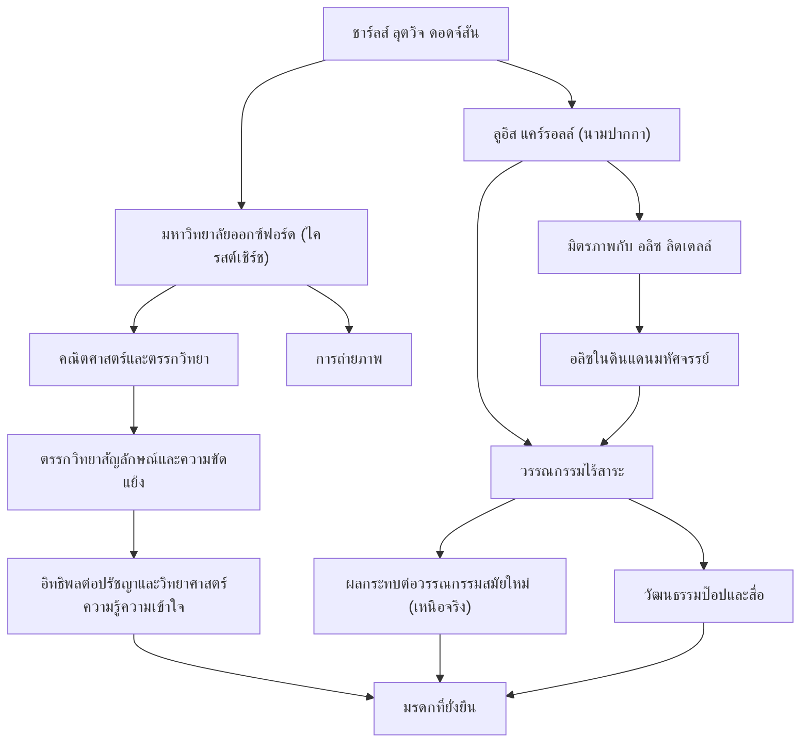

## คำนำ

เมื่อได้ยินชื่อ "ลูอิส แคร์รอลล์" หลายคนมักจะนึกถึงผู้แต่งนิทานเด็กที่โด่งดังไปทั่วโลกอย่าง "อลิซในดินแดนมหัศจรรย์" (Alice's Adventures in Wonderland) ทว่าชื่อจริงของเขาคือ ชาร์ลส์ ลุตวิจ ดอดจ์สัน เขาเป็นอาจารย์สอนคณิตศาสตร์ที่ไครสต์เชิร์ช มหาวิทยาลัยออกซ์ฟอร์ด เป็นช่างภาพ และเป็นนักตรรกวิทยา "วรรณกรรมไร้สาระ" (Nonsense Literature) ที่เขาสร้างสรรค์ขึ้นนั้นไม่ได้เป็นเพียงนิทานสำหรับเด็กเท่านั้น แต่ยังคงส่งผลกระทบอย่างลึกซึ้งต่อวงการภาษาศาสตร์ ปรัชญา และตรรกวิทยา ในบทความนี้ เราจะเจาะลึกถึงชีวิตอันหลากหลายของลูอิส แคร์รอลล์ ปรัชญาที่แฝงอยู่ในผลงานของเขา และอิทธิพลที่เขามีต่อคนรุ่นหลัง

## ชีวิตในวัยเด็ก: จากเด็กชายในบ้านพักนักบวชสู่นักคณิตศาสตร์แห่งออกซ์ฟอร์ด

ชาร์ลส์ ลุตวิจ ดอดจ์สัน เกิดในปี 1832 ที่บ้านพักนักบวชในเมืองแดร์สบรี มณฑลเชสเชียร์ ทางตะวันตกเฉียงเหนือของอังกฤษ เขาเติบโตในสภาพแวดล้อมครอบครัวที่เข้มงวดและมีปัญญา เขาแสดงความสนใจอย่างมากในการเล่นคำ ปริศนา มายากล และหุ่นกระบอกตั้งแต่ยังเด็ก ในช่วงวัยเด็ก เขาได้จัดทำนิตยสารทำมือสำหรับพี่น้องในครอบครัว ซึ่งมีทั้งบทกวีขบขันและภาพประกอบ สิ่งเหล่านี้เผยให้เห็นแววของลูอิส แคร์รอลล์ ในอนาคต

เมื่อเข้าเรียนที่ไครสต์เชิร์ช มหาวิทยาลัยออกซ์ฟอร์ดในปี 1851 เขาได้แสดงพรสวรรค์ด้านคณิตศาสตร์อย่างโดดเด่นและสำเร็จการศึกษาเป็นอันดับหนึ่ง หลังจากนั้นเขาก็ได้สอนวิชาคณิตศาสตร์ที่นั่นเป็นเวลา 26 ปี ชีวิตประจำวันของเขาเป็นการสลับไปมาระหว่างสองบทบาท คือ ดอดจ์สัน นักคณิตศาสตร์ที่เคร่งครัดและจริงจัง และแคร์รอลล์ ชายผู้มีจินตนาการกว้างไกลและรักการเล่นกับเด็กๆ

เมื่อวันที่ 4 กรกฎาคม 1862 ขณะพายเรือในแม่น้ำเทมส์กับลูกสาวสามคนของเฮนรี ลิดเดลล์ คณบดีแห่งไครสต์เชิร์ช—รวมถึง อลิซ ลิดเดลล์—แคร์รอลล์ได้เล่านิทานที่แต่งขึ้นสดๆ ให้พวกเธอฟัง อลิซหลงใหลในเรื่องนี้มากและขอร้องว่า "ช่วยเขียนเรื่องนี้ให้ฉันหน่อย" ซึ่งนำไปสู่การสร้างสรรค์ผลงานชิ้นเอกแห่งประวัติศาสตร์ "อลิซในดินแดนมหัศจรรย์" (1865) ต่อมาเขาได้ตีพิมพ์ภาคต่อ "กระจกทะลุมิติ" (Through the Looking-Glass, 1871) และบทกวีไร้สาระขนาดยาว "การล่าสนาร์ก" (The Hunting of the Snark, 1876) ซึ่งสร้างชื่อเสียงให้เขาในฐานะนักเขียน

เขายังสนใจเทคโนโลยีการถ่ายภาพที่เพิ่งค้นพบในขณะนั้นอย่างรวดเร็วและกลายเป็นช่างภาพภาพบุคคลที่โดดเด่น ภาพถ่ายบุคคลสำคัญและเด็กๆ ของเขายังคงเป็นตัวแทนอันทรงคุณค่าของศิลปะการถ่ายภาพในยุควิกตอเรีย

## ปรัชญาและโลกทัศน์: เส้นกั้นระหว่างตรรกะกับความไร้สาระ

เสน่ห์อันยิ่งใหญ่ที่สุดในผลงานของลูอิส แคร์รอลล์ คือการผสมผสานระหว่าง "ตรรกะอันแยบยล" และ "ความไร้สาระ" (Nonsense) โลกของอลิซที่ดูเหมือนไร้สาระและไม่สมเหตุสมผลในแวบแรกนั้น แท้จริงแล้วถูกสร้างขึ้นในรูปแบบที่กลับกันของกฎทางคณิตศาสตร์และตรรกะขั้นสูง

ในฐานะดอดจ์สัน เขาเป็นนักตรรกวิทยาที่เคร่งครัดซึ่งเขียนหนังสือวิชาการ เช่น "ความรู้เบื้องต้นเกี่ยวกับดีเทอร์มิแนนต์" (1867) และ "ตรรกวิทยาสัญลักษณ์" (1896) วรรณกรรมไร้สาระของเขาเป็นเกมทางปัญญาที่ใช้ความกำกวมของคำ ความผิดพลาดของการอ้างเหตุผลแบบตรรกบท และการบิดเบือนเวลาและพื้นที่อย่างชาญฉลาด เทคนิคของเขาในการรื้อความหมายสัมบูรณ์ของ "คำ" และปลดปล่อยผู้อ่านออกจากกรอบของสามัญสำนึกมีความลึกซึ้งที่เชื่อมโยงกับปรัชญาภาษาในยุคสมัยใหม่

ตัวอย่างเช่น ฉากอันโด่งดังที่ฮัมป์ตี ดัมป์ตี ยืนยันว่า "เมื่อฉันใช้คำๆ หนึ่ง มันมีความหมายตามที่ฉันเลือกให้เป็น" ถือเป็นมุมมองที่แหลมคมเกี่ยวกับความไม่แน่นอนของภาษาและธรรมชาติของการสื่อสาร ว่ากันว่าสิ่งนี้มีอิทธิพลต่อนักปรัชญารุ่นหลังอย่างลุดวิก วิตต์เกนสไตน์ สำหรับเขาแล้ว "ตรรกะ" เป็นทั้งกฎสัมบูรณ์ที่กำหนดโลกและเป็น "ของเล่น" ขั้นสุดยอดที่สามารถสร้างจักรวาลคู่ขนานที่แตกต่างไปจากเดิมอย่างสิ้นเชิงได้เพียงแค่ปรับเงื่อนไขเพียงเล็กน้อย

## มรดก: ผลกระทบต่อวรรณกรรม วัฒนธรรม และวิทยาศาสตร์

มรดกของลูอิส แคร์รอลล์ แผ่ขยายออกไปไกลกว่าขอบเขตของวรรณกรรมเด็กมาก

ประการแรก ในสาขาวรรณกรรม เขาได้นำไปสู่การหลุดพ้นจาก "ลัทธิสั่งสอน" ในขณะที่วรรณกรรมเด็กในยุคนั้นส่วนใหญ่เป็นเครื่องมือสำหรับสอนศีลธรรมแก่เด็ก แคร์รอลล์กลับสร้างวรรณกรรมไร้สาระขึ้นมาเพื่อเป็น "ความบันเทิง" ล้วนๆ แนวทางนี้มีอิทธิพลต่อนักเขียนรุ่นหลังจำนวนมาก เช่น เจมส์ จอยซ์, วลาดิมีร์ นาโบคอฟ และฮอร์เก ลุยส์ บอร์เกส และเขายังได้รับการยกย่องว่าเป็นผู้บุกเบิกของลัทธิเหนือจริง (Surrealism)

อิทธิพลของเขาในวัฒนธรรมสมัยนิยมก็ไม่สามารถประเมินได้เช่นกัน ตั้งแต่ภาพยนตร์แอนิเมชั่นที่ดัดแปลงโดยดิสนีย์ไปจนถึงภาพยนตร์ ละครเวที ดนตรี และเกม ธีมของ "อลิซ" ถูกนำมาสร้างใหม่ซ้ำแล้วซ้ำเล่าในทุกสื่อ แม้แต่ในวัฒนธรรมไซคีเดลิกและผลงานนิยายวิทยาศาสตร์ (เช่น วลี "ตามกระต่ายขาวไป" ในภาพยนตร์เรื่อง "เดอะ เมทริกซ์") โลกทัศน์ที่สร้างโดยแคร์รอลล์ก็ยังทำหน้าที่เป็นสัญลักษณ์ที่สำคัญ

นอกจากนี้ ชื่อของเขายังคงอยู่ยงคงกระพันในสาขาวิทยาศาสตร์และคณิตศาสตร์ ไม่ใช่เรื่องแปลกที่ความขัดแย้งของแคร์รอลล์ (Carroll's paradox) จะถูกอ้างอิงในงานวิจัยด้านฟิสิกส์ ตรรกวิทยา และวิทยาศาสตร์ความรู้ความเข้าใจ ตำราของเขาซึ่งพิสูจน์ให้เห็นถึงเส้นบางๆ ระหว่างตรรกะกับความบ้าคลั่ง ยังคงกระตุ้นความอยากรู้อยากเห็นทางปัญญาของผู้คนในปัจจุบัน

## แผนภูมิแสดงความสำเร็จและความสัมพันธ์

## บทสรุป

ลูอิส แคร์รอลล์ หรือ ชาร์ลส์ ลุตวิจ ดอดจ์สัน ได้สร้าง "จักรวาลแห่งถ้อยคำ" ที่ไม่มีใครเคยไปถึงมาก่อน โดยเชื่อมโยงความคิดเชิงตรรกะอันเป็นเอกลักษณ์ของเขาและจินตนาการอันลึกล้ำภายในสังคมที่เข้มงวดของยุควิกตอเรีย การติดตามชีวิตของเขาทำให้เราได้เห็นปาฏิหาริย์ว่าคณิตศาสตร์อันเคร่งครัดและจินตนาการอันไร้สาระสามารถก้องกังวานอยู่ในจิตใจของมนุษย์คนเดียวได้อย่างไร

โพรงที่เขากระโดดลงไปเพื่อตามกระต่ายขาวนั้นยังคงลึกจนมองไม่เห็นก้นแม้ในปัจจุบัน ซึ่งผ่านไปแล้วกว่า 150 ปี เมื่อเราต้องเผชิญกับขีดจำกัดของสามัญสำนึกและตรรกะ ตำราที่แคร์รอลล์ทิ้งไว้จะยังคงส่องสว่างตลอดไปในฐานะ "เวทมนตร์แห่งถ้อยคำ" เพื่อช่วยให้เราเล็ดลอดผ่านกำแพงเหล่านั้นไปได้
