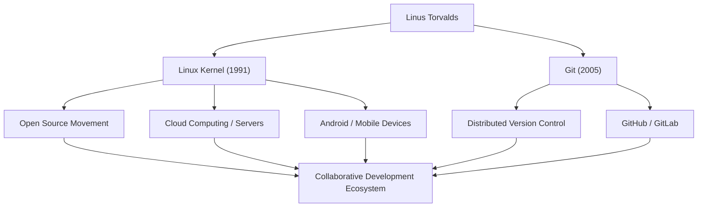

# عملاق المصدر المفتوح: مسار وفلسفة لينوس تورفالدس

"لينكس" (Linux)، نظام التشغيل الذي يدعم البنية التحتية الحديثة لتكنولوجيا المعلومات ويعمل على أنظمة لا حصر لها. و"جت" (Git)، نظام التحكم في الإصدارات الذي يستخدمه المطورون حول العالم يوميًا. مبتكر هذين البرنامجين التاريخيين هو المبرمج الفنلندي لينوس تورفالدس (Linus Torvalds). يتعمق هذا المقال في الابتكارات التي قدمها، والفلسفة الفريدة التي تقف وراءها، والتأثير الهائل الذي تركه على الأجيال القادمة.

## الحياة المبكرة وميلاد لينكس

وُلد لينوس تورفالدس في هلسنكي، فنلندا، عام 1969. نشأ في كنف والدين يعملان في مجال الصحافة، وأظهر اهتمامًا قويًا بالرياضيات وأجهزة الكمبيوتر منذ صغره. فتح جهاز (Commodore VIC-20)، الذي تعرف عليه بفضل جده، أبواب البرمجة أمامه، والتحق لاحقًا بجامعة هلسنكي لدراسة علوم الكمبيوتر.

جاءت فرصته الأولى لترك بصمته في التاريخ في عام 1991 بينما كان لا يزال طالبًا جامعيًا. وبسبب عدم رضاه عن قيود الترخيص الخاصة بنظام "MINIX"، وهو نظام تشغيل تعليمي كان مستخدمًا على نطاق واسع في ذلك الوقت، بدأ في تطوير محاكي طرفية لأجهزة الكمبيوتر المتوافقة مع (PC/AT) كهواية شخصية. تطور هذا في النهاية إلى نواة (Kernel) نظام تشغيل، وتم إصداره للعالم باسم "لينكس" (Linux).

في أغسطس من نفس العام، نشر رسالة شهيرة في مجموعة أخبار (Usenet) تفيد بأنه يقوم بإنشاء "نظام تشغيل مجاني صغير". في البداية، كان مجرد مشروع شخصي، ولكن من خلال اعتماد رخصة جنو العمومية (GPL) وإصدار الكود المصدري، بدأ قراصنة الكمبيوتر (الهاكرز) من جميع أنحاء العالم في المشاركة في تطويره. وبمساعدة حقبة الانتشار الواسع للإنترنت، تطور لينكس بسرعة.

## السعي وراء حل المشكلات: تطوير Git

مع توسع نطاق تطوير نواة لينكس، أصبحت إدارة تغييرات التعليمات البرمجية من آلاف المطورين المنتشرين حول العالم أمرًا صعبًا للغاية. في عام 2005، واجهوا أزمة عندما تم إلغاء الترخيص المجاني لنظام التحكم في الإصدار التجاري الذي كانوا يستخدمونه، "BitKeeper".

بعد أن قرر أن أدوات المصدر المفتوح الحالية (مثل CVS و Subversion) لا يمكنها تلبية متطلباتهم، قرر لينوس تطوير نظام جديد للتحكم في الإصدار بنفسه. والمثير للدهشة أنه أكمل التصميم الأساسي والتنفيذ الأولي في غضون أسابيع قليلة فقط. كان هذا هو نظام التحكم في الإصدارات الموزع، "Git".

تم تصميم Git مع التركيز على نموذج التطوير اللامركزي، والأداء الساحق، وسلامة البيانات. اليوم، أصبح Git المعيار الفعلي في تطوير البرمجيات، ويدعم التعاون العالمي من خلال منصات مثل GitHub.

## تدفق الإنجازات والتأثير

يوضح المخطط التالي تدفق إنجازات لينوس تورفالدس الرئيسية والتأثير الذي أحدثته على المجتمع.

## فلسفة لينوس: البراغماتية و"من أجل المتعة فقط"

تتميز مبادئ سلوك وفلسفة لينوس تورفالدس بالتركيز على "البراغماتية" (العملية) بدلاً من الأيديولوجية. في حين أن ريتشارد ستولمان، مؤسس حركة البرمجيات الحرة، دافع عن حرية البرمجيات من منظور أخلاقي، فإن لينوس يدعم المصدر المفتوح لسبب عملي للغاية وهو أن "المصدر المفتوح ينتج برمجيات أفضل".

كما يوحي عنوان سيرته الذاتية "من أجل المتعة فقط" (Just for Fun)، تكمن القوة الدافعة له في الفضول الفكري الخالص ومتعة حل المشكلات الفنية. كلماته، "المبرمجون الجيدون لا يكتبون التعليمات البرمجية لمجرد أن البرنامج يعمل. بل يكتبونها لأنها جميلة"، تضرب في صميم ثقافة الهاكرز.

كما عُرف بأسلوب تواصله الصريح للغاية (والعدواني أحيانًا). من خلال الانتقاد المستمر للتعليمات البرمجية منخفضة الجودة والمواصفات غير المعقولة، حافظ بصرامة على جودة نواة لينكس. ومع ذلك، في السنوات الأخيرة، فكر في موقفه الخاص وسعى إلى تواصل بناء أكثر من أجل الحفاظ على صحة المجتمع. يمكن اعتبار هذا أيضًا مظهرًا من مظاهر براغماتيته، حيث يضع استدامة المشروع كأولوية قصوى.

## الإرث والأهمية في المجتمع الحديث

يتجاوز التأثير الذي تركه لينوس تورفالدس على الأجيال القادمة بكثير مجرد "إنشاء برامج مفيدة". ما أثبته هو حقيقة أن "الغرباء من جميع أنحاء العالم يمكنهم التعاون عبر الإنترنت وبناء أنظمة معقدة على أعلى مستوى في العالم".

اليوم، 100% من أفضل 500 حاسوب عملاق في العالم تعمل بنظام لينكس، وأساس الهواتف الذكية التي نستخدمها يوميًا (أندرويد) هو لينكس أيضًا. كما لا يمكن للبنية التحتية السحابية (مثل AWS و Google Cloud و Azure) أن توجد بدون لينكس. والمطورون الذين يبنون تلك الأنظمة يستخدمون Git بشكل طبيعي كالتنفس.

المشروع الذي بدأ كـ "هواية صغيرة" لمبرمج واحد تطور الآن ليصبح البنية التحتية الأكثر أهمية في المجتمع الرقمي للبشرية. يواصل لينوس تورفالدس تجسيد القيمة التي تجلبها قاعدة التكنولوجيا المفتوحة التي لا تتحكم فيها أي شركة معينة. من المؤكد أن رؤيته الفنية وإيمانه بالتعاون المفتوح سيستمران في إلهام خبراء التكنولوجيا في المستقبل.
