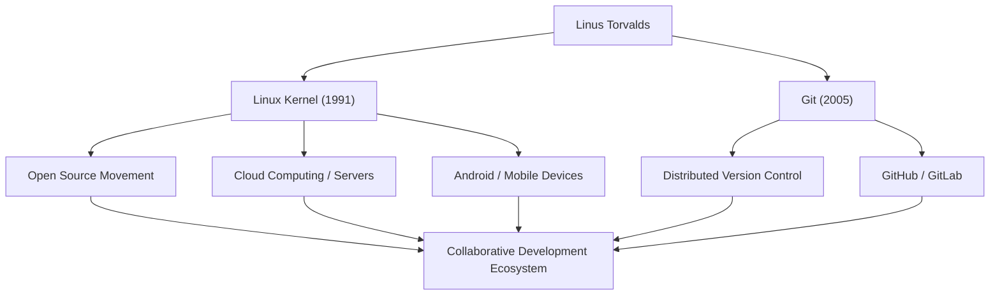

# Gigant des Open Source: Der Werdegang und die Philosophie von Linus Torvalds

"Linux", das Betriebssystem, das die Grundlage der modernen IT-Infrastruktur bildet und auf unzähligen Systemen läuft. Und "Git", das Versionskontrollsystem, das täglich von Entwicklern weltweit genutzt wird. Der Schöpfer dieser beiden historischen Softwareprodukte ist der finnische Programmierer Linus Torvalds. Dieser Artikel befasst sich eingehend mit den Innovationen, die er hervorgebracht hat, der einzigartigen Philosophie dahinter und dem unermesslichen Einfluss, den er auf zukünftige Generationen hatte.

## Frühes Leben und die Geburt von Linux

Linus Torvalds wurde 1969 in Helsinki, Finnland, geboren. Er wuchs bei Eltern auf, die Journalisten waren, und zeigte schon in jungen Jahren ein starkes Interesse an Mathematik und Computern. Ein Commodore VIC-20, den er durch den Einfluss seines Großvaters kennenlernte, öffnete ihm die Tür zur Programmierung, und später studierte er Informatik an der Universität Helsinki.

Die erste Gelegenheit, in die Geschichte einzugehen, ergab sich 1991, als er noch Student war. Unzufrieden mit den Lizenzbeschränkungen von "MINIX", einem damals weit verbreiteten Betriebssystem für den Bildungsbereich, begann er als persönliches Hobby mit der Entwicklung eines Terminal-Emulators für PC/AT-kompatible Rechner. Dieser entwickelte sich schließlich zu einem Betriebssystem-Kernel und wurde als "Linux" der Welt vorgestellt.

Im August desselben Jahres veröffentlichte er eine berühmte Nachricht in einer Usenet-Newsgroup, in der er erklärte, dass er "ein kleines kostenloses Betriebssystem" entwickle. Zunächst war es nur ein persönliches Projekt, aber durch die Übernahme der GPL (GNU General Public License) und die Veröffentlichung des Quellcodes begannen Hacker aus der ganzen Welt, sich an der Entwicklung zu beteiligen. Begünstigt durch das Zeitalter der weiten Verbreitung des Internets entwickelte sich Linux rasant.

## Das Streben nach Problemlösungen: Die Entwicklung von Git

Mit der Ausweitung der Linux-Kernel-Entwicklung wurde die Verwaltung der Codeänderungen von Tausenden von Entwicklern, die über die ganze Welt verstreut waren, extrem schwierig. Im Jahr 2005 kam es zu einer Krise, als die kostenlose Lizenz für das kommerzielle Versionskontrollsystem "BitKeeper", das sie verwendet hatten, widerrufen wurde.

Da Linus feststellte, dass die vorhandenen Open-Source-Tools (wie CVS und Subversion) ihre Anforderungen nicht erfüllen konnten, beschloss er, selbst ein neues Versionskontrollsystem zu entwickeln. Erstaunlicherweise stellte er das grundlegende Design und die erste Implementierung in nur wenigen Wochen fertig. Dies war das verteilte Versionskontrollsystem "Git".

Git wurde mit Fokus auf ein dezentrales Entwicklungsmodell, überwältigende Leistung und Datenintegrität entwickelt. Heute ist Git zum De-facto-Standard in der Softwareentwicklung geworden und unterstützt die weltweite Zusammenarbeit über Plattformen wie GitHub.

## Flussdiagramm der Errungenschaften und Auswirkungen

Das folgende Diagramm zeigt den Ablauf der wichtigsten Errungenschaften von Linus Torvalds und deren Auswirkungen auf die Gesellschaft.

## Linus' Philosophie: Pragmatismus und "Just for Fun"

Die Verhaltensprinzipien und die Philosophie von Linus Torvalds zeichnen sich durch die Betonung von "Pragmatismus" anstelle von Ideologie aus. Während Richard Stallman, der Gründer der Freie-Software-Bewegung, die Softwarefreiheit aus einer moralischen und ethischen Perspektive vertrat, unterstützt Linus Open Source aus dem sehr praktischen Grund, dass "Open Source bessere Software hervorbringt".

Wie der Titel seiner Autobiografie "Just for Fun" (Nur zum Spaß) andeutet, liegt seine Antriebskraft in reiner intellektueller Neugier und der Freude am Lösen technischer Probleme. Seine Worte: "Gute Programmierer schreiben keinen Code, nur weil das Programm funktioniert. Sie schreiben ihn, weil er schön ist", treffen den Kern der Hacker-Kultur.

Er war auch für seinen extrem direkten (und manchmal aggressiven) Kommunikationsstil bekannt. Indem er Code von geringer Qualität und unvernünftige Spezifikationen schonungslos kritisierte, hielt er die Qualität des Linux-Kernels streng aufrecht. In den letzten Jahren hat er jedoch sein eigenes Verhalten reflektiert und bemüht sich um eine konstruktivere Kommunikation, um die Gesundheit der Gemeinschaft zu erhalten. Auch dies kann als Manifestation seines Pragmatismus gesehen werden, der die Nachhaltigkeit des Projekts an die oberste Stelle setzt.

## Vermächtnis und Bedeutung in der modernen Gesellschaft

Der Einfluss, den Linus Torvalds auf zukünftige Generationen hatte, geht weit über die reine "Entwicklung nützlicher Software" hinaus. Er bewies die Tatsache, dass "Fremde aus der ganzen Welt über das Internet zusammenarbeiten und die komplexesten Systeme der Welt auf höchstem Niveau aufbauen können".

Heute laufen 100 % der 500 besten Supercomputer der Welt mit Linux, und die Basis der Smartphones, die wir täglich nutzen (Android), ist ebenfalls Linux. Auch die Cloud-Infrastruktur (wie AWS, Google Cloud und Azure) könnte ohne Linux nicht existieren. Und die Entwickler, die diese Systeme aufbauen, nutzen Git so selbstverständlich wie das Atmen.

Ein Projekt, das als "kleines Hobby" für einen einzigen Programmierer begann, hat sich heute zur wichtigsten Infrastruktur der digitalen Gesellschaft der Menschheit entwickelt. Linus Torvalds verkörpert weiterhin den Wert, den eine offene Technologiebasis mit sich bringt, die nicht von einem bestimmten Unternehmen kontrolliert wird. Seine technische Weitsicht und sein Glaube an die offene Zusammenarbeit werden sicherlich auch zukünftige Technologen inspirieren.
