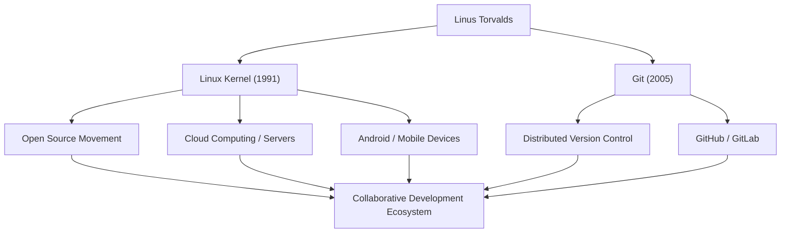

# Giant of Open Source: The Trajectory and Philosophy of Linus Torvalds

"Linux," the OS that underpins modern IT infrastructure and runs on countless systems. And "Git," the version control system used daily by developers worldwide. The creator of these two historic pieces of software is Finnish programmer Linus Torvalds. This article delves deeply into the innovations he brought forth, the unique philosophy behind them, and the immeasurable impact he has had on future generations.

## Early Life and the Birth of Linux

Linus Torvalds was born in Helsinki, Finland, in 1969. Raised by journalist parents, he showed a strong interest in mathematics and computers from a young age. A Commodore VIC-20, which he encountered through his grandfather's influence, opened the door to programming for him, and he later went on to study computer science at the University of Helsinki.

His first opportunity to leave his mark on history came in 1991 while he was still a university student. Dissatisfied with the licensing restrictions of "MINIX," an educational OS widely used at the time, he began developing a terminal emulator for PC/AT compatible machines as a personal hobby. This eventually evolved into an operating system (OS) kernel and was released to the world as "Linux."

In August of the same year, he posted a famous message to a Usenet newsgroup stating that he was creating a "little free operating system." Initially, it was just a personal project, but by adopting the GPL (GNU General Public License) and releasing the source code, hackers from all over the world began to participate in its development. Aided by the era of widespread internet adoption, Linux evolved rapidly.

## The Pursuit of Problem Solving: The Development of Git

As the scale of Linux kernel development expanded, managing code changes from thousands of developers scattered around the world became extremely difficult. In 2005, the community faced a crisis when the free license for the commercial version control system they had been using, "BitKeeper," was revoked.

Determining that existing open-source tools (such as CVS and Subversion) could not meet their requirements, Linus decided to develop a new version control system himself. Amazingly, he completed the basic design and initial implementation in just a few weeks. This was the distributed version control system, "Git."

Git was designed with a focus on a decentralized development model, overwhelming performance, and data integrity. Today, Git has become the de facto standard in software development, supporting global collaboration through platforms like GitHub.

## The Flow of Achievements and Impact

The following diagram shows the flow of Linus Torvalds' major achievements and the impact they have had on society.

## Linus's Philosophy: Pragmatism and "Just for Fun"

Linus Torvalds' behavioral principles and philosophy are characterized by an emphasis on "Pragmatism" rather than ideology. While Richard Stallman, the founder of the free software movement, advocated for software freedom from a moral and ethical perspective, Linus supports open source for the highly practical reason that "open source produces better software."

As the title of his autobiography "Just for Fun" suggests, his driving force lies in pure intellectual curiosity and the joy of solving technical problems. His words, "Good programmers do not write code just because the program works. They write it because it is beautiful," strike at the core of hacker culture.

He was also known for his extremely blunt (and sometimes aggressive) communication style. By relentlessly criticizing low-quality code and unreasonable specifications, he strictly maintained the quality of the Linux kernel. In recent years, however, he has reflected on his own attitude and striven for more constructive communication in order to maintain the health of the community. This, too, can be seen as a manifestation of his pragmatism, placing the sustainability of the project as the highest priority.

## Legacy and Significance in Modern Society

The impact Linus Torvalds has had on future generations goes far beyond simply "creating useful software." What he proved is the fact that "strangers from all over the world can collaborate via the internet and build the world's highest level of complex systems."

Today, 100% of the world's top 500 supercomputers run on Linux, and the foundation of the smartphones we use daily (Android) is also Linux. Cloud infrastructure (such as AWS, Google Cloud, and Azure) could not exist without Linux. And the developers building those systems use Git as naturally as breathing.

A project that started as a "little hobby" for one programmer has now grown into the most crucial infrastructure in humanity's digital society. Linus Torvalds continues to embody the value brought by an open technology foundation not controlled by any specific corporation. His technical foresight and belief in open collaboration will surely continue to inspire future technologists.
