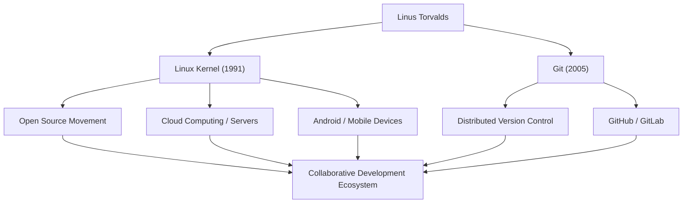

# El Gigante del Código Abierto: La Trayectoria y Filosofía de Linus Torvalds

"Linux", el sistema operativo que sustenta la infraestructura de TI moderna y se ejecuta en innumerables sistemas. Y "Git", el sistema de control de versiones utilizado a diario por desarrolladores de todo el mundo. El creador de estos dos históricos programas de software es el programador finlandés Linus Torvalds. Este artículo profundiza en las innovaciones que creó, la filosofía única que hay detrás de ellas y el incalculable impacto que ha tenido en las generaciones futuras.

## Primeros Años y el Nacimiento de Linux

Linus Torvalds nació en Helsinki, Finlandia, en 1969. Criado por padres periodistas, mostró un gran interés por las matemáticas y las computadoras desde una edad temprana. Un Commodore VIC-20, con el que tuvo contacto gracias a la influencia de su abuelo, le abrió las puertas a la programación, y más tarde estudió ciencias de la computación en la Universidad de Helsinki.

Su primera oportunidad de dejar huella en la historia llegó en 1991, mientras aún era estudiante universitario. Insatisfecho con las restricciones de licencia de "MINIX", un sistema operativo educativo muy utilizado en aquel entonces, empezó a desarrollar un emulador de terminal para máquinas compatibles con PC/AT como un pasatiempo personal. Esto acabó evolucionando hasta convertirse en el núcleo (kernel) de un sistema operativo, y fue lanzado al mundo como "Linux".

En agosto de ese mismo año, publicó un famoso mensaje en un grupo de noticias de Usenet afirmando que estaba creando "un pequeño sistema operativo gratuito". Al principio no era más que un proyecto personal, pero al adoptar la GPL (Licencia Pública General de GNU) y liberar el código fuente, hackers de todo el mundo empezaron a participar en su desarrollo. Ayudado por la época de expansión de Internet, Linux evolucionó rápidamente.

## La Búsqueda de Soluciones: El Desarrollo de Git

A medida que se ampliaba la escala del desarrollo del kernel de Linux, gestionar los cambios de código de miles de desarrolladores dispersos por todo el mundo se hizo extremadamente difícil. En 2005, se enfrentaron a una crisis cuando se revocó la licencia gratuita del sistema comercial de control de versiones que habían estado utilizando, "BitKeeper".

Al determinar que las herramientas de código abierto existentes (como CVS y Subversion) no podían satisfacer sus necesidades, Linus decidió desarrollar él mismo un nuevo sistema de control de versiones. Sorprendentemente, completó el diseño básico y la implementación inicial en unas pocas semanas. Así nació el sistema de control de versiones distribuido "Git".

Git se diseñó centrándose en un modelo de desarrollo descentralizado, un rendimiento abrumador y la integridad de los datos. En la actualidad, Git se ha convertido en el estándar de facto del desarrollo de software, apoyando la colaboración mundial a través de plataformas como GitHub.

## Flujo de Logros e Impacto

El siguiente diagrama muestra el flujo de los principales logros de Linus Torvalds y el impacto que han tenido en la sociedad.

## La Filosofía de Linus: Pragmatismo y "Solo por Diversión"

Los principios de comportamiento y la filosofía de Linus Torvalds se caracterizan por hacer hincapié en el "Pragmatismo" en lugar de en la ideología. Mientras que Richard Stallman, fundador del movimiento del software libre, defendía la libertad del software desde una perspectiva moral y ética, Linus apoya el código abierto por la razón sumamente práctica de que "el código abierto produce un software mejor".

Como sugiere el título de su autobiografía, "Just for Fun" (Solo por diversión), su fuerza motriz reside en la pura curiosidad intelectual y el placer de resolver problemas técnicos. Sus palabras, "Los buenos programadores no escriben código porque el programa funcione. Lo escriben porque es hermoso", apuntan a la esencia de la cultura hacker.

También era conocido por su estilo de comunicación extremadamente franco (y a veces agresivo). Al criticar implacablemente el código de baja calidad y las especificaciones irracionales, mantuvo estrictamente la calidad del kernel de Linux. Sin embargo, en los últimos años ha reflexionado sobre su propia actitud y se ha esforzado por lograr una comunicación más constructiva para mantener la salud de la comunidad. Esto también puede verse como una manifestación de su pragmatismo, situando la sostenibilidad del proyecto como máxima prioridad.

## Legado y Significado en la Sociedad Moderna

El impacto que Linus Torvalds ha tenido en las generaciones futuras va mucho más allá de simplemente "crear software útil". Lo que demostró es el hecho de que "desconocidos de todo el mundo pueden colaborar a través de Internet y construir los sistemas complejos de más alto nivel del mundo".

Hoy en día, el 100% de las 500 mejores supercomputadoras del mundo funcionan con Linux, y la base de los teléfonos inteligentes que usamos a diario (Android) también es Linux. La infraestructura en la nube (como AWS, Google Cloud y Azure) tampoco podría existir sin Linux. Y los desarrolladores que construyen esos sistemas usan Git con la misma naturalidad con la que respiran.

Un proyecto que empezó como un "pequeño pasatiempo" para un programador se ha convertido ahora en la infraestructura más importante de la sociedad digital humana. Linus Torvalds sigue encarnando el valor que aporta una base tecnológica abierta no controlada por ninguna corporación específica. Su visión técnica y su creencia en la colaboración abierta seguirán sin duda inspirando a los futuros tecnólogos.
