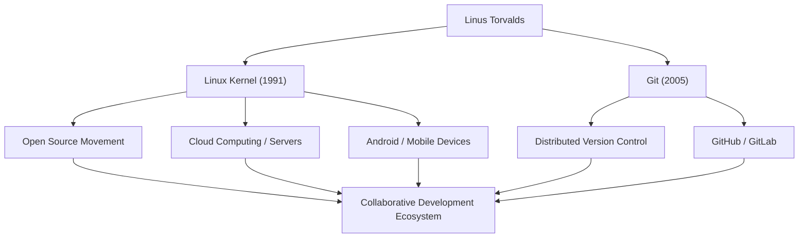

# Le Géant de l'Open Source : La Trajectoire et la Philosophie de Linus Torvalds

« Linux », le système d'exploitation qui sous-tend l'infrastructure informatique moderne et fonctionne sur d'innombrables systèmes. Et « Git », le système de contrôle de version utilisé quotidiennement par les développeurs du monde entier. Le créateur de ces deux logiciels historiques est le programmeur finlandais Linus Torvalds. Cet article plonge au cœur des innovations qu'il a apportées, de la philosophie unique qui les sous-tend, et de l'impact incommensurable qu'il a eu sur les générations futures.

## Jeunesse et naissance de Linux

Linus Torvalds est né à Helsinki, en Finlande, en 1969. Élevé par des parents journalistes, il a montré un vif intérêt pour les mathématiques et les ordinateurs dès son plus jeune âge. Un Commodore VIC-20, qu'il a découvert grâce à l'influence de son grand-père, lui a ouvert les portes de la programmation, et il a par la suite étudié l'informatique à l'Université d'Helsinki.

Sa première occasion de marquer l'histoire s'est présentée en 1991, alors qu'il était encore étudiant. Insatisfait des restrictions de licence de « MINIX », un OS éducatif largement utilisé à l'époque, il a commencé à développer un émulateur de terminal pour les machines compatibles PC/AT comme passe-temps personnel. Cela a finalement évolué pour devenir le noyau (kernel) d'un système d'exploitation et a été présenté au monde sous le nom de « Linux ».

En août de la même année, il a publié un célèbre message sur un groupe de discussion Usenet déclarant qu'il créait un « petit système d'exploitation gratuit ». Au départ, ce n'était qu'un projet personnel, mais en adoptant la licence GPL (GNU General Public License) et en publiant le code source, des hackers du monde entier ont commencé à participer à son développement. Aidé par l'ère de la démocratisation d'Internet, Linux a évolué rapidement.

## La recherche de solutions : le développement de Git

À mesure que l'échelle du développement du noyau Linux s'est étendue, la gestion des modifications de code de milliers de développeurs dispersés dans le monde entier est devenue extrêmement difficile. En 2005, ils ont été confrontés à une crise lorsque la licence gratuite du système de contrôle de version commercial qu'ils utilisaient, « BitKeeper », a été révoquée.

Constatant que les outils open source existants (tels que CVS et Subversion) ne pouvaient pas répondre à leurs exigences, Linus a décidé de développer lui-même un nouveau système de contrôle de version. Étonnamment, il a achevé la conception de base et l'implémentation initiale en quelques semaines seulement. Il s'agissait du système de contrôle de version décentralisé, « Git ».

Git a été conçu en mettant l'accent sur un modèle de développement décentralisé, des performances écrasantes et l'intégrité des données. Aujourd'hui, Git est devenu le standard de facto dans le développement de logiciels, soutenant la collaboration mondiale via des plateformes comme GitHub.

## Flux des réalisations et de l'impact

Le diagramme suivant montre le flux des principales réalisations de Linus Torvalds et l'impact qu'elles ont eu sur la société.

## La philosophie de Linus : le pragmatisme et « Just for Fun »

Les principes comportementaux et la philosophie de Linus Torvalds se caractérisent par l'accent mis sur le « pragmatisme » plutôt que sur l'idéologie. Tandis que Richard Stallman, le fondateur du mouvement du logiciel libre, plaidait pour la liberté du logiciel d'un point de vue moral et éthique, Linus soutient l'open source pour la raison très pratique que « l'open source produit de meilleurs logiciels ».

Comme le suggère le titre de son autobiographie « Just for Fun » (Il était une fois Linux), son moteur réside dans la pure curiosité intellectuelle et la joie de résoudre des problèmes techniques. Ses mots : « Les bons programmeurs n'écrivent pas du code juste parce que le programme fonctionne. Ils l'écrivent parce qu'il est beau », touchent à l'essence de la culture hacker.

Il était également connu pour son style de communication extrêmement direct (et parfois agressif). En critiquant impitoyablement le code de mauvaise qualité et les spécifications déraisonnables, il a strictement maintenu la qualité du noyau Linux. Cependant, ces dernières années, il a réfléchi à sa propre attitude et s'est efforcé d'avoir une communication plus constructive afin de maintenir la santé de la communauté. Cela peut également être vu comme une manifestation de son pragmatisme, plaçant la pérennité du projet comme la priorité absolue.

## Héritage et signification dans la société moderne

L'impact que Linus Torvalds a eu sur les générations futures va bien au-delà de la simple « création de logiciels utiles ». Ce qu'il a prouvé, c'est le fait que « des inconnus du monde entier peuvent collaborer via Internet et construire les systèmes complexes du plus haut niveau mondial ».

Aujourd'hui, 100 % des 500 meilleurs superordinateurs du monde fonctionnent sous Linux, et la base des smartphones que nous utilisons quotidiennement (Android) est également Linux. L'infrastructure cloud (telle qu'AWS, Google Cloud et Azure) ne pourrait pas exister sans Linux. Et les développeurs qui construisent ces systèmes utilisent Git aussi naturellement qu'ils respirent.

Un projet qui a commencé comme un « petit passe-temps » pour un seul programmeur est aujourd'hui devenu l'infrastructure la plus cruciale de la société numérique de l'humanité. Linus Torvalds continue d'incarner la valeur apportée par une base technologique ouverte non contrôlée par une entreprise spécifique. Sa vision technique et sa croyance en la collaboration ouverte continueront sûrement d'inspirer les futurs technologues.
