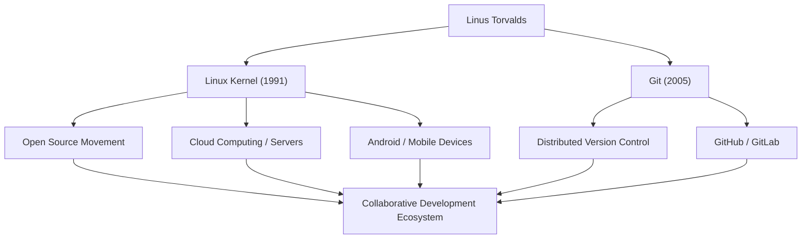

# ओपन सोर्स के दिग्गज: लिनस टोरवाल्ड्स का पथ और दर्शन

"Linux" (लिनक्स), वह ओएस (ऑपरेटिंग सिस्टम) जो आधुनिक आईटी बुनियादी ढांचे को आधार प्रदान करता है और अनगिनत प्रणालियों पर चलता है। और "Git" (गिट), वह संस्करण नियंत्रण प्रणाली जिसका उपयोग दुनिया भर के डेवलपर्स द्वारा प्रतिदिन किया जाता है। इन दो ऐतिहासिक सॉफ्टवेयर को बनाने वाले फिनलैंड के प्रोग्रामर लिनस टोरवाल्ड्स (Linus Torvalds) हैं। यह लेख उनके द्वारा लाए गए नवाचारों, उनके पीछे के अनूठे दर्शन, और भावी पीढ़ियों पर उनके द्वारा डाले गए असीमित प्रभाव पर गहराई से प्रकाश डालता है।

## प्रारंभिक जीवन और लिनक्स का जन्म

लिनस टोरवाल्ड्स का जन्म 1969 में हेलसिंकी, फिनलैंड में हुआ था। पत्रकार माता-पिता द्वारा पाले-पोसे गए, उन्होंने कम उम्र से ही गणित और कंप्यूटर में गहरी रुचि दिखाई। एक कमोडोर वीआईसी-20 (Commodore VIC-20), जिसके संपर्क में वे अपने दादाजी के प्रभाव से आए थे, ने उनके लिए प्रोग्रामिंग के द्वार खोले, और बाद में उन्होंने हेलसिंकी विश्वविद्यालय में कंप्यूटर विज्ञान का अध्ययन किया।

इतिहास में अपनी पहचान बनाने का उनका पहला अवसर 1991 में आया, जब वे अभी भी विश्वविद्यालय के छात्र थे। उस समय व्यापक रूप से उपयोग किए जाने वाले शैक्षिक ओएस "MINIX" के लाइसेंस प्रतिबंधों से असंतुष्ट होकर, उन्होंने व्यक्तिगत शौक के रूप में PC/AT संगत मशीनों के लिए एक टर्मिनल एमुलेटर विकसित करना शुरू किया। यह अंततः एक ऑपरेटिंग सिस्टम (ओएस) कर्नेल में विकसित हुआ और इसे "Linux" के रूप में दुनिया के सामने पेश किया गया।

उसी वर्ष अगस्त में, उन्होंने यूसनेट (Usenet) न्यूज़ग्रुप में एक प्रसिद्ध संदेश पोस्ट किया जिसमें कहा गया था कि वह "एक छोटा सा मुफ़्त ऑपरेटिंग सिस्टम बना रहे हैं।" प्रारंभ में, यह केवल एक व्यक्तिगत प्रोजेक्ट था, लेकिन जीपीएल (GPL - GNU General Public License) को अपनाकर और स्रोत कोड (सोर्स कोड) को जारी करके, दुनिया भर के हैकर्स इसके विकास में भाग लेने लगे। इंटरनेट के व्यापक प्रसार के युग से सहायता प्राप्त, लिनक्स तेजी से विकसित हुआ।

## समस्या समाधान की खोज: गिट (Git) का विकास

जैसे-जैसे लिनक्स कर्नेल विकास का पैमाना बढ़ा, दुनिया भर में फैले हजारों डेवलपर्स के कोड परिवर्तनों को प्रबंधित करना बेहद मुश्किल हो गया। 2005 में, उन्हें एक संकट का सामना करना पड़ा जब उनके द्वारा उपयोग किए जा रहे व्यावसायिक संस्करण नियंत्रण प्रणाली "बिटकीपर" (BitKeeper) का मुफ्त लाइसेंस रद्द कर दिया गया।

यह निर्धारित करते हुए कि मौजूदा ओपन-सोर्स टूल (जैसे कि सीवीएस और सबवर्जन) उनकी आवश्यकताओं को पूरा नहीं कर सकते हैं, लिनस ने स्वयं एक नई संस्करण नियंत्रण प्रणाली विकसित करने का निर्णय लिया। आश्चर्यजनक रूप से, उन्होंने कुछ ही हफ्तों में बुनियादी डिज़ाइन और प्रारंभिक कार्यान्वयन पूरा कर लिया। यह वितरित संस्करण नियंत्रण प्रणाली (Distributed Version Control System), "Git" थी।

गिट को विकेंद्रीकृत विकास मॉडल, शानदार प्रदर्शन, और डेटा अखंडता पर ध्यान केंद्रित करते हुए डिज़ाइन किया गया था। आज, गिट सॉफ्टवेयर विकास में एक मानक बन गया है, जो गिटहब (GitHub) जैसे प्लेटफार्मों के माध्यम से वैश्विक सहयोग का समर्थन करता है।

## उपलब्धियों और प्रभाव का प्रवाह

नीचे दिया गया चित्र लिनस टोरवाल्ड्स की प्रमुख उपलब्धियों और समाज पर उनके प्रभाव के प्रवाह को दर्शाता है।

## लिनस का दर्शन: व्यावहारिकता और "सिर्फ मनोरंजन के लिए" (Just for Fun)

लिनस टोरवाल्ड्स के व्यवहारिक सिद्धांतों और दर्शन की विशेषता यह है कि वे विचारधारा के बजाय "व्यावहारिकता" (Pragmatism) पर जोर देते हैं। जबकि फ्री सॉफ्टवेयर मूवमेंट के संस्थापक रिचर्ड स्टॉलमैन ने नैतिक और नैतिक दृष्टिकोण से सॉफ्टवेयर स्वतंत्रता की वकालत की, लिनस ओपन सोर्स का समर्थन इस अत्यधिक व्यावहारिक कारण से करते हैं कि "ओपन सोर्स बेहतर सॉफ्टवेयर बनाता है।"

जैसा कि उनकी आत्मकथा "जस्ट फॉर फन" (Just for Fun) के शीर्षक से पता चलता है, उनकी प्रेरक शक्ति शुद्ध बौद्धिक जिज्ञासा और तकनीकी समस्याओं को सुलझाने के आनंद में निहित है। उनके शब्द, "अच्छे प्रोग्रामर केवल इसलिए कोड नहीं लिखते क्योंकि प्रोग्राम काम करता है। वे इसे इसलिए लिखते हैं क्योंकि यह सुंदर है," हैकर संस्कृति के मूल को दर्शाते हैं।

उन्हें अपनी अत्यधिक स्पष्ट (और कभी-कभी आक्रामक) संचार शैली के लिए भी जाना जाता था। निम्न-गुणवत्ता वाले कोड और अनुचित विशिष्टताओं की बेरहमी से आलोचना करके, उन्होंने लिनक्स कर्नेल की गुणवत्ता को कड़ाई से बनाए रखा। हालांकि, हाल के वर्षों में, उन्होंने समुदाय के स्वास्थ्य को बनाए रखने के लिए अपने स्वयं के रवैये पर विचार किया है और अधिक रचनात्मक संचार का प्रयास किया है। इसे भी उनकी व्यावहारिकता की अभिव्यक्ति के रूप में देखा जा सकता है, जो परियोजना की स्थिरता को सर्वोच्च प्राथमिकता देती है।

## आधुनिक समाज में विरासत और महत्व

भावी पीढ़ियों पर लिनस टोरवाल्ड्स का प्रभाव केवल "उपयोगी सॉफ्टवेयर बनाने" से कहीं आगे जाता है। उन्होंने जो साबित किया वह यह तथ्य है कि "दुनिया भर के अजनबी इंटरनेट के माध्यम से सहयोग कर सकते हैं और दुनिया के उच्चतम स्तर की जटिल प्रणालियों का निर्माण कर सकते हैं।"

आज, दुनिया के शीर्ष 500 सुपर कंप्यूटरों में से 100% लिनक्स पर चलते हैं, और जिन स्मार्टफोन का हम रोजाना उपयोग करते हैं (एंड्रॉइड), उनका आधार भी लिनक्स है। क्लाउड इंफ्रास्ट्रक्चर (जैसे एडब्ल्यूएस, गूगल क्लाउड, और एज़्योर) भी लिनक्स के बिना मौजूद नहीं हो सकता। और उन प्रणालियों का निर्माण करने वाले डेवलपर्स गिट का उपयोग उतनी ही स्वाभाविकता से करते हैं जैसे वे सांस लेते हैं।

एक प्रोग्रामर के "छोटे से शौक" के रूप में शुरू हुआ प्रोजेक्ट अब मानवता के डिजिटल समाज में सबसे महत्वपूर्ण बुनियादी ढांचा बन गया है। लिनस टोरवाल्ड्स एक खुले प्रौद्योगिकी आधार द्वारा लाए गए मूल्य का प्रतीक बने हुए हैं जो किसी विशिष्ट निगम द्वारा नियंत्रित नहीं है। उनकी तकनीकी दूरदर्शिता और खुले सहयोग में उनका विश्वास निश्चित रूप से भविष्य के तकनीकी विशेषज्ञों को प्रेरित करता रहेगा।
