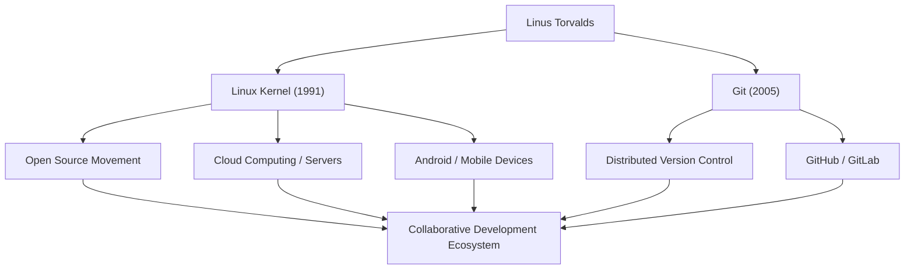

# Raksasa Open Source: Jejak dan Filosofi Linus Torvalds

"Linux," OS yang mendasari infrastruktur TI modern dan berjalan di sistem yang tak terhitung jumlahnya. Dan "Git," sistem kontrol versi yang digunakan setiap hari oleh para pengembang di seluruh dunia. Pencipta dua perangkat lunak bersejarah ini adalah programmer asal Finlandia, Linus Torvalds. Artikel ini menggali lebih dalam tentang inovasi yang ia hasilkan, filosofi unik di baliknya, dan dampak tak terukur yang telah ia berikan pada generasi mendatang.

## Kehidupan Awal dan Kelahiran Linux

Linus Torvalds lahir di Helsinki, Finlandia, pada tahun 1969. Dibesarkan oleh orang tua jurnalis, ia menunjukkan minat yang kuat pada matematika dan komputer sejak usia muda. Sebuah Commodore VIC-20, yang ia kenal melalui pengaruh kakeknya, membuka pintu pemrograman baginya, dan ia kemudian belajar ilmu komputer di Universitas Helsinki.

Kesempatan pertamanya untuk meninggalkan jejak dalam sejarah datang pada tahun 1991 saat ia masih menjadi mahasiswa. Merasa tidak puas dengan batasan lisensi "MINIX," sebuah OS pendidikan yang banyak digunakan saat itu, ia mulai mengembangkan emulator terminal untuk mesin yang kompatibel dengan PC/AT sebagai hobi pribadinya. Ini akhirnya berkembang menjadi kernel sistem operasi (OS) dan dirilis ke dunia sebagai "Linux."

Pada bulan Agustus di tahun yang sama, ia memposting pesan terkenal ke grup berita Usenet yang menyatakan bahwa ia sedang membuat "sistem operasi gratis yang kecil." Awalnya, itu hanyalah proyek pribadi, tetapi dengan mengadopsi GPL (GNU General Public License) dan merilis kode sumbernya, peretas dari seluruh dunia mulai berpartisipasi dalam pengembangannya. Dibantu oleh era adopsi internet yang luas, Linux berkembang dengan pesat.

## Pengejaran Pemecahan Masalah: Pengembangan Git

Seiring dengan bertambahnya skala pengembangan kernel Linux, mengelola perubahan kode dari ribuan pengembang yang tersebar di seluruh dunia menjadi sangat sulit. Pada tahun 2005, mereka menghadapi krisis ketika lisensi gratis untuk sistem kontrol versi komersial yang mereka gunakan, "BitKeeper," dicabut.

Menyimpulkan bahwa alat sumber terbuka (open-source) yang ada (seperti CVS dan Subversion) tidak dapat memenuhi kebutuhan mereka, Linus memutuskan untuk mengembangkan sistem kontrol versi baru sendiri. Hebatnya, ia menyelesaikan desain dasar dan implementasi awal hanya dalam beberapa minggu. Ini adalah sistem kontrol versi terdistribusi, "Git."

Git dirancang dengan fokus pada model pengembangan terdesentralisasi, kinerja yang luar biasa, dan integritas data. Saat ini, Git telah menjadi standar de facto dalam pengembangan perangkat lunak, mendukung kolaborasi global melalui platform seperti GitHub.

## Alur Pencapaian dan Dampak

Diagram berikut menunjukkan alur pencapaian utama Linus Torvalds dan dampaknya terhadap masyarakat.

## Filosofi Linus: Pragmatisme dan "Just for Fun"

Prinsip perilaku dan filosofi Linus Torvalds ditandai dengan penekanan pada "Pragmatisme" daripada ideologi. Sementara Richard Stallman, pendiri gerakan perangkat lunak bebas, mengadvokasi kebebasan perangkat lunak dari perspektif moral dan etika, Linus mendukung sumber terbuka karena alasan yang sangat praktis, yaitu "sumber terbuka menghasilkan perangkat lunak yang lebih baik."

Seperti yang tersirat dari judul otobiografinya "Just for Fun" (Hanya untuk Bersenang-senang), kekuatan pendorongnya terletak pada rasa ingin tahu intelektual yang murni dan kegembiraan dalam memecahkan masalah teknis. Kata-katanya, "Programmer yang baik tidak menulis kode hanya karena program itu berfungsi. Mereka menulisnya karena kode itu indah," sangat mengena pada inti budaya peretas (hacker).

Ia juga dikenal dengan gaya komunikasinya yang sangat blak-blakan (dan terkadang agresif). Dengan mengkritik tanpa henti kode berkualitas rendah dan spesifikasi yang tidak masuk akal, ia dengan ketat menjaga kualitas kernel Linux. Namun dalam beberapa tahun terakhir, ia telah merenungkan sikapnya sendiri dan berupaya untuk melakukan komunikasi yang lebih konstruktif demi menjaga kesehatan komunitas. Hal ini juga dapat dilihat sebagai manifestasi dari pragmatismenya, menempatkan keberlanjutan proyek sebagai prioritas tertinggi.

## Warisan dan Signifikansi dalam Masyarakat Modern

Dampak yang diberikan Linus Torvalds pada generasi mendatang jauh melampaui sekadar "membuat perangkat lunak yang berguna." Apa yang ia buktikan adalah fakta bahwa "orang asing dari seluruh dunia dapat berkolaborasi melalui internet dan membangun sistem kompleks tingkat tertinggi di dunia."

Saat ini, 100% dari 500 superkomputer teratas di dunia berjalan dengan Linux, dan fondasi ponsel pintar yang kita gunakan setiap hari (Android) juga adalah Linux. Infrastruktur cloud (seperti AWS, Google Cloud, dan Azure) juga tidak akan ada tanpa Linux. Dan para pengembang yang membangun sistem tersebut menggunakan Git secara alami seperti bernapas.

Sebuah proyek yang dimulai sebagai "hobi kecil" untuk seorang programmer kini telah berkembang menjadi infrastruktur paling penting dalam masyarakat digital umat manusia. Linus Torvalds terus mewujudkan nilai yang dibawa oleh fondasi teknologi terbuka yang tidak dikendalikan oleh perusahaan tertentu. Visi teknis dan keyakinannya pada kolaborasi terbuka pasti akan terus menginspirasi para pakar teknologi di masa depan.
