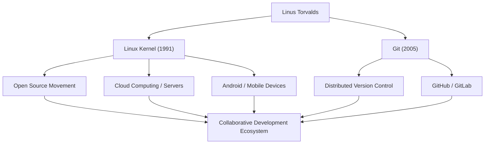

# 오픈 소스의 거성: 리누스 토발즈의 궤적과 철학

현대 IT 인프라를 지탱하며 수많은 시스템에서 가동되고 있는 운영 체제(OS) 'Linux(리눅스)'. 그리고 전 세계 개발자들이 매일 사용하는 버전 관리 시스템 'Git(깃)'. 이 두 가지 역사적인 소프트웨어를 만들어낸 사람이 바로 핀란드 출신의 프로그래머 리누스 토발즈(Linus Torvalds)입니다. 본 기사에서는 그가 창출한 혁신과 그 이면에 있는 독자적인 철학, 그리고 후세에 미친 헤아릴 수 없는 영향에 대해 깊이 파헤쳐 봅니다.

## 성장 배경과 리눅스의 탄생

리누스 토발즈는 1969년 핀란드 헬싱키에서 태어났습니다. 언론인 부모 밑에서 자란 그는 어린 시절부터 수학과 컴퓨터에 큰 관심을 보였습니다. 할아버지의 영향으로 접하게 된 Commodore VIC-20이 그를 프로그래밍의 세계로 안내했고, 이후 헬싱키 대학교에서 컴퓨터 과학을 전공하게 됩니다.

그가 역사에 이름을 남기게 된 첫 번째 계기는 1991년, 아직 대학생이던 시절이었습니다. 당시 널리 사용되던 교육용 OS 'MINIX'의 라이선스 제한에 불만을 품은 그는 개인적인 취미로 PC/AT 호환 기종을 위한 터미널 에뮬레이터 개발을 시작했습니다. 이것이 결국 운영 체제(OS)의 커널로 발전하여 'Linux'라는 이름으로 세상에 나오게 됩니다.

같은 해 8월, 그는 Usenet 뉴스그룹에 "작고 무료인 운영 체제를 만들고 있다"는 유명한 메시지를 올렸습니다. 처음에는 단지 개인적인 프로젝트에 불과했지만, GPL(GNU 일반 공중 사용 허가서)을 채택하고 소스 코드를 공개함으로써 전 세계 해커들이 개발에 참여하기 시작했습니다. 인터넷 보급이라는 시대적 배경에 힘입어 리눅스는 빠르게 진화해 나갔습니다.

## 문제 해결의 추구: Git의 개발

리눅스 커널 개발 규모가 커짐에 따라, 전 세계에 흩어져 있는 수천 명의 개발자가 제출하는 코드 변경 사항을 관리하는 것이 매우 어려워졌습니다. 2005년, 그동안 사용하던 상용 버전 관리 시스템 'BitKeeper'의 무료 라이선스가 철회되는 위기에 직면하게 됩니다.

기존의 오픈 소스 도구(CVS, Subversion 등)로는 요구 사항을 충족할 수 없다고 판단한 리누스는 직접 새로운 버전 관리 시스템을 개발하기로 결심합니다. 놀랍게도 그는 불과 몇 주 만에 기본 설계와 초기 구현을 완성했습니다. 이것이 바로 분산형 버전 관리 시스템 'Git'입니다.

Git은 비중앙 집중식 개발 모델, 압도적인 성능, 그리고 데이터 무결성을 중시하여 설계되었습니다. 현재 Git은 소프트웨어 개발의 사실상 표준이 되었으며, GitHub 등의 플랫폼을 통해 전 세계적인 협업을 뒷받침하고 있습니다.

## 업적과 영향의 흐름도

다음 다이어그램은 리누스 토발즈의 주요 업적과 그것이 사회에 미친 영향의 흐름을 보여줍니다.

## 리누스의 철학: 실용주의와 "Just for Fun"

리누스 토발즈의 행동 원리나 철학은 이데올로기보다 '실용성(Pragmatism)'에 무게를 두고 있다는 점이 특징입니다. 자유 소프트웨어 운동의 창시자인 리처드 스톨만이 도덕적·윤리적 관점에서 소프트웨어의 자유를 주장한 반면, 리누스는 "오픈 소스가 더 뛰어난 소프트웨어를 만들 수 있기 때문"이라는 지극히 현실적인 이유로 오픈 소스를 지지합니다.

그의 자서전 제목 《그냥 재미로(Just for Fun)》가 보여주듯, 그의 원동력은 순수한 지적 호기심과 기술적 문제를 해결하는 즐거움에 있습니다. "뛰어난 프로그래머는 프로그램이 작동하기 때문에 코드를 작성하는 것이 아니다. 아름답기 때문에 작성하는 것이다"라는 그의 말은 해커 문화의 진수를 보여줍니다.

또한, 그는 매우 직설적이고 때로는 과격한 의사소통 스타일로도 알려져 있었습니다. 품질이 떨어지는 코드나 불합리한 사양에 대해서는 가차 없이 비판을 가함으로써 리눅스 커널의 품질을 엄격하게 유지해 왔습니다. 그러나 최근에는 커뮤니티의 건전성을 유지하기 위해 자신의 태도를 반성하고, 보다 건설적인 의사소통을 위해 노력하고 있습니다. 이 역시 프로젝트의 지속 가능성을 최우선으로 여기는 실용주의의 발현이라고 할 수 있습니다.

## 후세에 미친 영향과 현대 사회에서의 의의

리누스 토발즈가 후세에 미친 영향은 단순히 '유용한 소프트웨어를 만들었다'는 틀에 국한되지 않습니다. 그가 증명한 것은 "인터넷을 통해 일면식도 없는 사람들이 협력하여 세계 최고 수준의 복잡한 시스템을 구축할 수 있다"는 사실입니다.

오늘날 세계 500대 슈퍼컴퓨터의 100%가 리눅스로 구동되며, 우리가 매일 사용하는 스마트폰(Android)의 기반도 리눅스입니다. 클라우드 인프라(AWS, Google Cloud, Azure 등) 역시 리눅스 없이는 성립될 수 없습니다. 그리고 이러한 시스템을 구축하는 개발자들은 숨을 쉬듯 자연스럽게 Git을 사용하고 있습니다.

한 프로그래머의 '작은 취미'에서 시작된 프로젝트는 이제 인류의 디지털 사회에서 가장 중요한 인프라로 성장했습니다. 특정 기업에 지배되지 않는 개방형 기술 기반이 가져다주는 가치를 계속해서 구현해 나가고 있는 리누스 토발즈. 그의 기술적 선견지명과 열린 협업에 대한 신념은 앞으로도 미래의 기술자들에게 지속적인 영감을 줄 것입니다.
