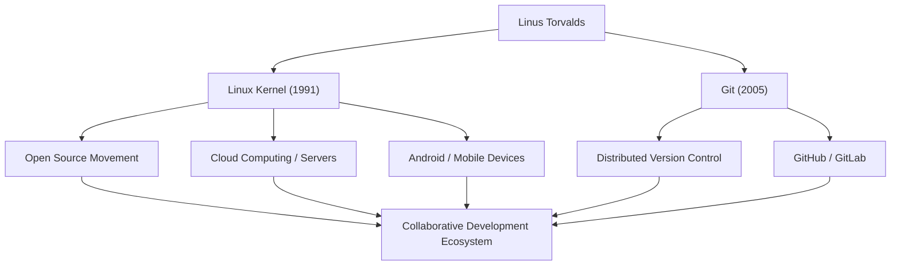

# オープンソースの巨星：リーナス・トーバルズの軌跡と哲学

現代のITインフラを支え、数え切れないほどのシステムで稼働しているOS「Linux」。そして、世界中の開発者が日々利用するバージョン管理システム「Git」。これら2つの歴史的ソフトウェアを生み出したのが、フィンランド出身のプログラマー、リーナス・トーバルズ（Linus Torvalds）です。本記事では、彼が生み出した革新と、その背景にある独自の哲学、そして後世に与えた計り知れない影響について深く掘り下げます。

## 生い立ちとLinuxの誕生

リーナス・トーバルズは1969年、フィンランドのヘルシンキで生まれました。ジャーナリストの両親のもとに育った彼は、幼少期から数学やコンピュータに強い関心を示しました。祖父の影響で触れたCommodore VIC-20が彼のプログラミングへの扉を開き、その後ヘルシンキ大学で計算機科学を学ぶことになります。

彼が歴史に名を刻む最初の契機は1991年、大学在学中のことでした。当時広く使われていた教育用OS「MINIX」のライセンス制限に不満を抱いた彼は、自らの趣味としてPC/AT互換機向けのターミナルエミュレータの開発を始めます。これが後にオペレーティングシステム（OS）のカーネルへと発展し、「Linux」として世に送り出されることになります。

同年8月、彼はUsenetのニュースグループに「ちょっとした無料のOSを作っている」という有名なメッセージを投稿しました。当初は単なる個人的なプロジェクトに過ぎませんでしたが、GPL（GNU General Public License）を採用してソースコードを公開したことで、世界中のハッカーたちが開発に参加し始めます。インターネットの普及という時代背景も後押しし、Linuxは急速に進化を遂げていきました。

## 課題解決の追求：Gitの開発

Linuxカーネルの開発規模が拡大するにつれ、世界中に散らばる何千人もの開発者からのコード変更を管理することは極めて困難になっていきました。2005年、それまで使用していた商用のバージョン管理システム「BitKeeper」の無料ライセンスが撤回されるという危機に直面します。

既存のオープンソースツール（CVSやSubversionなど）では要件を満たせないと判断したリーナスは、自らの手で新たなバージョン管理システムを開発することを決意します。驚くべきことに、彼はわずか数週間で基本設計と初期実装を完成させました。これが分散型バージョン管理システム「Git」です。

Gitは、非中央集権的な開発モデル、圧倒的なパフォーマンス、そしてデータの完全性を重視して設計されました。現在、Gitはソフトウェア開発のデファクトスタンダードとなっており、GitHubなどのプラットフォームを通じて世界中のコラボレーションを支えています。

## 功績と影響のフロー

以下の図は、リーナス・トーバルズの主要な功績と、それが社会に与えた影響のフローを示しています。

## リーナスの哲学：実用主義と「Just for Fun」

リーナス・トーバルズの行動原理や哲学は、イデオロギーよりも「実用性（Pragmatism）」に重きを置いている点に特徴があります。フリーソフトウェア運動の創始者であるリチャード・ストールマンが道徳的・倫理的な観点からソフトウェアの自由を主張したのに対し、リーナスは「オープンソースのほうが優れたソフトウェアを作れるから」という極めて現実的な理由でオープンソースを支持しています。

彼の自伝のタイトル『それがぼくには楽しかったから（Just for Fun）』が示すように、彼の原動力は純粋な知的好奇心と、技術的な問題を解決する楽しさにあります。「優れたプログラマーは、プログラムが動くからコードを書くのではない。美しいから書くのだ」という彼の言葉は、ハッカー文化の真髄を突いています。

また、彼は非常に率直（時に過激）なコミュニケーションスタイルでも知られていました。質の低いコードや不条理な仕様に対しては容赦なく批判を浴びせることで、Linuxカーネルの品質を厳格に保ってきました。しかし近年では、コミュニティの健全性を保つために自身の態度を反省し、より建設的なコミュニケーションに努めるようになっています。これもまた、プロジェクトの持続可能性を最優先する彼の実用主義の表れと言えるでしょう。

## 後世への影響と現代社会における意義

リーナス・トーバルズが後世に与えた影響は、単に「便利なソフトウェアを作った」という枠に収まりません。彼が証明したのは、「インターネットを通じて見ず知らずの人々が協働し、世界最高峰の複雑なシステムを構築できる」という事実です。

今日、世界のトップ500のスーパーコンピュータの100%がLinuxで稼働し、私たちが普段利用しているスマートフォン（Android）の基盤もLinuxです。クラウドインフラ（AWS、Google Cloud、Azureなど）もLinuxなしには成立しません。そして、それらのシステムを構築する開発者たちは、息をするようにGitを使用しています。

一人のプログラマーの「ちょっとした趣味」から始まったプロジェクトは、今や人類のデジタル社会における最も重要なインフラストラクチャへと成長しました。特定の企業に支配されないオープンな技術基盤がもたらす価値を体現し続けているリーナス・トーバルズ。彼の技術的先見性と、オープンなコラボレーションへの信念は、これからも未来の技術者たちにインスピレーションを与え続けることでしょう。
