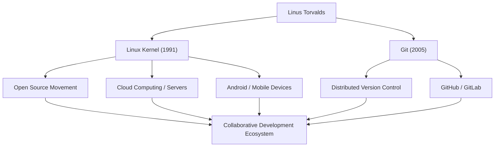

# O Gigante do Código Aberto: A Trajetória e Filosofia de Linus Torvalds

"Linux", o sistema operacional que sustenta a moderna infraestrutura de TI e roda em incontáveis sistemas. E "Git", o sistema de controle de versão usado diariamente por desenvolvedores em todo o mundo. O criador desses dois softwares históricos é o programador finlandês Linus Torvalds. Este artigo aprofunda as inovações que ele trouxe, a filosofia única por trás delas e o impacto imensurável que ele teve nas gerações futuras.

## Início da Vida e o Nascimento do Linux

Linus Torvalds nasceu em Helsinque, na Finlândia, em 1969. Criado por pais jornalistas, ele demonstrou forte interesse por matemática e computadores desde jovem. Um Commodore VIC-20, com o qual teve contato por influência do avô, abriu-lhe as portas da programação e, mais tarde, ele foi estudar ciência da computação na Universidade de Helsinque.

Sua primeira oportunidade de deixar sua marca na história surgiu em 1991, quando ainda era estudante universitário. Insatisfeito com as restrições de licença do "MINIX", um SO educacional amplamente utilizado na época, ele começou a desenvolver um emulador de terminal para máquinas compatíveis com PC/AT como um hobby pessoal. Isso eventualmente evoluiu para o núcleo (kernel) de um sistema operacional e foi lançado para o mundo como "Linux".

Em agosto do mesmo ano, ele publicou uma famosa mensagem em um grupo de notícias Usenet afirmando que estava criando um "pequeno sistema operacional gratuito". Inicialmente, era apenas um projeto pessoal, mas ao adotar a GPL (GNU General Public License) e liberar o código-fonte, hackers de todo o mundo começaram a participar do seu desenvolvimento. Ajudado pela era da disseminação da internet, o Linux evoluiu rapidamente.

## A Busca por Soluções: O Desenvolvimento do Git

À medida que a escala do desenvolvimento do kernel do Linux se expandia, gerenciar as alterações de código de milhares de desenvolvedores espalhados pelo mundo tornou-se extremamente difícil. Em 2005, a comunidade enfrentou uma crise quando a licença gratuita do sistema comercial de controle de versão que vinham utilizando, o "BitKeeper", foi revogada.

Determinando que as ferramentas de código aberto existentes (como CVS e Subversion) não podiam atender aos seus requisitos, Linus decidiu desenvolver ele mesmo um novo sistema de controle de versão. Surpreendentemente, ele concluiu o projeto básico e a implementação inicial em apenas algumas semanas. Este foi o sistema de controle de versão distribuído, "Git".

O Git foi projetado com foco em um modelo de desenvolvimento descentralizado, desempenho avassalador e integridade de dados. Hoje, o Git se tornou o padrão de fato no desenvolvimento de software, apoiando a colaboração global por meio de plataformas como o GitHub.

## Fluxo de Conquistas e Impacto

O diagrama a seguir mostra o fluxo das principais conquistas de Linus Torvalds e o impacto que tiveram na sociedade.

## A Filosofia de Linus: Pragmatismo e "Just for Fun"

Os princípios comportamentais e a filosofia de Linus Torvalds são caracterizados por uma ênfase no "Pragmatismo" em vez da ideologia. Enquanto Richard Stallman, o fundador do movimento do software livre, defendia a liberdade do software de uma perspectiva moral e ética, Linus apoia o código aberto por uma razão extremamente prática: "o código aberto produz um software melhor".

Como sugere o título de sua autobiografia, "Just for Fun" (Apenas por Diversão), sua força motriz reside na pura curiosidade intelectual e na alegria de resolver problemas técnicos. Suas palavras: "Bons programadores não escrevem código apenas porque o programa funciona. Eles escrevem porque é belo", atingem o cerne da cultura hacker.

Ele também era conhecido por seu estilo de comunicação extremamente direto (e às vezes agressivo). Ao criticar implacavelmente códigos de baixa qualidade e especificações irracionais, ele manteve estritamente a qualidade do kernel do Linux. Nos últimos anos, porém, ele tem refletido sobre sua própria atitude e se esforçado para ter uma comunicação mais construtiva, a fim de manter a saúde da comunidade. Isso também pode ser visto como uma manifestação de seu pragmatismo, colocando a sustentabilidade do projeto como prioridade máxima.

## Legado e Significado na Sociedade Moderna

O impacto que Linus Torvalds teve nas gerações futuras vai muito além de simplesmente "criar softwares úteis". O que ele provou foi o fato de que "estranhos de todo o mundo podem colaborar via internet e construir os sistemas complexos de mais alto nível do mundo".

Hoje, 100% dos 500 melhores supercomputadores do mundo rodam Linux, e a base dos smartphones que usamos diariamente (Android) também é o Linux. A infraestrutura em nuvem (como AWS, Google Cloud e Azure) também não poderia existir sem o Linux. E os desenvolvedores que constroem esses sistemas usam o Git tão naturalmente quanto respiram.

Um projeto que começou como um "pequeno hobby" para um programador cresceu e se tornou a infraestrutura mais crucial na sociedade digital da humanidade. Linus Torvalds continua a incorporar o valor trazido por uma base de tecnologia aberta não controlada por nenhuma corporação específica. Sua visão técnica e sua crença na colaboração aberta certamente continuarão a inspirar os futuros tecnólogos.
