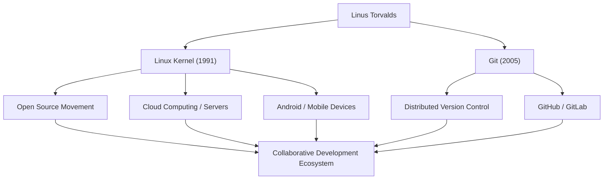

# Гигант Open Source: Путь и Философия Линуса Торвальдса

«Linux» — операционная система, лежащая в основе современной ИТ-инфраструктуры и работающая на бесчисленном множестве устройств. И «Git» — система контроля версий, ежедневно используемая разработчиками по всему миру. Создателем этих двух исторических программных продуктов является финский программист Линус Торвальдс (Linus Torvalds). В этой статье мы подробно рассмотрим инновации, которые он привнес, уникальную философию, лежащую в их основе, и неоценимое влияние, которое он оказал на будущие поколения.

## Ранние годы и рождение Linux

Линус Торвальдс родился в Хельсинки, Финляндия, в 1969 году. Выросший в семье журналистов, он с ранних лет проявлял сильный интерес к математике и компьютерам. Commodore VIC-20, с которым он познакомился благодаря своему дедушке, открыл для него двери в программирование, и позже он поступил в Хельсинкский университет для изучения компьютерных наук.

Его первая возможность оставить след в истории появилась в 1991 году, когда он еще был студентом университета. Недовольный лицензионными ограничениями «MINIX», популярной в то время учебной ОС, он начал в качестве личного хобби разрабатывать эмулятор терминала для PC/AT-совместимых компьютеров. В конечном итоге это переросло в ядро операционной системы (ОС) и было выпущено в мир под названием «Linux».

В августе того же года он опубликовал знаменитое сообщение в группе новостей Usenet, заявив, что создает «небольшую бесплатную операционную систему». Изначально это был просто личный проект, но после принятия лицензии GPL (GNU General Public License) и открытия исходного кода, хакеры со всего мира начали участвовать в его разработке. Благодаря эпохе широкого распространения интернета, Linux развивался стремительными темпами.

## Стремление к решению проблем: Разработка Git

По мере расширения масштабов разработки ядра Linux управление изменениями кода от тысяч разработчиков, разбросанных по всему миру, становилось крайне сложным. В 2005 году сообщество столкнулось с кризисом, когда была отозвана бесплатная лицензия на коммерческую систему контроля версий «BitKeeper», которую они использовали.

Решив, что существующие open-source инструменты (такие как CVS и Subversion) не удовлетворяют их требованиям, Линус решил разработать новую систему контроля версий самостоятельно. Удивительно, но он завершил базовое проектирование и первоначальную реализацию всего за несколько недель. Так появилась распределенная система контроля версий «Git».

При проектировании Git основное внимание уделялось децентрализованной модели разработки, ошеломляющей производительности и целостности данных. Сегодня Git стал стандартом де-факто в разработке программного обеспечения, поддерживая глобальное сотрудничество через такие платформы, как GitHub.

## Схема достижений и влияния

На следующей диаграмме показана связь основных достижений Линуса Торвальдса и их влияния на общество.

## Философия Линуса: Прагматизм и «Just for Fun»

Принципы поведения и философия Линуса Торвальдса характеризуются акцентом на «прагматизм», а не на идеологию. В то время как Ричард Столлман, основатель движения за свободное программное обеспечение, выступал за свободу ПО с моральной и этической точек зрения, Линус поддерживает open source по очень практичной причине: «открытый исходный код позволяет создавать лучшее программное обеспечение».

Как следует из названия его автобиографии «Just for Fun» (Ради забавы), его движущей силой является чистое интеллектуальное любопытство и радость от решения технических проблем. Его слова: «Хорошие программисты не пишут код только потому, что программа работает. Они пишут его, потому что он прекрасен», — отражают саму суть хакерской культуры.

Он также был известен своим крайне прямолинейным (а иногда и агрессивным) стилем общения. Безжалостно критикуя некачественный код и необоснованные спецификации, он строго поддерживал качество ядра Linux. Однако в последние годы он пересмотрел свое отношение и стал стремиться к более конструктивному общению ради поддержания здоровой атмосферы в сообществе. Это также можно рассматривать как проявление его прагматизма, ставящего устойчивость проекта на первое место.

## Наследие и значение в современном обществе

Влияние, которое Линус Торвальдс оказал на будущие поколения, выходит далеко за рамки просто «создания полезного программного обеспечения». Он доказал тот факт, что «незнакомые люди со всего мира могут сотрудничать через интернет и создавать сложнейшие в мире системы».

Сегодня 100% из 500 лучших суперкомпьютеров мира работают на Linux, и основа смартфонов, которыми мы пользуемся каждый день (Android), — это тоже Linux. Облачная инфраструктура (например, AWS, Google Cloud и Azure) также не могла бы существовать без Linux. А разработчики, создающие эти системы, используют Git так же естественно, как дышат.

Проект, начавшийся как «небольшое хобби» одного программиста, теперь превратился в самую важную инфраструктуру цифрового общества человечества. Линус Торвальдс продолжает воплощать ценность, которую приносит открытая технологическая база, не контролируемая какой-либо конкретной корпорацией. Его техническое предвидение и вера в открытое сотрудничество, несомненно, будут продолжать вдохновлять технологов будущего.
