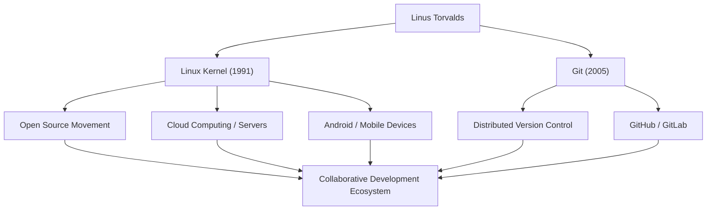

# 开源巨星：林纳斯·托瓦兹的轨迹与哲学

支撑现代IT基础设施、在无数系统上运行的操作系统“Linux”。以及，全球开发者每天都在使用的版本控制系统“Git”。创造了这两个历史性软件的，是来自芬兰的程序员林纳斯·托瓦兹（Linus Torvalds）。本文将深入探讨他所带来的创新、其背后的独特哲学，以及对后世产生的不可估量的影响。

## 早年生活与Linux的诞生

林纳斯·托瓦兹于1969年出生于芬兰赫尔辛基。他在记者父母的抚养下长大，从小就对数学和计算机表现出浓厚的兴趣。受祖父影响接触到的Commodore VIC-20为他打开了编程的大门，之后他进入赫尔辛基大学学习计算机科学。

他名留青史的第一个契机发生在1991年，当时他还在上大学。他对当时广泛使用的教育用操作系统“MINIX”的许可限制感到不满，于是开始作为个人爱好为PC/AT兼容机开发终端模拟器。这最终发展成为操作系统（OS）的内核，并作为“Linux”问世。

同年8月，他在Usenet新闻组发布了一条著名的消息：“我正在做一个小型的免费操作系统”。起初这只是一个个人项目，但通过采用GPL（GNU通用公共许可证）并公开源代码，世界各地的黑客开始参与开发。在互联网普及的时代背景推动下，Linux实现了快速进化。

## 对解决问题的追求：Git的开发

随着Linux内核开发规模的扩大，管理散布在全球各地的数千名开发者的代码更改变得极其困难。2005年，他们面临着一场危机：之前使用的商业版本控制系统“BitKeeper”取消了免费许可。

林纳斯认为现有的开源工具（如CVS和Subversion）无法满足要求，于是决定亲自开发一个新的版本控制系统。令人惊讶的是，他仅用了几周时间就完成了基础设计和初始实现。这就是分布式版本控制系统“Git”。

Git的设计非常重视去中心化的开发模式、压倒性的性能以及数据的完整性。如今，Git已成为软件开发的行业标准，通过GitHub等平台支撑着全球的协作。

## 成就与影响的流程

下图展示了林纳斯·托瓦兹的主要成就及其对社会产生影响的流程。

## 林纳斯的哲学：实用主义与“Just for Fun”

林纳斯·托瓦兹的行为准则和哲学的特点在于，相比于意识形态，他更看重“实用性（Pragmatism）”。自由软件运动的创始人理查德·斯托曼从道德和伦理的角度主张软件的自由，而林纳斯支持开源的原因则非常现实：“因为开源能开发出更好的软件”。

正如他的自传标题《只是为了好玩（Just for Fun）》所表明的那样，他的动力源于纯粹的求知欲和解决技术问题的乐趣。“优秀的程序员写代码不是因为程序能运行，而是因为它优美”，他的这句话直击黑客文化的精髓。

此外，他极其直率（有时甚至有些过激）的沟通风格也广为人知。通过对低质量代码和不合理规范毫不留情的批评，他严格保持了Linux内核的质量。然而近年来，为了维护社区的健康发展，他反省了自己的态度，并努力进行更具建设性的沟通。这也可以说是他将项目的可持续性放在首位的实用主义的体现。

## 对后世的影响与在现代社会中的意义

林纳斯·托瓦兹对后世的影响，远非“开发了便利的软件”所能概括。他证明了一个事实：“通过互联网，素不相识的人们可以相互协作，构建出世界上最复杂的系统”。

今天，全球前500台超级计算机100%都运行在Linux上，我们日常使用的智能手机（Android）的基础也是Linux。云基础设施（AWS、Google Cloud、Azure等）如果没有Linux也无法成立。而且，构建这些系统的开发者们，正像呼吸一样自然地使用着Git。

一个始于某位程序员“小爱好”的项目，如今已成长为人类数字社会最重要的基础设施。林纳斯·托瓦兹不断体现着不受特定企业控制的开放技术基础所带来的价值。他的技术远见和对开放协作的信念，必将继续激励未来的技术人员。
