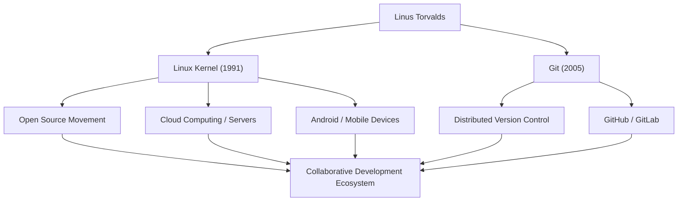

# 開源巨星：林納斯·托瓦茲的軌跡與哲學

支撐現代IT基礎設施、在無數系統上運行的作業系統「Linux」。以及，全球開發者每天都在使用的版本控制系統「Git」。創造了這兩個歷史性軟體的，是來自芬蘭的程式設計師林納斯·托瓦茲（Linus Torvalds）。本文將深入探討他所帶來的創新、其背後的獨特哲學，以及對後世產生的不可估量的影響。

## 早年生活與Linux的誕生

林納斯·托瓦茲於1969年出生於芬蘭赫爾辛基。他在記者父母的撫養下長大，從小就對數學和電腦表現出濃厚的興趣。受祖父影響接觸到的Commodore VIC-20為他打開了程式設計的大門，之後他進入赫爾辛基大學學習計算機科學。

他名留青史的第一個契機發生在1991年，當時他還在上大學。他對當時廣泛使用的教育用作業系統「MINIX」的許可限制感到不滿，於是開始作為個人愛好為PC/AT相容機開發終端模擬器。這最終發展成為作業系統（OS）的核心，並作為「Linux」問世。

同年8月，他在Usenet新聞群組發布了一條著名的訊息：「我正在做一個小型的免費作業系統」。起初這只是一個個人專案，但透過採用GPL（GNU通用公共授權條款）並公開原始碼，世界各地的駭客開始參與開發。在網際網路普及的時代背景推動下，Linux實現了快速進化。

## 對解決問題的追求：Git的開發

隨著Linux核心開發規模的擴大，管理散佈在全球各地的數千名開發者的程式碼更改變得極其困難。2005年，他們面臨著一場危機：之前使用的商業版本控制系統「BitKeeper」取消了免費授權。

林納斯認為現有的開源工具（如CVS和Subversion）無法滿足要求，於是決定親自開發一個新的版本控制系統。令人驚訝的是，他僅用了幾週時間就完成了基礎設計和初始實作。這就是分散式版本控制系統「Git」。

Git的設計非常重視去中心化的開發模式、壓倒性的效能以及資料的完整性。如今，Git已成為軟體開發的行業標準，透過GitHub等平台支撐著全球的協作。

## 成就與影響的流程

下圖展示了林納斯·托瓦茲的主要成就及其對社會產生影響的流程。

## 林納斯的哲學：實用主義與「Just for Fun」

林納斯·托瓦茲的行為準則和哲學的特點在於，相比於意識形態，他更看重「實用性（Pragmatism）」。自由軟體運動的創始人理查德·斯托曼從道德和倫理的角度主張軟體的自由，而林納斯支持開源的原因則非常現實：「因為開源能開發出更好的軟體」。

正如他的自傳標題《只是為了好玩（Just for Fun）》所表明的那樣，他的動力源於純粹的求知慾和解決技術問題的樂趣。「優秀的程式設計師寫程式碼不是因為程式能運行，而是因為它優美」，他的這句話直擊駭客文化的精髓。

此外，他極其直率（有時甚至有些過激）的溝通風格也廣為人知。透過對低品質程式碼和不合理規範毫不留情的批評，他嚴格保持了Linux核心的品質。然而近年來，為了維護社群的健康發展，他反省了自己的態度，並努力進行更具建設性的溝通。這也可以說是他將專案的可持續性放在首位的實用主義的體現。

## 對後世的影響與在現代社會中的意義

林納斯·托瓦茲對後世的影響，遠非「開發了便利的軟體」所能概括。他證明了一個事實：「透過網際網路，素不相識的人們可以相互協作，構建出世界上最複雜的系統」。

今天，全球前500台超級電腦100%都運行在Linux上，我們日常使用的智慧型手機（Android）的基礎也是Linux。雲端基礎設施（AWS、Google Cloud、Azure等）如果沒有Linux也無法成立。而且，構建這些系統的開發者們，正像呼吸一樣自然地使用著Git。

一個始於某位程式設計師「小愛好」的專案，如今已成長為人類數位社會最重要的基礎設施。林納斯·托瓦茲不斷體現著不受特定企業控制的開放技術基礎所帶來的價值。他的技術遠見和對開放協作的信念，必將繼續激勵未來的技術人員。
