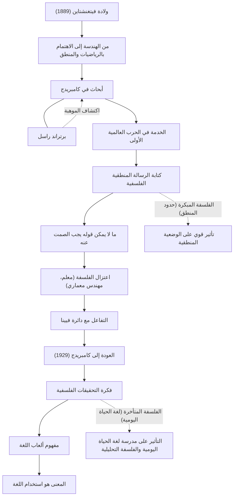

لودفيغ فيتغنشتاين (Ludwig Wittgenstein، 1889–1951) هو واحد من أهم الفلاسفة وأكثرهم تأثيراً في القرن العشرين. تنقسم فلسفته بشكل عام إلى فترتين: الفترة المبكرة التي استكشف فيها حدود اللغة والمنطق، والفترة المتأخرة التي ركزت على استخدام اللغة اليومية. من النادر جدًا في تاريخ الفكر أن يقوم فيلسوف في حياته بهدم نظرياته السابقة من جذورها ويؤسس نظامين فلسفيين مختلفين تمامًا.

## من الابن الأصغر لعائلة ثرية في فيينا إلى كامبريدج

ولد فيتغنشتاين عام 1889 في فيينا، عاصمة الإمبراطورية النمساوية المجرية، في واحدة من أغنى عائلات صناعة الصلب في أوروبا. نشأ محاطًا بالموسيقى والفن منذ صغره، وكان قصره يزوره شخصيات مثل برامز ومالر. ومع ذلك، كانت البيئة الأسرية معقدة، وعانت من مأساة انتحار إخوته واحداً تلو الآخر.

في البداية، انتقل إلى برلين ثم مانشستر في إنجلترا لدراسة الهندسة. أثناء انخراطه في أبحاث حول المراوح في هندسة الطيران، طوّر اهتمامًا قويًا بأسس الرياضيات، وبالتالي بالمنطق نفسه. قاده هذا الاهتمام إلى جامعة كامبريدج، حيث درس تحت إشراف برتراند راسل، النجم البارز في العالم الفلسفي في ذلك الوقت. سرعان ما أدرك راسل العبقرية الاستثنائية لفيتغنشتاين وأشاد به قائلاً: "هو الوحيد الذي يمكنه أن يكمل مسيرتي".

## "رسالة منطقية فلسفية" وفلسفة الصمت

عندما اندلعت الحرب العالمية الأولى، تطوع فيتغنشتاين في الجيش النمساوي. وسط نيران الحرب، كان يحمل دائمًا دفتر ملاحظات يعمق فيه أفكاره الفلسفية. في معسكر أسرى الجيش الإيطالي، أكمل كتابه الفلسفي الوحيد الذي نُشر في حياته، "رسالة منطقية فلسفية" (Tractatus Logico-Philosophicus).

في هذا العمل، استنتج: "ما يمكن قوله بوضوح يمكن التحدث عنه، وما لا يمكن التحدث عنه يجب أن نصمت بشأنه". وفقًا له، وظيفة اللغة هي "نسخ" حقائق العالم، ولا يمكن التحدث منطقيًا إلا عن الحقائق العلمية الطبيعية. أكد أن أهم الأمور مثل الأخلاق، والدين، والجمال، ومعنى الحياة تتجاوز حدود اللغة ولا يمكن التعبير عنها. مع هذا الكتاب، اعتقد أن "جميع مشاكل الفلسفة قد تم حلها"، وترك عالم الفلسفة.

## الابتعاد عن الفلسفة والعودة إليها

بعد الانتهاء من "الرسالة المنطقية الفلسفية"، تنازل عن ثروته الهائلة بالكامل لإخوته وأخواته، وأصبح معلمًا في مدرسة ابتدائية في قرية جبلية نمساوية وهو معدم. عمل أيضًا بستانيًا في دير ومهندسًا معماريًا لمنزل شقيقته. ومع ذلك، لم يجد السلام الروحي الذي كان يبحث عنه، وأصبحت حياته كمعلم مليئة بالمشاكل بسبب توجيهاته الصارمة للأطفال، مما اضطره للتخلي عن ذلك.

في النهاية، من خلال تفاعلاته مع دائرة فيينا (الوضعيون المنطقيون)، استعاد فيتغنشتاين شغفه بالفلسفة مرة أخرى. في عام 1929، عاد إلى كامبريدج وبدأ يدرك عيوب نظرية "الرسالة المنطقية الفلسفية" التي أسسها بنفسه سابقًا.

## ألعاب اللغة و"تحقيقات فلسفية"

من خلال محاضراته في كامبريدج، طور فيتغنشتاين نهجًا جديدًا تمامًا. هذا هو ما تبلور في "الفلسفة المتأخرة"، التي نُشرت بعد وفاته تحت عنوان "تحقيقات فلسفية" (Philosophical Investigations).

أنكر فكرته السابقة بأن معنى اللغة يكمن في البنية المنطقية المطلقة التي تعكس العالم. بدلاً من ذلك، جادل بأن معنى اللغة "يكمن في استخدامها". وشرح ذلك بمفهوم "ألعاب اللغة". الكلمات لا تكتسب معنى إلا من خلال استخدامها في سياقات متنوعة وقواعد اجتماعية (ألعاب)، واعتقد أن العديد من مشاكل الفلسفة تشبه "الأمراض" الناجمة عن سوء فهم استخدام هذه اللغة. لذلك، عرّف دور الفلسفة ليس "كحل" للمشاكل، بل كفك لتعقيدات اللغة وتقديم "علاج" روحي.

## العلاقات الشخصية وتدفق الإنجازات

يوضح الشكل أدناه حياة فيتغنشتاين والتحولات الفلسفية التي مر بها.

## التأثير والإرث للأجيال القادمة

أصبحت أفكار فيتغنشتاين القوة الدافعة للتحول النموذجي المسمى "المنعطف اللغوي" في فلسفة القرن العشرين. أثرت فلسفته المبكرة بشكل كبير على الوضعيين المنطقيين مثل كارناب وشليك، وأرست أسس فلسفة العلوم. من ناحية أخرى، تبنى فلاسفة مدرسة لغة الحياة اليومية مثل جيه إل أوستن وجيلبرت رايل فلسفته المتأخرة، وامتد تأثيرها إلى الفلسفة التحليلية المعاصرة، وكذلك إلى اللغويات وعلم النفس وأبحاث الذكاء الاصطناعي.

تجاوز حدود الأوساط الأكاديمية، ولا تزال حياته الصارمة وموقفه الذي لا يقبل المساومة تجاه الحقيقة يأسر العديد من الكتاب والفنانين. كما كتب: "كيف يمكنني أن أكون إنسانًا سيئًا للغاية وأنتج أشياء جيدة جدًا؟"، تستمر كلماته، التي ولدت بعد صراع مستمر مع الذات، في طرح أسئلة عميقة علينا حتى اليوم.
