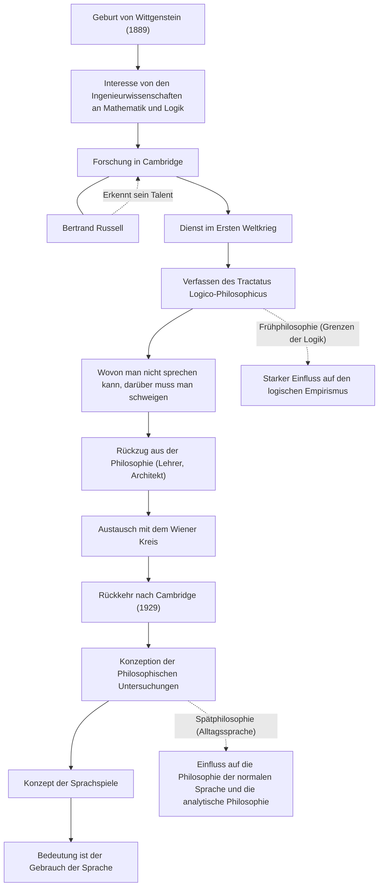

Ludwig Wittgenstein (1889–1951) ist einer der wichtigsten und einflussreichsten Philosophen des 20. Jahrhunderts. Seine Philosophie wird grob in eine frühe Phase, in der er die Grenzen von Sprache und Logik erforschte, und eine späte Phase, die sich auf den Gebrauch der Alltagssprache konzentrierte, unterteilt. Dass ein einzelner Philosoph im Laufe seines Lebens seine eigene frühere Theorie von Grund auf umstößt und zwei völlig unterschiedliche philosophische Systeme begründet, ist selbst in der Ideengeschichte ein äußerst seltenes Ereignis.

## Vom jüngsten Sohn eines Wiener Magnaten nach Cambridge

Wittgenstein wurde 1889 in Wien, der Hauptstadt von Österreich-Ungarn, in eine der bedeutendsten Stahlindustriellen-Familien Europas geboren. Von klein auf wuchs er umgeben von Musik und Kunst auf, und in ihrem Haus verkehrten Persönlichkeiten wie Brahms und Mahler. Die familiäre Situation war jedoch komplex, und seine Brüder wurden von der Tragödie heimgesucht, dass sie einer nach dem anderen durch Suizid aus dem Leben schieden.

Ursprünglich ging er nach Berlin und dann ins britische Manchester, um Ingenieurwesen zu studieren. Während seiner Arbeit an der Propellerforschung in der Luftfahrttechnik entwickelte er ein starkes Interesse an den Grundlagen der Mathematik und damit an der Logik selbst. Dieses Interesse führte ihn an die Universität Cambridge, wo er bei Bertrand Russell, einem damaligen Giganten der philosophischen Welt, studierte. Russell erkannte sofort Wittgensteins geniales Talent und lobte ihn hoch: "Er ist der Einzige, der mir nachfolgen kann."

## Der "Tractatus Logico-Philosophicus" und die Philosophie des Schweigens

Als der Erste Weltkrieg ausbrach, meldete sich Wittgenstein freiwillig zur österreichischen Armee. Mitten im Krieg trug er stets ein Notizbuch bei sich und vertiefte seine philosophischen Gedanken. In einem Kriegsgefangenenlager der italienischen Armee vollendete er sein einziges zu Lebzeiten veröffentlichtes philosophisches Werk, den "Tractatus Logico-Philosophicus".

In diesem Werk schlussfolgerte er: "Wovon man nicht sprechen kann, darüber muss man schweigen." Ihm zufolge besteht die Funktion der Sprache darin, die Tatsachen der Welt "abzubilden", und logisch gesprochen werden kann nur über naturwissenschaftliche Tatsachen. Er behauptete, dass die wichtigsten Dinge wie Ethik, Religion, Schönheit und der Sinn des Lebens die Grenzen der Sprache überschreiten und nicht ausgesprochen werden können. Mit diesem Buch glaubte er, dass "alle Probleme der Philosophie gelöst seien", und verließ die philosophische Welt.

## Abkehr von der Philosophie und Rückkehr

Nachdem er den "Tractatus Logico-Philosophicus" geschrieben hatte, übertrug er sein riesiges Erbe vollständig auf seine Geschwister, wurde selbst mittellos und arbeitete als Grundschullehrer in einem österreichischen Bergdorf. Er arbeitete auch als Gärtner in einem Kloster und als Architekt für das Haus seiner Schwester. Jedoch fand er den spirituellen Frieden, den er suchte, nicht, und sein Leben als Lehrer scheiterte an seinem zu strengen Unterricht gegenüber den Kindern, was ihn zur Aufgabe zwang.

Schließlich fand Wittgenstein durch den Austausch mit dem Wiener Kreis (den logischen Empiristen) seine Leidenschaft für die Philosophie wieder. 1929 kehrte er nach Cambridge zurück und begann, die Mängel der Theorie zu erkennen, die er einst im "Tractatus Logico-Philosophicus" aufgestellt hatte.

## Sprachspiele und "Philosophische Untersuchungen"

Durch seine Vorlesungen in Cambridge entwickelte Wittgenstein einen völlig neuen Ansatz. Dies ist die "Spätphilosophie", die in den posthum veröffentlichten "Philosophischen Untersuchungen" mündete.

Er verwarf die Idee seiner frühen Phase, dass die Bedeutung der Sprache in einer absoluten logischen Struktur liege, die die Welt abbildet. Stattdessen argumentierte er, dass die Bedeutung der Sprache "in ihrem Gebrauch" liegt. Er erklärte dies mit dem Konzept der "Sprachspiele". Wörter erhalten ihre Bedeutung erst dadurch, dass sie in verschiedenen Kontexten und sozialen Regeln (Spielen) verwendet werden, und er glaubte, dass viele philosophische Probleme wie eine "Krankheit" seien, die aus einem Missverständnis dieses Sprachgebrauchs entstehe. Daher definierte er die Rolle der Philosophie nicht als das "Lösen" von Problemen, sondern als das Entwirren sprachlicher Verstrickungen und das Durchführen einer mentalen "Therapie".

## Beziehungen und Entwicklungsfluss

Wittgensteins Leben und philosophische Entwicklung sind in der folgenden Abbildung dargestellt.

## Einfluss auf die Nachwelt und Vermächtnis

Wittgensteins Denken war die treibende Kraft hinter einem Paradigmenwechsel in der Philosophie des 20. Jahrhunderts, der als "linguistic turn" (linguistische Wende) bekannt ist. Seine frühe Philosophie hatte großen Einfluss auf den logischen Empirismus von Carnap, Schlick und anderen und legte den Grundstein für die Wissenschaftsphilosophie. Seine Spätphilosophie hingegen wurde von der Ordinary Language Philosophy (Philosophie der normalen Sprache) wie der von J.L. Austin und Gilbert Ryle übernommen und beeinflusst noch immer die moderne analytische Philosophie sowie Linguistik, Psychologie und die Forschung zur künstlichen Intelligenz.

Er ging über die Grenzen der akademischen Welt hinaus, und seine unerbittliche Lebensweise sowie seine kompromisslose Haltung gegenüber der Wahrheit faszinieren weiterhin viele Literaten und Künstler. Wie er schrieb: "Wie kann ich nur ein so schlechter Mensch sein, aber so gute Dinge hervorbringen?" Die vielen Worte, die nach einem ständigen Kampf mit sich selbst entstanden sind, fordern uns bis heute heraus.
