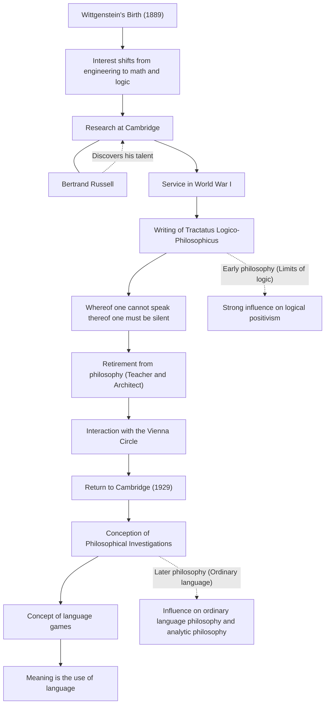

Ludwig Wittgenstein (1889–1951) is one of the most important and influential philosophers of the 20th century. His philosophy is broadly divided into an early period, which pursued the limits of language and logic, and a later period, which focused on the use of ordinary language. It is an extremely rare event in intellectual history for a single philosopher to completely overturn his own past theories and establish two entirely different philosophical systems within his lifetime.

## From the Youngest Son of a Wealthy Viennese Family to Cambridge

Wittgenstein was born in 1889 in Vienna, the capital of the Austro-Hungarian Empire, into one of Europe's leading steel tycoon families. He grew up surrounded by music and art from a young age, and their mansion was even visited by Brahms and Mahler. However, his family environment was complex, and tragedy struck as his older brothers took their own lives one after another.

Initially, he traveled to Berlin and then to Manchester, England, to study engineering. While engaging in propeller research in aeronautical engineering, he developed a strong interest in the foundations of mathematics, and by extension, logic itself. This interest led him to Cambridge University, where he studied under Bertrand Russell, a giant of the philosophical world at the time. Russell quickly recognized Wittgenstein's brilliant aptitude and highly praised him, saying, "He is the only one who will succeed me."

## Tractatus Logico-Philosophicus and the Philosophy of Silence

When World War I broke out, Wittgenstein volunteered for the Austrian army. Amidst the fires of war, he always carried a notebook and deepened his philosophical speculations. It was in an Italian prisoner-of-war camp that he completed the Tractatus Logico-Philosophicus, the only philosophical book published during his lifetime.

In this work, he concluded, "What can be said at all can be said clearly; and whereof one cannot speak thereof one must be silent." According to him, the function of language is to "picture" the facts of the world, and only natural scientific facts can be spoken of logically. He declared that the most important matters, such as ethics, religion, beauty, and the meaning of life, transcend the limits of language and cannot be spoken of. With this book, he believed that "all the problems of philosophy have been solved," and left the philosophical world.

## Departure and Return to Philosophy

After completing the Tractatus Logico-Philosophicus, he surrendered his entire vast inheritance to his brothers and sisters, rendering himself penniless, and became an elementary school teacher in an Austrian mountain village. He also worked as a monastery gardener and as an architect for his sister's mansion. However, the mental tranquility he sought eluded him, and his life as a teacher forced him into setbacks due to issues with his overly strict instruction toward the children.

Eventually, Wittgenstein regained his passion for philosophy through his interactions with the Vienna Circle (the logical positivists). In 1929, he returned to Cambridge and began to notice the flaws in the theories of the Tractatus Logico-Philosophicus that he himself had once established.

## Language Games and Philosophical Investigations

Through his lectures at Cambridge, Wittgenstein developed a completely new approach. This was his "later philosophy," which culminated in the Philosophical Investigations, published after his death.

He rejected his early idea that the meaning of language lies in an absolute logical structure that pictures the world. Instead, he argued that the meaning of a word is "its use in the language." He explained this through the concept of "language games." Words only have meaning when used within various contexts and social rules (games), and he believed that many of the problems in philosophy were like "diseases" arising from misunderstandings of this usage of language. Therefore, he defined the role of philosophy not as "solving" problems, but as untangling the knots of language and performing psychological "therapy."

## Flow of Relationships and Achievements

The following diagram illustrates Wittgenstein's life and philosophical transitions.

## Legacy and Influence on Later Generations

Wittgenstein's ideas were the driving force behind the paradigm shift known as the "linguistic turn" in 20th-century philosophy. His early philosophy had a profound influence on logical positivists like Carnap and Schlick, and laid the foundations of the philosophy of science. On the other hand, his later philosophy was inherited by the ordinary language school, such as J.L. Austin and Gilbert Ryle, and its influence extends to modern analytic philosophy, as well as linguistics, psychology, and artificial intelligence research.

Transcending the boundaries of academia, his rigorous way of life and his uncompromising attitude toward truth continue to captivate many writers and artists. As he wrote, "How is it that I, who am such a bad man, can produce such good things?", the many words born out of an endless struggle with himself continue to deeply question us even today.
