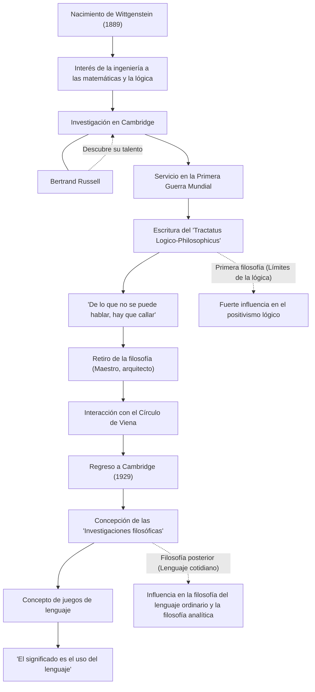

Ludwig Wittgenstein (1889–1951) es uno de los filósofos más importantes e influyentes del siglo XX. Su filosofía se divide a grandes rasgos en su primer período, en el que exploró los límites del lenguaje y la lógica, y un período posterior centrado en el uso del lenguaje cotidiano. Que un solo filósofo derrocara radicalmente sus propias teorías del pasado para establecer dos sistemas filosóficos completamente distintos a lo largo de su vida es un acontecimiento extremadamente raro en la historia del pensamiento.

## De ser el hijo menor de un multimillonario vienés a Cambridge

Wittgenstein nació en 1889 en Viena, capital del Imperio austrohúngaro, en el seno de una de las familias siderúrgicas más acaudaladas de Europa. Creció rodeado de música y arte, y la mansión familiar era visitada por figuras como Brahms y Mahler. Sin embargo, el entorno familiar era complejo y la tragedia golpeó a su familia cuando sus hermanos mayores se quitaron la vida uno tras otro.

Inicialmente, viajó a Berlín y luego a Mánchester, Inglaterra, para estudiar ingeniería. Mientras investigaba el diseño de hélices en ingeniería aeronáutica, desarrolló un profundo interés por los fundamentos de las matemáticas y, en última instancia, por la lógica misma. Este interés lo llevó a la Universidad de Cambridge, donde estudió bajo la tutela de Bertrand Russell, la estrella de la filosofía de aquel entonces. Russell rápidamente reconoció el genio de Wittgenstein y lo elogió afirmando: "Él es el único capaz de continuar mi trabajo".

## El 'Tractatus Logico-Philosophicus' y la filosofía del silencio

Al estallar la Primera Guerra Mundial, Wittgenstein se ofreció como voluntario en el ejército austriaco. En medio del fuego cruzado, siempre llevaba un cuaderno consigo, profundizando en su pensamiento filosófico. Fue en un campo de prisioneros italiano donde completó el único libro de filosofía que publicó en vida, el *Tractatus Logico-Philosophicus*.

En esta obra, concluyó: "De lo que se puede hablar, se puede hablar claramente; de lo que no se puede hablar, hay que callar". Según él, la función del lenguaje es "figurar" o "retratar" los hechos del mundo, y los únicos hechos de los que se puede hablar lógicamente son los de las ciencias naturales. Declaró que los asuntos más importantes, como la ética, la religión, la estética y el significado de la vida, se encuentran más allá de los límites del lenguaje y, por tanto, son inefables. Con este libro, consideró que "todos los problemas filosóficos habían sido resueltos" y abandonó el mundo de la filosofía.

## Retirada de la filosofía y el regreso

Después de escribir el *Tractatus Logico-Philosophicus*, renunció a toda su vasta herencia en favor de sus hermanos y hermanas, quedando sin un centavo, y se convirtió en maestro de escuela primaria en un pueblo de las montañas de Austria. También trabajó como jardinero en un monasterio y como arquitecto para la casa de su hermana. Sin embargo, no logró la paz mental que buscaba, y su vida como maestro se vio frustrada debido a su disciplina excesivamente severa con los niños.

Con el tiempo, a través de sus interacciones con el Círculo de Viena (los positivistas lógicos), Wittgenstein recuperó su pasión por la filosofía. En 1929, regresó a Cambridge y comenzó a darse cuenta de las fallas de la teoría del *Tractatus Logico-Philosophicus* que él mismo había establecido.

## Los juegos de lenguaje y las 'Investigaciones filosóficas'

A través de sus conferencias en Cambridge, Wittgenstein desarrolló un enfoque completamente nuevo. Esta fue su "filosofía posterior", la cual cristalizó en las *Investigaciones filosóficas* (Philosophical Investigations), publicadas póstumamente.

Negó su idea anterior de que el significado del lenguaje reside en una estructura lógica absoluta que retrata al mundo. En su lugar, argumentó que el significado del lenguaje está en "su uso". Explicó esto con el concepto de "juegos de lenguaje". Las palabras solo adquieren significado al ser utilizadas dentro de diversos contextos y reglas sociales (juegos), y creía que gran parte de los problemas filosóficos son como "enfermedades" que surgen de un malentendido del uso de nuestro lenguaje. Por lo tanto, definió el papel de la filosofía no como la de "resolver" problemas, sino como el desenredo de las confusiones lingüísticas y la realización de una "terapia" mental.

## Flujo de relaciones y logros

La vida y la evolución filosófica de Wittgenstein se muestran en el siguiente diagrama:

## Influencia y legado

El pensamiento de Wittgenstein fue la fuerza impulsora detrás del cambio de paradigma en la filosofía del siglo XX conocido como el "giro lingüístico". Su primera filosofía tuvo un profundo impacto en el positivismo lógico de figuras como Carnap y Schlick, y sentó las bases de la filosofía de la ciencia. Por otro lado, su filosofía posterior fue adoptada por la escuela del lenguaje ordinario, representada por J.L. Austin y Gilbert Ryle, extendiendo su influencia a la filosofía analítica contemporánea, e incluso a la lingüística, la psicología y la investigación en inteligencia artificial.

Trascendió los límites académicos; su vida rigurosa y su actitud de rechazo total a cualquier compromiso respecto a la verdad siguen fascinando a muchos escritores y artistas. Como él mismo escribió: "¿Cómo es posible que siendo un hombre tan malo pueda producir algo tan bueno?", las palabras nacidas tras una lucha incesante consigo mismo siguen cuestionándonos profundamente hoy en día.
