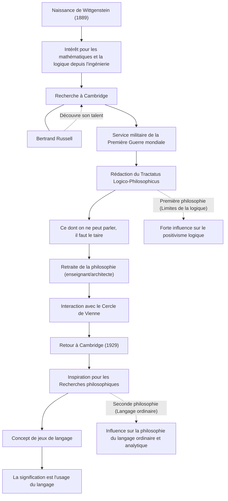

Ludwig Wittgenstein (1889–1951) est l'un des philosophes les plus importants et influents du XXe siècle. Sa philosophie se divise largement en une première période, où il a exploré les limites du langage et de la logique, et une seconde période, axée sur l'usage du langage ordinaire. Il est extrêmement rare dans l'histoire des idées qu'un seul philosophe renverse fondamentalement ses propres théories passées pour construire deux systèmes philosophiques complètement différents au cours de sa vie.

## Du plus jeune fils d'un magnat viennois à Cambridge

Wittgenstein est né en 1889 à Vienne, capitale de l'Empire austro-hongrois, dans l'une des familles de magnats de l'acier les plus riches d'Europe. Ayant grandi entouré de musique et d'art, la maison familiale recevait des visites de figures telles que Brahms et Mahler. Cependant, l'environnement familial était complexe, et ses frères aînés se sont succédés pour mettre fin à leurs jours dans une série de tragédies.

Initialement, il s'est rendu à Berlin, puis à Manchester en Angleterre pour étudier l'ingénierie. Alors qu'il travaillait sur la recherche sur les hélices en ingénierie aéronautique, il a développé un fort intérêt pour les fondements des mathématiques et, par extension, pour la logique elle-même. Cet intérêt l'a conduit à l'Université de Cambridge, où il a étudié sous la direction de Bertrand Russell, la superstar philosophique de l'époque. Russell a rapidement reconnu le génie de Wittgenstein, faisant son éloge en disant que seul lui pourrait lui succéder.

## Le "Tractatus Logico-Philosophicus" et la philosophie du silence

Lorsque la Première Guerre mondiale a éclaté, Wittgenstein s'est porté volontaire pour l'armée autrichienne. Au milieu des combats, il portait toujours ses carnets avec lui, approfondissant ses réflexions philosophiques. C'est dans un camp de prisonniers de guerre en Italie qu'il a achevé le seul livre de philosophie publié de son vivant, le "Tractatus Logico-Philosophicus".

Dans cet ouvrage, il conclut : "Ce qu'on peut dire peut être dit clairement ; et sur ce dont on ne peut parler, il faut garder le silence." Selon lui, la fonction du langage est de "dépeindre" les faits du monde, et seuls les faits des sciences naturelles peuvent être décrits logiquement. Il a déclaré que les questions les plus importantes telles que l'éthique, la religion, la beauté et le sens de la vie se situent au-delà des limites du langage et ne peuvent être exprimées. Avec ce livre, il a cru que "tous les problèmes philosophiques ont été résolus" et a quitté le monde de la philosophie.

## Départ de la philosophie et retour

Après avoir écrit le "Tractatus Logico-Philosophicus", il a cédé sa vaste fortune à ses frères et sœurs, se retrouvant sans le sou, et est devenu instituteur dans un village de montagne autrichien. Il a également travaillé comme jardinier dans un monastère et comme architecte pour la maison de sa sœur. Cependant, il n'a pas trouvé la paix mentale qu'il recherchait, et sa vie d'enseignant a été un échec, en partie à cause de sa discipline trop stricte envers les enfants.

Éventuellement, grâce à ses interactions avec le Cercle de Vienne (positivistes logiques), Wittgenstein a retrouvé sa passion pour la philosophie. En 1929, il est retourné à Cambridge et a commencé à réaliser les défauts de la théorie qu'il avait établie dans le "Tractatus Logico-Philosophicus".

## Jeux de langage et "Recherches philosophiques"

À travers ses conférences à Cambridge, Wittgenstein a développé une approche entièrement nouvelle. C'est sa "seconde philosophie", qui a abouti aux "Recherches philosophiques" (Philosophical Investigations), publiées après sa mort.

Il a rejeté l'idée de sa première période selon laquelle le sens du langage réside dans une structure logique absolue qui dépeint le monde. Au lieu de cela, il a soutenu que la signification d'un mot "est son usage". Il a expliqué cela avec le concept de "jeux de langage". Les mots ne prennent sens que lorsqu'ils sont utilisés dans divers contextes et règles sociales (jeux), et il croyait que de nombreux problèmes philosophiques sont comme des "maladies" causées par une mauvaise compréhension de ces usages linguistiques. Par conséquent, il a défini le rôle de la philosophie non pas comme la "résolution" de problèmes, mais comme le démêlage des nœuds du langage pour fournir une "thérapie" mentale.

## Relations et flux des réalisations

La vie et les transitions philosophiques de Wittgenstein sont présentées dans le diagramme ci-dessous.

## Impact sur les générations futures et héritage

La pensée de Wittgenstein a été la force motrice d'un changement de paradigme appelé le "tournant linguistique" dans la philosophie du XXe siècle. Sa première philosophie a grandement influencé le positivisme logique de penseurs comme Carnap et Schlick, jetant les bases de la philosophie des sciences. D'autre part, sa seconde philosophie a été reprise par l'école du langage ordinaire avec J.L. Austin et Gilbert Ryle, étendant son influence à la philosophie analytique contemporaine, ainsi qu'à la linguistique, la psychologie et la recherche sur l'intelligence artificielle.

Au-delà des frontières académiques, sa vie intense et son attitude intransigeante envers la vérité continuent de fasciner de nombreux écrivains et artistes. Comme il l'a écrit : "Comment se fait-il que je sois une si mauvaise personne et que je puisse pourtant produire de si bonnes choses ?", les innombrables mots nés de sa lutte incessante avec lui-même continuent de nous remettre profondément en question aujourd'hui.
