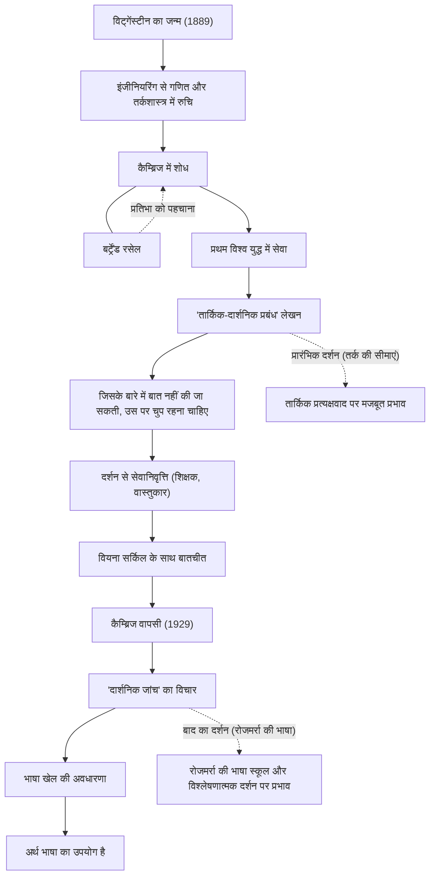

लुडविग विट्गेंस्टीन (Ludwig Wittgenstein, 1889–1951) 20वीं सदी के सबसे महत्वपूर्ण और प्रभावशाली दार्शनिकों में से एक हैं। उनके दर्शन को मोटे तौर पर दो भागों में बांटा गया है: प्रारंभिक काल, जिसमें उन्होंने भाषा और तर्क की सीमाओं का पता लगाया, और बाद का काल, जिसमें उन्होंने रोज़मर्रा की भाषा के उपयोग पर ध्यान केंद्रित किया। बौद्धिक इतिहास में यह बहुत दुर्लभ है कि एक दार्शनिक ने अपने जीवनकाल में अपने ही पिछले सिद्धांतों को पूरी तरह से पलट दिया और दो बिल्कुल अलग दार्शनिक प्रणालियाँ स्थापित कीं।

## वियना के एक अमीर परिवार के सबसे छोटे बेटे से कैम्ब्रिज तक

विट्गेंस्टीन का जन्म 1889 में ऑस्ट्रिया-हंगरी साम्राज्य की राजधानी वियना में, यूरोप के सबसे धनी इस्पात-उद्योग परिवारों में से एक में हुआ था। वह कम उम्र से ही संगीत और कला से घिरे हुए पले-बढ़े और उनके घर में ब्राह्म्स और महलर जैसे लोग आते थे। हालाँकि, उनका पारिवारिक माहौल जटिल था और उनके भाइयों ने एक के बाद एक आत्महत्या कर ली, जो उनके परिवार के लिए एक बड़ी त्रासदी थी।

शुरू में, वह इंजीनियरिंग पढ़ने के लिए बर्लिन और फिर मैनचेस्टर, इंग्लैंड गए। एयरोनॉटिकल इंजीनियरिंग में प्रोपेलर पर शोध करते हुए, उन्होंने गणित की नींव और आगे चलकर तर्कशास्त्र में गहरी रुचि विकसित की। इस रुचि ने उन्हें कैम्ब्रिज विश्वविद्यालय में पहुँचाया, जहाँ उन्होंने उस समय दार्शनिक दुनिया के एक महान व्यक्ति बर्ट्रेंड रसेल के अधीन अध्ययन किया। रसेल ने तुरंत विट्गेंस्टीन की प्रतिभाशाली क्षमता को पहचान लिया और उनकी प्रशंसा करते हुए कहा, "मेरे बाद केवल वही व्यक्ति है जो इस दिशा में आगे बढ़ सकता है।"

## 'तार्किक-दार्शनिक प्रबंध' और मौन का दर्शन

जब प्रथम विश्व युद्ध शुरू हुआ, तो विट्गेंस्टीन ने ऑस्ट्रियाई सेना में स्वेच्छा से काम किया। युद्ध के बीच, वह हमेशा अपने साथ एक नोटबुक रखते थे और अपने दार्शनिक विचारों को गहरा करते थे। इतालवी सेना के कैदी के रूप में एक शिविर में उन्होंने अपनी एकमात्र दार्शनिक पुस्तक, 'तार्किक-दार्शनिक प्रबंध' (Tractatus Logico-Philosophicus) पूरी की, जो उनके जीवनकाल में प्रकाशित हुई थी।

इस कार्य में, उन्होंने निष्कर्ष निकाला: "जिसके बारे में स्पष्ट रूप से बात की जा सकती है, उसके बारे में बात की जानी चाहिए। लेकिन जिसके बारे में बात नहीं की जा सकती, उसके बारे में चुप रहना चाहिए।" उनके अनुसार, भाषा का कार्य दुनिया के तथ्यों की "नकल" करना है, और केवल प्राकृतिक विज्ञान के तथ्यों के बारे में तार्किक रूप से बात की जा सकती है। उन्होंने कहा कि नैतिकता, धर्म, सौंदर्य और जीवन के अर्थ जैसे सबसे महत्वपूर्ण विषय भाषा की सीमाओं से परे हैं और उनके बारे में बात नहीं की जा सकती। इस पुस्तक के साथ, उनका मानना था कि "दर्शन की सभी समस्याएँ हल हो गई हैं," और उन्होंने दर्शन की दुनिया छोड़ दी।

## दर्शनशास्त्र से वापसी और फिर से प्रवेश

'तार्किक-दार्शनिक प्रबंध' लिखने के बाद, उन्होंने अपनी सारी बड़ी विरासत अपने भाई-बहनों को दे दी, और ऑस्ट्रिया के एक पहाड़ी गाँव में प्राथमिक स्कूल के शिक्षक बन गए, जहाँ वे पूरी तरह से निर्धन हो गए थे। उन्होंने एक मठ में माली के रूप में और अपनी बहन की हवेली के वास्तुकार के रूप में भी काम किया। हालाँकि, उन्हें वह मानसिक शांति नहीं मिली जिसकी वे तलाश कर रहे थे, और बच्चों के प्रति उनके बहुत सख्त व्यवहार के कारण एक शिक्षक के रूप में उनका जीवन समस्याग्रस्त हो गया, जिसके कारण उन्हें असफलताओं का सामना करना पड़ा।

अंततः, वियना सर्किल (तार्किक प्रत्यक्षवादी) के साथ बातचीत के माध्यम से, विट्गेंस्टीन ने दर्शन के लिए अपना जुनून फिर से हासिल कर लिया। 1929 में, वे कैम्ब्रिज लौट आए और 'तार्किक-दार्शनिक प्रबंध' के अपने पिछले सिद्धांतों में खामियों को नोटिस करना शुरू कर दिया।

## भाषा के खेल और 'दार्शनिक जांच'

कैम्ब्रिज में अपने व्याख्यानों के माध्यम से, विट्गेंस्टीन ने एक पूरी तरह से नया दृष्टिकोण विकसित किया। यह उनका "बाद का दर्शन" है, जो उनकी मृत्यु के बाद प्रकाशित 'दार्शनिक जांच' (Philosophical Investigations) में परिणत हुआ।

उन्होंने अपने पूर्व विचार को खारिज कर दिया कि भाषा का अर्थ एक पूर्ण तार्किक संरचना में निहित है जो दुनिया को प्रतिबिंबित करती है। इसके बजाय, उन्होंने तर्क दिया कि भाषा का अर्थ "इसके उपयोग में निहित है।" उन्होंने इसे "भाषा खेल" की अवधारणा के साथ समझाया। शब्द केवल विभिन्न संदर्भों और सामाजिक नियमों (खेलों) के भीतर उपयोग किए जाने पर अर्थ प्राप्त करते हैं, और उनका मानना था कि दर्शन की कई समस्याएँ भाषा के उपयोग को गलत समझने से उत्पन्न होने वाली "बीमारियों" की तरह हैं। इसलिए, उन्होंने दर्शन की भूमिका को समस्याओं को "हल करने" के रूप में नहीं, बल्कि भाषा की उलझनों को सुलझाने और आध्यात्मिक "चिकित्सा" प्रदान करने के रूप में परिभाषित किया।

## व्यक्तिगत संबंध और उपलब्धियों का प्रवाह

नीचे दिया गया चित्र विट्गेंस्टीन के जीवन और दार्शनिक संक्रमणों को दर्शाता है।

## बाद की पीढ़ियों पर प्रभाव और विरासत

विट्गेंस्टीन का विचार 20वीं सदी के दर्शन में "भाषाई मोड़" कहे जाने वाले प्रतिमान बदलाव के पीछे एक प्रेरक शक्ति बन गया। उनके प्रारंभिक दर्शन ने कार्नाप और श्लिक जैसे तार्किक प्रत्यक्षवादियों को गहराई से प्रभावित किया और विज्ञान के दर्शन की नींव रखी। दूसरी ओर, उनके बाद के दर्शन को जे. एल. ऑस्टिन और गिल्बर्ट राइल जैसे रोजमर्रा की भाषा स्कूल के दार्शनिकों द्वारा अपनाया गया था, और इसका प्रभाव समकालीन विश्लेषणात्मक दर्शन के साथ-साथ भाषा विज्ञान, मनोविज्ञान और कृत्रिम बुद्धिमत्ता अनुसंधान तक फैला हुआ है।

उन्होंने अकादमिक सीमाओं को पार किया, और उनका कठोर जीवन और सच्चाई के प्रति उनके अडिग रवैये ने कई लेखकों और कलाकारों को मोहित करना जारी रखा है। जैसा कि उन्होंने लिखा था, "मैं इतना बुरा इंसान कैसे हो सकता हूं और फिर भी इतनी अच्छी चीजें कैसे बना सकता हूं?" अपने साथ निरंतर संघर्ष के बाद पैदा हुए उनके शब्द आज भी हमसे गहरे सवाल पूछते हैं।
