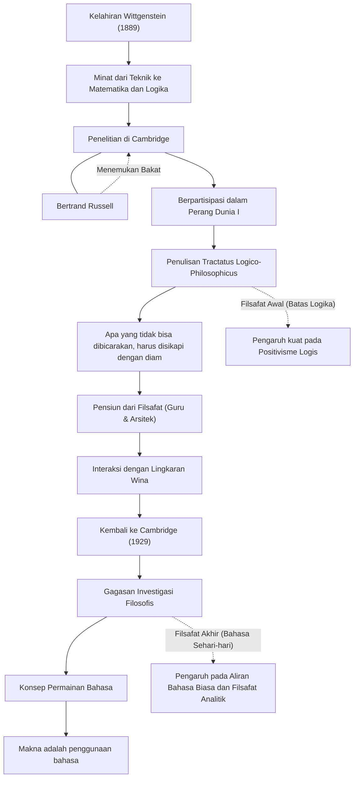

Ludwig Wittgenstein (1889–1951) adalah salah satu filsuf paling penting dan berpengaruh di abad ke-20. Filsafatnya secara luas dibagi menjadi dua periode: periode awal yang mengeksplorasi batas-batas bahasa dan logika, dan periode akhir yang berfokus pada penggunaan bahasa sehari-hari. Sangat jarang dalam sejarah pemikiran bahwa seorang filsuf membalikkan teorinya sendiri dan membangun dua sistem filosofis yang sama sekali berbeda selama hidupnya.

## Dari Anak Bungsu Konglomerat Wina hingga ke Cambridge

Wittgenstein lahir pada tahun 1889 di Wina, ibu kota Kekaisaran Austro-Hongaria, di salah satu keluarga konglomerat baja terkaya di Eropa. Ia dibesarkan di lingkungan yang dikelilingi oleh musik dan seni; bahkan tokoh seperti Brahms dan Mahler mengunjungi rumah keluarganya. Namun, lingkungan keluarganya cukup kompleks, dan ia dihadapkan pada tragedi saudara-saudara laki-lakinya yang berturut-turut bunuh diri.

Awalnya, ia pergi ke Berlin dan kemudian ke Manchester di Inggris untuk belajar teknik. Saat melakukan penelitian mengenai baling-baling dalam teknik penerbangan, ia mengembangkan minat yang mendalam terhadap dasar-dasar matematika, yang kemudian mengarah pada logika itu sendiri. Minat ini membawanya ke Universitas Cambridge, di mana ia belajar di bawah Bertrand Russell, salah satu filsuf besar pada masanya. Russell segera menyadari bakat jenius Wittgenstein dan memujinya dengan mengatakan, "Dialah satu-satunya orang yang bisa meneruskan jejak saya."

## "Tractatus Logico-Philosophicus" dan Filsafat Keheningan

Ketika Perang Dunia I meletus, Wittgenstein mendaftar menjadi sukarelawan untuk tentara Austria. Di tengah kancah pertempuran, ia selalu membawa buku catatannya untuk mendalami pemikiran-pemikiran filosofisnya. Saat ditawan di kamp penjara Italia, ia berhasil menyelesaikan "Tractatus Logico-Philosophicus", satu-satunya buku filsafatnya yang diterbitkan selama ia hidup.

Dalam karya ini, ia menyimpulkan: "Apa yang bisa dikatakan, dapat dikatakan dengan jelas; dan apa yang tidak bisa dibicarakan, harus disikapi dengan diam." Menurutnya, fungsi bahasa adalah untuk "menggambarkan" fakta-fakta dunia, dan hanya fakta-fakta sains alam yang dapat dibicarakan secara logis. Ia menegaskan bahwa hal-hal yang paling penting seperti etika, agama, keindahan, dan makna hidup berada di luar batas bahasa dan tidak dapat dibicarakan. Dengan buku ini, ia menganggap bahwa "semua masalah filsafat telah terpecahkan" dan meninggalkan dunia filsafat.

## Menjauh dan Kembali ke Filsafat

Setelah menyelesaikan "Tractatus Logico-Philosophicus", ia menyerahkan seluruh harta warisannya yang sangat besar kepada saudara-saudaranya dan memilih hidup tanpa uang sepeser pun sebagai guru sekolah dasar di sebuah desa pegunungan di Austria. Ia juga bekerja sebagai tukang kebun biara dan sebagai arsitek rumah saudara perempuannya. Namun, ia tidak menemukan kedamaian batin yang dicarinya, dan kehidupannya sebagai guru mengalami kegagalan karena metode pengajarannya yang terlalu keras terhadap anak-anak.

Seiring berjalannya waktu, melalui interaksi dengan Lingkaran Wina (para positivis logis), Wittgenstein kembali menemukan gairahnya terhadap filsafat. Pada tahun 1929, ia kembali ke Cambridge dan mulai menyadari kelemahan dari teori yang ia bangun sendiri dalam "Tractatus Logico-Philosophicus".

## Permainan Bahasa dan "Investigasi Filosofis"

Melalui kuliah-kuliahnya di Cambridge, Wittgenstein mengembangkan pendekatan yang sama sekali baru. Inilah "filsafat akhirnya" yang memuncak dalam karya "Investigasi Filosofis" (Philosophical Investigations), yang diterbitkan setelah kematiannya.

Ia menolak pandangan awalnya yang menyatakan bahwa makna bahasa terletak pada struktur logis absolut yang mencerminkan dunia. Sebaliknya, ia berpendapat bahwa makna bahasa "ada dalam penggunaannya". Ia menjelaskannya melalui konsep "permainan bahasa". Kata-kata baru memiliki makna saat digunakan dalam berbagai konteks atau aturan sosial (permainan), dan ia percaya bahwa banyak masalah filsafat muncul seperti semacam "penyakit" akibat kesalahpahaman tentang penggunaan bahasa tersebut. Oleh karena itu, ia merumuskan bahwa peran filsafat bukanlah untuk "memecahkan" masalah, melainkan untuk mengurai kekusutan bahasa dan melakukan "terapi" mental.

## Hubungan Tokoh dan Aliran Pencapaian

Kehidupan Wittgenstein dan transformasi filosofisnya diilustrasikan dalam diagram berikut.

## Pengaruh dan Warisan bagi Generasi Berikutnya

Pemikiran Wittgenstein menjadi kekuatan pendorong pergeseran paradigma yang disebut "putaran linguistik" dalam filsafat abad ke-20. Filsafat awalnya memiliki pengaruh yang sangat besar terhadap positivisme logis Carnap dan Schlick, serta meletakkan dasar bagi filsafat ilmu. Di sisi lain, filsafat akhirnya diwarisi oleh filsuf bahasa sehari-hari seperti J.L. Austin dan Gilbert Ryle, yang pengaruhnya meluas ke filsafat analitik modern, linguistik, psikologi, dan bahkan penelitian kecerdasan buatan (AI).

Melampaui batas-batas akademis, gaya hidupnya yang ketat dan sikapnya yang tanpa kompromi terhadap kebenaran terus memikat banyak penulis dan seniman. Seperti yang ia tulis, "Bagaimana mungkin aku bisa menjadi orang yang begitu buruk, namun tetap menghasilkan hal-hal yang begitu baik?" kata-kata yang lahir dari pergulatan tiada henti dengan dirinya sendiri masih terus memberikan pertanyaan mendalam bagi kita hingga hari ini.
