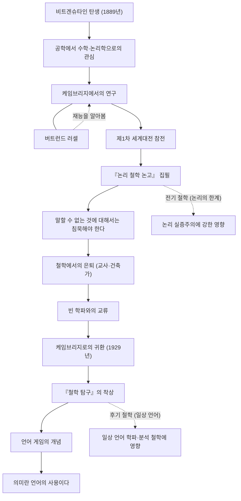

루트비히 비트겐슈타인(Ludwig Wittgenstein, 1889–1951)은 20세기에서 가장 중요하고 영향력 있는 철학자 중 한 명입니다. 그의 철학은 언어와 논리의 한계를 추구했던 전기와 일상 언어의 사용에 초점을 맞춘 후기로 크게 나뉩니다. 한 명의 철학자가 일생 동안 자신의 과거 이론을 근본적으로 뒤집고 전혀 다른 두 개의 철학 체계를 세운 것은 사상사에서도 극히 드문 일입니다.

## 빈의 부호 막내아들에서 케임브리지로

비트겐슈타인은 1889년 오스트리아-헝가리 제국의 수도 빈에서 유럽 굴지의 철강 재벌 가문에서 태어났습니다. 어릴 적부터 음악과 예술에 둘러싸여 자랐으며, 그 저택에는 브람스나 말러가 방문할 정도였습니다. 하지만 가정 환경은 복잡했고, 그의 형들이 차례로 스스로 목숨을 끊는 비극을 겪었습니다.

처음에는 공학을 배우기 위해 베를린, 그리고 영국의 맨체스터로 건너갔습니다. 항공 공학에서 프로펠러 연구에 종사하던 중, 그는 수학의 기초, 나아가 논리학 자체에 강한 관심을 갖게 됩니다. 이 관심이 그를 케임브리지 대학으로 이끌었고, 당시 철학계의 거장이었던 버트런드 러셀 밑에서 배우게 됩니다. 러셀은 비트겐슈타인의 천재적인 자질을 즉시 알아보고 "나를 이을 자는 그밖에 없다"고 극찬했습니다.

## 『논리 철학 논고』와 침묵의 철학

제1차 세계대전이 발발하자 비트겐슈타인은 오스트리아군에 자원합니다. 전란 속에서도 그는 항상 노트를 들고 다니며 철학적인 사색을 깊이 했습니다. 이탈리아군의 포로가 된 수용소 안에서 완성시킨 것이 그가 생전에 출판한 유일한 철학서 『논리 철학 논고(Tractatus Logico-Philosophicus)』입니다.

이 저술에서 그는 "말할 수 있는 것에 대해서는 명료하게 말할 수 있다. 그러나 말할 수 없는 것에 대해서는 침묵해야 한다"고 결론지었습니다. 그에 따르면 언어의 기능은 세계의 사실을 '모사하는' 것이며, 논리적으로 말할 수 있는 것은 자연과학적인 사실뿐입니다. 윤리, 종교, 미, 그리고 인생의 의의와 같은 가장 중요한 사안은 언어의 한계를 넘어서므로 말할 수 없다고 단정했습니다. 이 책으로 그는 "철학의 모든 문제는 해결되었다"고 생각하고 철학의 세계에서 떠납니다.

## 철학에서의 이탈과 귀환

『논리 철학 논고』를 완성한 후, 그는 막대한 유산을 모두 형제자매에게 양도하고 자신은 무일푼이 되어 오스트리아의 산골 마을에서 초등학교 교사가 됩니다. 또한 수도원의 정원사나 누나 저택의 건축가로도 일했습니다. 하지만 그가 원했던 정신적인 평안은 얻지 못했고, 교사로서의 생활도 아이들에 대한 지나치게 엄격한 지도가 문제가 되어 좌절을 겪어야 했습니다.

이윽고 비트겐슈타인은 빈 학파(논리 실증주의자들)와의 교류를 통해 다시 철학에 대한 열정을 되찾습니다. 1929년, 그는 케임브리지로 돌아와 과거 자신이 세운 『논리 철학 논고』 이론의 결함을 깨닫기 시작했습니다.

## 언어 게임과 『철학 탐구』

케임브리지에서의 강의를 통해 비트겐슈타인은 전혀 새로운 접근법을 전개합니다. 그것이 그의 사후에 출판된 『철학 탐구(Philosophical Investigations)』로 결실을 맺는 '후기 철학'입니다.

그는 언어의 의미가 세계를 모사하는 절대적인 논리 구조에 있다는 전기의 생각을 부정했습니다. 대신 언어의 의미는 '그 사용 속에 있다'고 주장합니다. 그는 이를 '언어 게임'이라는 개념으로 설명했습니다. 말이란 다양한 문맥이나 사회적 규칙(게임) 속에서 사용됨으로써 비로소 의미를 가지는 것이며, 철학의 많은 문제는 이 언어의 사용법을 오해하는 데서 생기는 '질병' 같은 것이라고 생각했습니다. 따라서 철학의 역할은 문제를 '해결하는' 것이 아니라 언어의 얽힘을 풀어내고 정신적인 '치료'를 하는 것이라고 정의했습니다.

## 인물 관계와 업적의 흐름

비트겐슈타인의 생애와 철학적인 변천을 아래 그림에 나타냅니다.

## 후세에의 영향과 유산

비트겐슈타인의 사상은 20세기 철학에서 '언어론적 전회(linguistic turn)'라고 불리는 패러다임 전환의 원동력이 되었습니다. 그의 전기 철학은 카르납이나 슐리크 등 논리 실증주의에 지대한 영향을 미치며 과학 철학의 기초를 다졌습니다. 반면, 그의 후기 철학은 J.L. 오스틴이나 길버트 라일과 같은 일상 언어 학파에 계승되어 현대의 분석 철학, 나아가 언어학, 심리학, 인공지능 연구에까지 그 영향을 미치고 있습니다.

그는 학문의 틀을 넘어, 그의 치열한 삶의 방식이나 진리에 대한 일체의 타협을 허용하지 않는 태도는 많은 문학자나 예술가들을 매료시키고 있습니다. "나는 어째서 이렇게 나쁜 인간인데 이렇게 좋은 것을 만들어낼 수 있는 걸까"라고 그가 글을 남겼듯이, 자기 자신과의 끊임없는 투쟁 끝에 빚어진 수많은 말들은 지금도 우리에게 깊은 물음을 던지고 있습니다.
