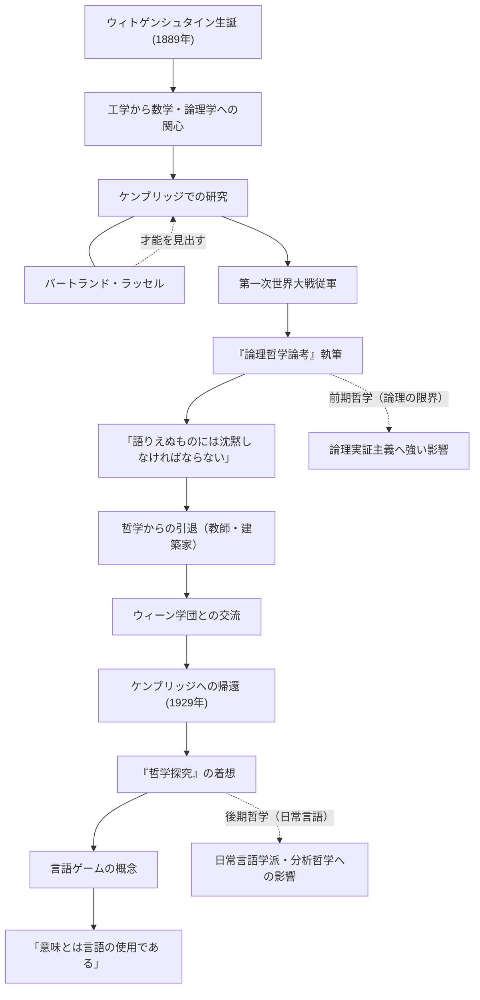

ルートヴィヒ・ウィトゲンシュタイン（Ludwig Wittgenstein, 1889–1951）は、20世紀における最も重要で影響力のある哲学者の一人です。彼の哲学は、言語と論理の限界を追求した前期と、日常言語の使用に焦点を当てた後期に大別されます。一人の哲学者が生涯のうちに、自らの過去の理論を根本から覆し、二つの全く異なる哲学大系を打ち立てたことは、思想史においても極めて稀な出来事です。

## ウィーンの富豪の末っ子からケンブリッジへ

ウィトゲンシュタインは1889年、オーストリア＝ハンガリー帝国の首都ウィーンで、ヨーロッパ有数の鉄鋼財閥の家に生まれました。幼い頃から音楽や芸術に囲まれて育ち、その邸宅にはブラームスやマーラーが訪れるほどでした。しかし、家庭環境は複雑であり、彼の兄たちは次々と自ら命を絶つという悲劇に見舞われています。

当初、彼は工学を学ぶためにベルリン、そしてイギリスのマンチェスターへ渡りました。航空工学におけるプロペラの研究に従事する中で、彼は数学の基礎、ひいては論理学そのものに強い関心を抱くようになります。この関心が彼をケンブリッジ大学へと導き、当時の哲学界の巨星であったバートランド・ラッセルの下で学ぶことになります。ラッセルはすぐにウィトゲンシュタインの天才的な素質を見抜き、「私の後に続く者は彼しかいない」と絶賛しました。

## 『論理哲学論考』と沈黙の哲学

第一次世界大戦が勃発すると、ウィトゲンシュタインはオーストリア軍に志願します。戦火の最中、彼は常にノートを持ち歩き、哲学的な思索を深めました。イタリア軍の捕虜となった収容所の中で完成させたのが、彼の生前に出版された唯一の哲学書『論理哲学論考（Tractatus Logico-Philosophicus）』です。

この著作の中で彼は、「語りうるものについては明晰に語りうる。しかし、語りえぬものについては沈黙しなければならない」と結論づけました。彼によれば、言語の機能は世界の事実を「写し取る」ことであり、論理的に語ることができるのは自然科学的な事実のみです。倫理、宗教、美、そして人生の意義といった最も重要な事柄は、言語の限界を超えており、語ることはできないと断じました。この書をもって、彼は「哲学のすべての問題は解決された」と考え、哲学の世界から去ります。

## 哲学からの離脱と帰還

『論理哲学論考』を書き上げた後、彼は莫大な遺産をすべて兄弟姉妹に譲り渡し、自らは無一文となってオーストリアの山村で小学校の教師になります。また、修道院の庭師や、姉の邸宅の建築家としても働きました。しかし、彼が求めた精神的な平穏は得られず、教師としての生活も子どもたちに対する厳しすぎる指導が問題となり、挫折を余儀なくされました。

やがてウィトゲンシュタインは、ウィーン学団（論理実証主義者たち）との交流を通じて、再び哲学への情熱を取り戻します。1929年、彼はケンブリッジへと戻り、かつて自らが打ち立てた『論理哲学論考』の理論の欠陥に気づき始めました。

## 言語ゲームと『哲学探究』

ケンブリッジでの講義を通じて、ウィトゲンシュタインは全く新しいアプローチを展開します。それが彼の死後に出版された『哲学探究（Philosophical Investigations）』に結実する「後期哲学」です。

彼は、言語の意味が世界を写し取る絶対的な論理構造にあるという前期の考えを否定しました。代わりに、言語の意味は「その使用の中にある」と主張します。彼はこれを「言語ゲーム」という概念で説明しました。言葉とは、多様な文脈や社会的ルール（ゲーム）の中で使われることで初めて意味を持つのであり、哲学の多くの問題は、この言語の使用法を誤解していることから生じる「病気」のようなものだと考えたのです。したがって、哲学の役割は問題を「解決する」ことではなく、言語の絡まりを解きほぐし、精神的な「治療」を行うことだと定義しました。

## 人物関係と功績のフロー

ウィトゲンシュタインの生涯と哲学的な変遷を以下の図に示します。

## 後世への影響と遺産

ウィトゲンシュタインの思想は、20世紀の哲学において「言語論的転回」と呼ばれるパラダイムシフトの原動力となりました。彼の前期哲学はカルナップやシュリックらの論理実証主義に多大な影響を与え、科学哲学の基礎を築きました。一方、その後期哲学は、J.L.オースティンやギルバート・ライルといった日常言語学派に受け継がれ、現代の分析哲学、さらには言語学、心理学、人工知能研究にまでその影響を及ぼしています。

彼は学問の枠を超え、その峻烈な生き方や、真理に対する一切の妥協を許さない態度は、多くの文学者や芸術家をも魅了し続けています。「私はどうしてこんなに悪い人間なのに、こんなに良いものを生み出すことができるのだろう」と彼が書き残したように、自己との絶え間ない闘争の末に生み出された言葉の数々は、今なお私たちに深く問いかけてきます。
