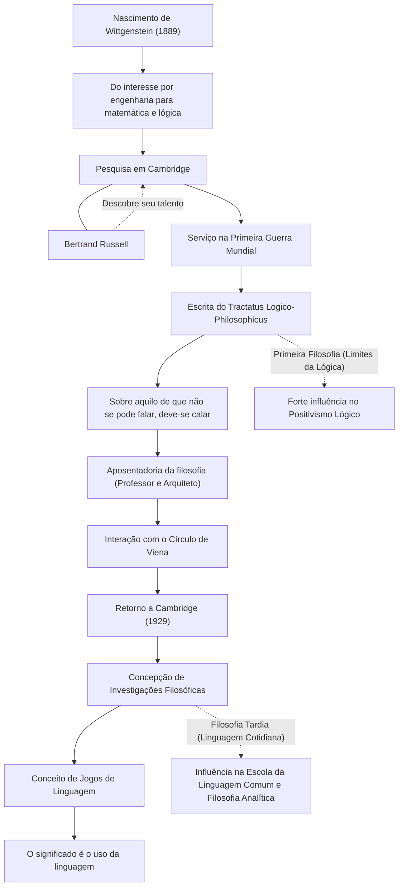

Ludwig Wittgenstein (1889–1951) foi um dos filósofos mais importantes e influentes do século XX. Sua filosofia é dividida em dois grandes períodos: o primeiro, que explorou os limites da linguagem e da lógica, e o último, que se concentrou no uso da linguagem cotidiana. O fato de um único filósofo, durante sua vida, subverter fundamentalmente suas próprias teorias do passado e estabelecer dois sistemas filosóficos completamente diferentes é um evento extremamente raro na história do pensamento.

## De Filho Mais Novo de um Magnata de Viena a Cambridge

Wittgenstein nasceu em 1889 na capital do Império Austro-Húngaro, Viena, em uma das famílias industriais mais ricas da Europa, ligada à siderurgia. Ele cresceu cercado de música e arte; a mansão de sua família recebia visitas de Brahms e Mahler. No entanto, o ambiente familiar era complexo, e seus irmãos mais velhos enfrentaram tragédias, tirando as próprias vidas um após o outro.

Inicialmente, ele viajou para Berlim e, em seguida, para Manchester, na Inglaterra, para estudar engenharia. Enquanto se dedicava à pesquisa de hélices na engenharia aeronáutica, ele desenvolveu um forte interesse pelos fundamentos da matemática e, por extensão, pela própria lógica. Esse interesse o levou à Universidade de Cambridge, onde estudou com Bertrand Russell, um dos grandes nomes da filosofia da época. Russell logo percebeu o talento genial de Wittgenstein e o elogiou grandemente, afirmando: "Ele é o único que pode me suceder".

## O "Tractatus Logico-Philosophicus" e a Filosofia do Silêncio

Com o início da Primeira Guerra Mundial, Wittgenstein se voluntariou para o exército austríaco. Em meio à guerra, ele sempre carregava cadernos consigo, aprofundando suas reflexões filosóficas. Foi em um campo de prisioneiros na Itália que ele concluiu o "Tractatus Logico-Philosophicus", o único livro de filosofia publicado durante sua vida.

Nesta obra, ele concluiu: "Sobre aquilo de que não se pode falar, deve-se calar". Segundo ele, a função da linguagem é "retratar" os fatos do mundo, e apenas fatos científicos naturais podem ser falados de forma lógica. Ele argumentou que as questões mais importantes, como ética, religião, beleza e o sentido da vida, estão além dos limites da linguagem e não podem ser discutidas. Com este livro, ele considerou que "todos os problemas da filosofia foram resolvidos" e abandonou o mundo da filosofia.

## Afastamento e Retorno à Filosofia

Após concluir o "Tractatus Logico-Philosophicus", ele abriu mão de toda a sua vasta herança, doando-a aos irmãos e irmãs, e tornou-se professor primário em uma vila nas montanhas austríacas, sem um centavo. Ele também trabalhou como jardineiro em um mosteiro e como arquiteto na mansão de sua irmã. No entanto, ele não encontrou a paz espiritual que buscava, e sua vida como professor sofreu reveses devido à sua severidade excessiva com as crianças.

Com o tempo, por meio de interações com o Círculo de Viena (os positivistas lógicos), Wittgenstein reacendeu sua paixão pela filosofia. Em 1929, ele retornou a Cambridge e começou a perceber as falhas nas teorias que ele mesmo havia estabelecido no "Tractatus Logico-Philosophicus".

## Jogos de Linguagem e "Investigações Filosóficas"

Através de suas palestras em Cambridge, Wittgenstein desenvolveu uma abordagem completamente nova. Essa é a "filosofia tardia", que culminou em "Investigações Filosóficas" (Philosophical Investigations), obra publicada após sua morte.

Ele rejeitou a ideia inicial de que o significado da linguagem reside em uma estrutura lógica absoluta que espelha o mundo. Em vez disso, ele argumentou que o significado da linguagem está "no seu uso". Ele explicou isso por meio do conceito de "jogos de linguagem". As palavras só adquirem significado quando usadas dentro de diversos contextos e regras sociais (jogos). Ele acreditava que muitos problemas filosóficos eram como "doenças" decorrentes do mal-entendido sobre o uso dessa linguagem. Portanto, ele definiu que o papel da filosofia não era "resolver" problemas, mas sim desvendar os emaranhados da linguagem e fornecer um "tratamento" espiritual.

## Relações e Fluxo de Conquistas

A vida de Wittgenstein e suas transições filosóficas são ilustradas no diagrama abaixo.

## Influência Posterior e Legado

O pensamento de Wittgenstein foi a força motriz por trás da mudança de paradigma conhecida como a "virada linguística" na filosofia do século XX. Sua primeira filosofia teve um profundo impacto no positivismo lógico de Carnap e Schlick, e estabeleceu as bases da filosofia da ciência. Por outro lado, sua filosofia posterior foi herdada por filósofos da linguagem comum, como J.L. Austin e Gilbert Ryle, influenciando a filosofia analítica moderna, a linguística, a psicologia e até a pesquisa em inteligência artificial.

Além dos limites acadêmicos, seu estilo de vida rigoroso e sua atitude inflexível em relação à verdade continuam a fascinar muitos escritores e artistas. Como ele escreveu: "Como posso ser uma pessoa tão má e mesmo assim produzir coisas tão boas?", as palavras forjadas por meio de uma constante luta consigo mesmo ainda ecoam profundamente para nós hoje.
