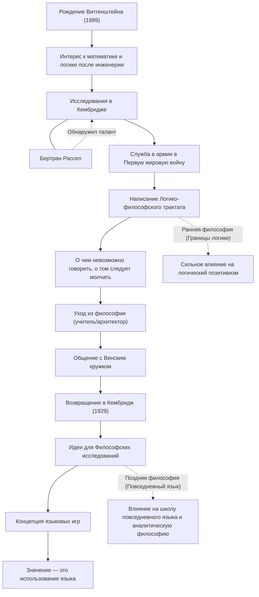

Людвиг Витгенштейн (1889–1951) — один из самых важных и влиятельных философов 20-го века. Его философию в целом делят на ранний период, в котором он исследовал границы языка и логики, и поздний период, сосредоточенный на использовании повседневного языка. В истории мысли крайне редко случается так, чтобы один философ на протяжении жизни в корне опроверг свои собственные прошлые теории и создал две совершенно разные философские системы.

## От младшего сына венского магната до Кембриджа

Витгенштейн родился в 1889 году в Вене, столице Австро-Венгерской империи, в одной из богатейших семей сталелитейных магнатов Европы. С детства он рос в окружении музыки и искусства, а их дом посещали такие деятели, как Брамс и Малер. Однако обстановка в семье была сложной, и его старшие братья один за другим свели счеты с жизнью, что стало для него чередой трагедий.

Сначала он отправился изучать инженерию в Берлин, а затем в Манчестер в Англии. Занимаясь исследованиями пропеллеров в области авиационной инженерии, он заинтересовался основами математики и, как следствие, самой логикой. Этот интерес привел его в Кембриджский университет, где он начал учиться у Бертрана Рассела, суперзвезды философского мира того времени. Рассел быстро распознал гений Витгенштейна, высоко оценив его и сказав, что лишь он сможет стать его преемником.

## "Логико-философский трактат" и философия молчания

С началом Первой мировой войны Витгенштейн добровольцем пошел в австрийскую армию. Во время боевых действий он всегда носил с собой тетради, углубляясь в философские размышления. Находясь в лагере для военнопленных в Италии, он завершил свою единственную опубликованную при жизни философскую книгу "Логико-философский трактат" (Tractatus Logico-Philosophicus).

В этом труде он пришел к выводу: "О чем можно сказать, о том можно сказать ясно; а о чем говорить невозможно, о том следует молчать". По его словам, функция языка — "отображать" факты мира, и логически описать можно только естественнонаучные факты. Он заявил, что самые важные вопросы, такие как этика, религия, красота и смысл жизни, находятся за пределами языка и не могут быть выражены. С этой книгой он решил, что "все проблемы философии решены", и покинул мир философии.

## Уход из философии и возвращение

Написав "Логико-философский трактат", он передал огромное наследство своим братьям и сестрам, оставшись без гроша, и стал школьным учителем в горной австрийской деревне. Он также работал садовником в монастыре и архитектором дома своей сестры. Однако он не обрел душевного покоя, который искал, и его жизнь в качестве учителя потерпела неудачу, отчасти из-за слишком строгого отношения к детям.

В конце концов, благодаря общению с Венским кружком (логическими позитивистами), Витгенштейн вновь обрел страсть к философии. В 1929 году он вернулся в Кембридж и начал осознавать недостатки теории, которую он создал в "Логико-философском трактате".

## Языковые игры и "Философские исследования"

В своих лекциях в Кембридже Витгенштейн разработал совершенно новый подход. Это была его "поздняя философия", которая вылилась в опубликованные после его смерти "Философские исследования" (Philosophical Investigations).

Он отверг идею раннего периода о том, что смысл языка заключается в абсолютной логической структуре, отображающей мир. Вместо этого он утверждал, что значение слова "заключается в его использовании". Он объяснил это с помощью концепции "языковых игр". Слова обретают смысл только тогда, когда они используются в различных контекстах и социальных правилах (играх), и он считал, что многие проблемы философии подобны "болезням", вызванным неправильным пониманием этого использования языка. Следовательно, он определил роль философии не в "решении" проблем, а в распутывании языковых узлов и проведении ментальной "терапии".

## Отношения и поток достижений

Жизнь и философские переходы Витгенштейна показаны на диаграмме ниже.

## Влияние на будущие поколения и наследие

Идеи Витгенштейна стали движущей силой сдвига парадигмы, названного "лингвистическим поворотом" в философии 20-го века. Его ранняя философия оказала огромное влияние на логический позитивизм таких мыслителей, как Карнап и Шлик, заложив основы философии науки. С другой стороны, его поздняя философия была перенята школой повседневного языка с Дж. Л. Остином и Гилбертом Райлом, распространив свое влияние на современную аналитическую философию, а также на лингвистику, психологию и исследования искусственного интеллекта.

Выходя за рамки академических кругов, его суровый образ жизни и бескомпромиссное отношение к истине продолжают очаровывать многих писателей и художников. Как он писал: "Как получается, что я такой плохой человек, и все же могу создавать такие хорошие вещи?", бесчисленные слова, рожденные из его непрестанной борьбы с самим собой, продолжают глубоко задавать нам вопросы и сегодня.
