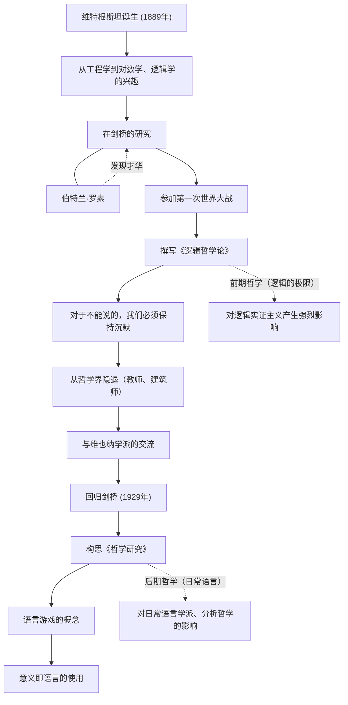

路德维希·维特根斯坦（Ludwig Wittgenstein, 1889–1951）是20世纪最重要且最具影响力的哲学家之一。他的哲学主要分为两个时期：探索语言与逻辑极限的前期，以及关注日常语言使用的后期。一位哲学家在有生之年彻底推翻了自己过去的理论，并建立起两个截然不同的哲学体系，这在思想史上也是极其罕见的事件。

## 从维也纳富豪的幺子到剑桥

1889年，维特根斯坦出生于奥匈帝国首都维也纳的一个欧洲顶尖钢铁财阀家庭。他从小在音乐和艺术的熏陶中长大，勃拉姆斯和马勒等人都曾是他们家的座上宾。然而，他的家庭环境十分复杂，他的哥哥们接连自杀，给他带来了巨大的悲剧。

起初，他为了学习工程学前往柏林，随后又到了英国的曼彻斯特。在从事航空工程中螺旋桨研究的过程中，他开始对数学基础，乃至逻辑学本身产生了浓厚的兴趣。这种兴趣将他引向了剑桥大学，在当时的哲学界巨星伯特兰·罗素门下学习。罗素很快就看出了维特根斯坦的天才特质，并极口称赞道：“能继承我衣钵的非他莫属。”

## 《逻辑哲学论》与沉默的哲学

第一次世界大战爆发后，维特根斯坦志愿加入奥地利军队。在战火中，他始终随身携带笔记本，不断深化自己的哲学思考。在成为意大利军队俘虏的战俘营里，他完成了生前出版的唯一一部哲学著作《逻辑哲学论》（Tractatus Logico-Philosophicus）。

在这部著作中，他得出结论：“凡是可以说的，都可以说得清楚；对于不能说的，我们必须保持沉默。”在他看来，语言的功能是“图示”世界的各种事实，而能够进行逻辑表达的只有自然科学的事实。伦理、宗教、美学以及人生的意义等最重要的事情，都超越了语言的界限，是无法言说的。凭借这本书，他认为“所有哲学问题都已得到解决”，于是离开了哲学界。

## 离开哲学与再次回归

写完《逻辑哲学论》后，他将庞大的遗产全部让给了兄弟姐妹，自己变得身无分文，去到奥地利的一个山村里当小学教师。他还曾担任过修道院的园丁以及姐姐宅邸的建筑师。然而，他并没有获得所追求的精神上的平静，作为教师的生活也因对孩子们的指导过于严厉而引发问题，最终不得不遭遇挫折。

不久之后，维特根斯坦通过与维也纳学派（逻辑实证主义者们）的交流，再次重燃了对哲学的热情。1929年，他回到了剑桥，开始意识到自己曾经建立的《逻辑哲学论》理论中存在的缺陷。

## 语言游戏与《哲学研究》

通过在剑桥的讲学，维特根斯坦展开了一种全新的方法。这就是在他死后出版的《哲学研究》（Philosophical Investigations）中结晶而成的“后期哲学”。

他否定了前期的观点，即语言的意义在于描绘世界的绝对逻辑结构。相反，他主张语言的意义在于“它的使用”。他用“语言游戏”这一概念来解释这一点。词语只有在多种语境和社会规则（游戏）中使用时才具有意义，他认为哲学的许多问题就像一种“疾病”，源于对语言用法的误解。因此，他将哲学的作用定义为不是“解决”问题，而是解开语言的纠结，进行精神上的“治疗”。

## 人物关系与成就流程

维特根斯坦的生平与哲学变迁如下图所示。

## 对后世的影响与遗产

维特根斯坦的思想成为了20世纪哲学中被称为“语言学转向”这一范式转移的动力。他的前期哲学对卡尔纳普和石里克等人的逻辑实证主义产生了巨大影响，奠定了科学哲学的基础。另一方面，他的后期哲学被J.L.奥斯汀和吉尔伯特·赖尔等日常语言学派所继承，其影响甚至延伸到了现代分析哲学，乃至语言学、心理学和人工智能研究等领域。

他超越了学术的界限，其严厉的生活方式和对真理毫不妥协的态度，至今仍吸引着许多文学家和艺术家。正如他所写下的：“我怎么会是这么坏的一个人，却能创造出这么好的东西来呢？”，那些在与自我不断斗争后产生的话语，至今仍在深深地拷问着我们。
