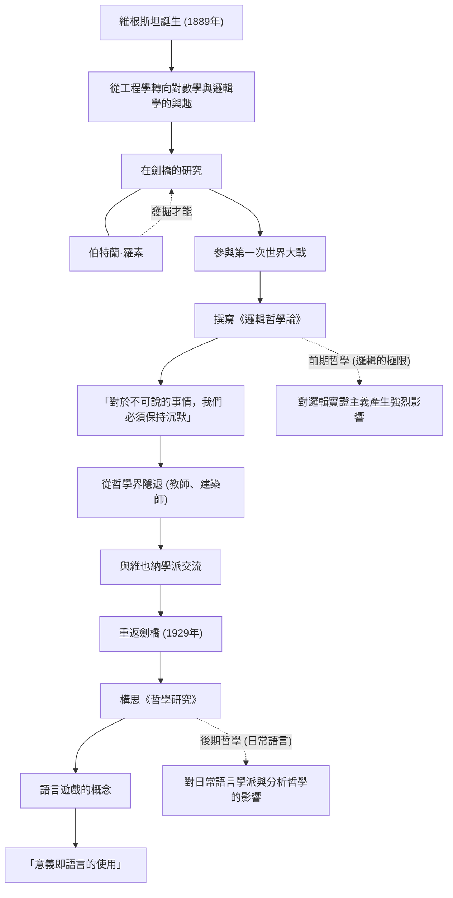

路德維希·維根斯坦 (Ludwig Wittgenstein, 1889–1951) 是20世紀最重要且最具影響力的哲學家之一。他的哲學大致可以分為探討語言與邏輯極限的前期，以及專注於日常語言使用的後期。一位哲學家在其一生中，從根本上推翻自己過去的理論，建立起兩個截然不同的哲學體系，這在思想史上是極為罕見的。

## 從維也納富豪的么子到劍橋

維根斯坦於1889年出生於奧匈帝國首都維也納，家族是歐洲首屈一指的鋼鐵財閥。他從小在音樂和藝術的薰陶中長大，家裡甚至有布拉姆斯和馬勒等名家造訪。然而，他的家庭環境複雜，幾位兄長接連自殺，這是一個巨大的悲劇。

起初，他為了學習工程學前往柏林，隨後又到了英國曼徹斯特。在從事航空工程中關於螺旋槳的研究時，他對數學基礎，進而對邏輯學本身產生了濃厚的興趣。這份興趣引領他來到了劍橋大學，拜入當時哲學界巨星伯特蘭·羅素 (Bertrand Russell) 的門下。羅素很快就看出了維根斯坦的天才特質，並盛讚道：「能繼承我衣缽的人非他莫屬。」

## 《邏輯哲學論》與沉默的哲學

第一次世界大戰爆發後，維根斯坦志願加入奧地利軍隊。在戰火中，他隨身帶著筆記本，不斷深化自己的哲學思考。後來他成為義大利軍隊的戰俘，在戰俘營中完成了他生前出版的唯一一部哲學著作《邏輯哲學論》(Tractatus Logico-Philosophicus)。

在這部著作中，他得出結論：「對於可以說的事情，可以說得清楚；而對於不可說的事情，我們必須保持沉默。」根據他的觀點，語言的功能是「描繪」世界的事實，而只有自然科學的事實才能在邏輯上被言說。至於倫理、宗教、美學以及人生的意義等最重要的事情，都超越了語言的界限，是無法被言說的。憑藉這本書，他認為「所有哲學問題都已獲得解決」，於是便離開了哲學界。

## 離開哲學與回歸

寫完《邏輯哲學論》後，他將自己繼承的龐大遺產全數讓給了兄弟姐妹，自己則身無分文地前往奧地利的偏遠山村擔任小學教師。此外，他還曾做過修道院的園丁，並為姐姐的宅邸擔任建築師。然而，他並未能獲得所渴求的精神平靜，作為教師的生活也因為對孩子們過於嚴苛而引發問題，最終被迫放棄。

不久之後，維根斯坦透過與維也納學派（邏輯實證主義者們）的交流，再次找回了對哲學的熱情。1929年，他重返劍橋，並開始意識到自己曾經建立的《邏輯哲學論》理論中存在缺陷。

## 語言遊戲與《哲學研究》

透過在劍橋的講學，維根斯坦發展出了一種全新的探究方式。這最終結集為他死後出版的《哲學研究》(Philosophical Investigations)，也就是他的「後期哲學」。

他否定了前期認為語言的意義在於描繪世界的絕對邏輯結構的觀點。取而代之的是，他主張語言的意義在於「其使用」。他用「語言遊戲」這個概念來解釋這一點。語言只有在多樣的語境和社會規則（遊戲）中使用時才具有意義，而哲學的許多問題，就像是因為誤解了語言的使用方式而產生的「疾病」。因此，他將哲學的作用定義為不是去「解決」問題，而是解開語言的糾結，進行精神上的「治療」。

## 人物關係與成就流程

維根斯坦的一生與哲學的演變如下圖所示。

## 對後世的影響與遺產

維根斯坦的思想成為了20世紀哲學中被稱為「語言學轉向」的典範轉移的原動力。他的前期哲學對卡爾納普、石里克等邏輯實證主義者產生了深遠的影響，奠定了科學哲學的基礎。另一方面，他的後期哲學則被 J.L. 奧斯丁與吉爾伯特·賴爾等日常語言學派繼承，並對現代分析哲學，甚至是語言學、心理學和人工智慧研究都產生了影響。

他超越了學術的框架，其嚴峻的生活方式以及對真理絕不妥協的態度，至今仍持續吸引著許多文學家與藝術家。正如他所寫下的：「我怎麼能是這麼壞的一個人，卻又創造出這麼好的東西呢？」，在與自我不斷抗爭後所孕育出的無數話語，至今仍向我們提出深刻的質問。
