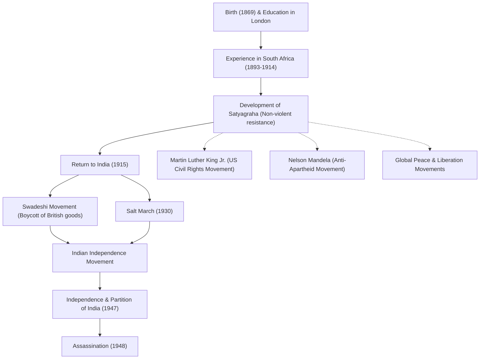

# رسول السلام المهاتما غاندي: كيف غير العصيان المدني اللاعنفي العالم

"العين بالعين تجعل العالم كله أعمى."

موهانداس كرمشاند غاندي (المعروف باسم المهاتما غاندي)، الذي ترك هذه الكلمات، هو أحد أكثر القادة تأثيراً في القرن العشرين. فلسفته في "العصيان المدني اللاعنفي (ساتياغراها)" لم تقُد الهند إلى الاستقلال عن الحكم الاستعماري البريطاني فحسب، بل أثرت بشكل عميق على حركات الحقوق المدنية والتحرير في جميع أنحاء العالم، بما في ذلك حركات مارتن لوثر كينغ الابن ونيلسون مانديلا. يتعمق هذا المقال في حياته وفلسفته، ويستكشف كيف أصبح يُدعى "الروح العظيمة (المهاتما)".

## الدراسة في لندن واليقظة في جنوب إفريقيا

وُلد غاندي عام 1869 في بوربندر، بولاية غوجارات غرب الهند، ونشأ في عائلة ثرية. في سن الثامنة عشرة، سافر إلى لندن، إنجلترا، لدراسة القانون وتأهل كمحامٍ. في ذلك الوقت، كان شاباً عادياً معجباً بالثقافة الغربية.

ومع ذلك، فإن تجربته في جنوب إفريقيا، حيث سافر للعمل في عام 1893، هي التي غيرت مصيره بشكل جذري. في جنوب إفريقيا في ذلك الوقت، كانت العنصرية القائمة على تفوق العرق الأبيض متفشية. تعرض غاندي نفسه لإذلال طرده من قطار على الرغم من حمله لتذكرة من الدرجة الأولى، لمجرد أنه كان شخصاً ملوناً. دفعته هذه الحادثة إلى بدء حركة لتحسين حقوق المهاجرين الهنود.

خلال ما يقرب من 20 عاماً من نشاطه في جنوب إفريقيا، أسس غاندي فلسفته الفريدة "ساتياغراها (التمسك بالحقيقة)". لم يكن هذا مجرد مقاومة سلبية، بل حركة لاعنفية نشطة تهدف إلى تصحيح الظلم من خلال مناشدة ضمير الخصم عبر المعاناة الذاتية، دون اللجوء إلى العنف.

## العودة إلى الهند وقيادة حركة الاستقلال

في عام 1915، عن عمر يناهز 45 عاماً، عاد غاندي إلى الهند وكرس نفسه لحركة استقلال وطنه. أصبح زعيماً للمؤتمر الوطني الهندي وقاد الاحتجاجات ضد القوانين البريطانية غير العادلة.

في صميم حركته كان هناك مبدأ "أهيمسا (اللاعنف)" و"سواديشي (استخدام المنتجات المحلية)". قاطع غاندي المنسوجات القطنية بريطانية الصنع وأطلق حركة لغزل الخيوط بنفسه باستخدام عجلة الغزل التقليدية (الشاركا). كانت هذه مقاومة ضد الهيمنة الاقتصادية البريطانية، بينما كانت تهدف في الوقت نفسه إلى الاستقلال واستعادة كرامة الشعب الهندي. أصبحت صورته وهو يغزل الخيوط رمزاً لحركة الاستقلال الهندية.

### مسيرة الملح (1930)

كان الحدث الأكثر رمزية في أنشطة غاندي هو "مسيرة الملح" التي نُظمت في عام 1930. في ذلك الوقت، كانت الحكومة الاستعمارية البريطانية تحتكر الملح وتفرض ضريبة ملح باهظة على الجماهير الهندية الفقيرة. للاحتجاج على ذلك، سار غاندي وأنصاره حوالي 390 كيلومتراً على مدار 24 يوماً للوصول إلى ساحل داندي المطل على بحر العرب. هناك، قام بغلي ماء البحر لصنع الملح بيديه، منتهكاً القانون علناً.

حظي هذا العمل المباشر اللاعنفي بتغطية إعلامية واسعة في جميع أنحاء العالم، مما زاد من الإدانة الدولية لبريطانيا وعزز بشكل حاسم زخم الاستقلال داخل الهند. سُجن أكثر من عشرات الآلاف، لكن إرادة الشعب لم تنكسر أبداً.

## تحقيق الاستقلال والنهاية المأساوية

بعد الحرب العالمية الثانية، وافقت بريطانيا أخيراً على استقلال الهند. ومع ذلك، لم يتحقق حلم غاندي بـ "هند موحدة". اشتد الصراع بين الهندوس والمسلمين، مما أدى إلى تقسيم الهند وباكستان في عام 1947. صام غاندي بيأس مخاطراً بحياته لتعزيز الانسجام بين الديانتين، وعمل بلا كلل لإخماد أعمال الشغب.

ومع ذلك، في 30 يناير 1948، بعد نصف عام فقط من الاستقلال، اغتيل غاندي على يد شاب هندوسي متعصب أثناء توجهه إلى اجتماع صلاة في نيودلهي. كان يبلغ من العمر 78 عاماً. جلبت وفاته حزناً عميقاً للعالم، لكن الروح التي تركها وراءه لن تموت أبداً.

## التأثير على الأجيال القادمة: إرث غاندي

أثبتت حياة غاندي كيف يمكن لـ "قوة الروح" التي يمتلكها إنسان واحد أن تحرك إمبراطورية عملاقة. لقد تجاوزت فلسفته في "العصيان المدني اللاعنفي" الحدود والعصور، وانتقلت إلى الأجيال القادمة.

قال مارتن لوثر كينغ الابن، الذي قاد حركة الحقوق المدنية الأمريكية، "قدم المسيح الروح والدافع، بينما قدم غاندي الطريقة"، وأطلق حركة لإلغاء التمييز العنصري من خلال اللاعنف. علاوة على ذلك، فإن العديد من قادة السلام، مثل نيلسون مانديلا، الذي ناضل ضد سياسة الفصل العنصري في جنوب إفريقيا، والدالاي لاما الرابع عشر للتبت، قد تأثروا بعمق بفلسفة غاندي.

حتى في المجتمع الحديث، وفي مواجهة التحديات العديدة التي نواجهها، مثل الصراعات والانقسامات والقضايا البيئية، فإن تعاليم غاندي، "كن أنت التغيير الذي تتمنى أن تراه في العالم"، تستمر في الصدى دون أن تتلاشى.

## تدفق الإنجازات والتأثير

أدناه رسم بياني يوضح الأحداث الرئيسية في حياة غاندي وتأثيرها على الأجيال القادمة.

