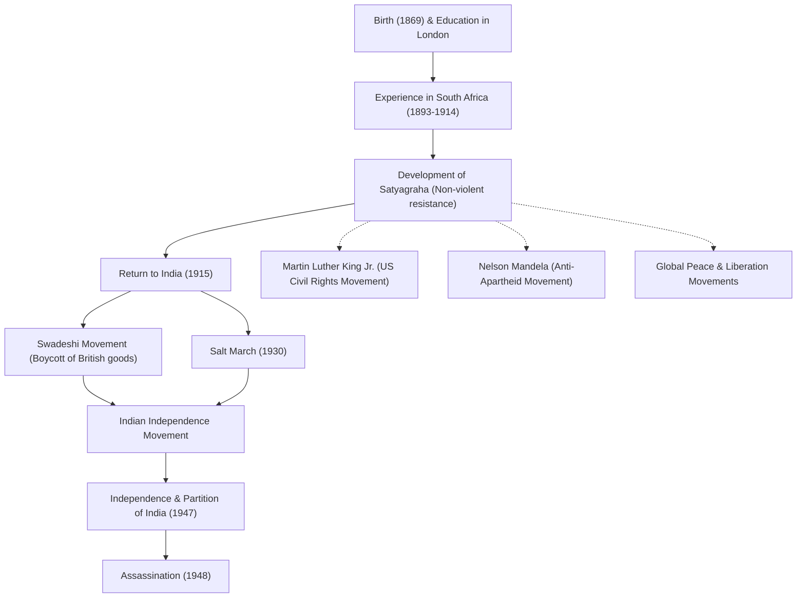

# Friedensapostel Mahatma Gandhi: Wie gewaltloser ziviler Ungehorsam die Welt veränderte

„Auge um Auge führt nur dazu, dass die ganze Welt erblindet.“

Mohandas Karamchand Gandhi (allgemein bekannt als Mahatma Gandhi), der diese Worte hinterlassen hat, ist einer der einflussreichsten Führer des 20. Jahrhunderts. Seine Philosophie des „gewaltlosen zivilen Ungehorsams (Satyagraha)“ führte Indien nicht nur zur Unabhängigkeit von der britischen Kolonialherrschaft, sondern beeinflusste auch Bürgerrechts- und Befreiungsbewegungen auf der ganzen Welt zutiefst, darunter die von [Martin Luther King Jr.](/de/p/biography-martin-luther-king-jr/) und [Nelson Mandela](/de/p/biography-nelson-mandela/). Dieser Artikel befasst sich mit seinem Leben und seiner Philosophie und untersucht, wie er dazu kam, die „Große Seele (Mahatma)“ genannt zu werden.

## Studium in London und Erwachen in Südafrika

Gandhi wurde 1869 in Porbandar im westindischen Bundesstaat Gujarat geboren und wuchs in einer wohlhabenden Familie auf. Im Alter von 18 Jahren reiste er nach London, England, um Jura zu studieren, und qualifizierte sich als Anwalt. Damals war er ein ganz normaler junger Mann, der die westliche Kultur bewunderte.

Es war jedoch seine Erfahrung in Südafrika, wohin er 1893 aus beruflichen Gründen reiste, die sein Schicksal grundlegend veränderte. Im damaligen Südafrika grassierte rassistischer Rassismus weißer Vorherrschaft. Gandhi selbst erlebte die Demütigung, aus einem Zug geworfen zu werden, obwohl er eine Erste-Klasse-Fahrkarte besaß, nur weil er eine Person mit dunkler Hautfarbe war. Dieser Vorfall veranlasste ihn, eine Bewegung zur Verbesserung der Rechte indischer Einwanderer ins Leben zu rufen.

Während seiner fast 20-jährigen Aktivität in Südafrika begründete Gandhi seine einzigartige Philosophie der „Satyagraha (Festhalten an der Wahrheit)“. Dies war kein bloßer passiver Widerstand, sondern eine aktive gewaltlose Bewegung, die darauf abzielte, Ungerechtigkeit zu korrigieren, indem man durch eigenes Leiden an das Gewissen des Gegners appellierte, ohne auf Gewalt zurückzugreifen.

## Rückkehr nach Indien und Führung der Unabhängigkeitsbewegung

1915 kehrte Gandhi im Alter von 45 Jahren nach Indien zurück und stürzte sich in die Unabhängigkeitsbewegung seiner Heimat. Er wurde ein Führer des Indischen Nationalkongresses und leitete Proteste gegen ungerechte britische Gesetze.

Im Mittelpunkt seiner Bewegung standen „Ahimsa (Gewaltlosigkeit)“ und „Swadeshi (Verwendung einheimischer Produkte)“. Gandhi boykottierte in Großbritannien hergestellte Baumwolltextilien und startete eine Bewegung, in der er mithilfe eines traditionellen Spinnrads (Charkha) selbst Fäden spann. Dies war ein Widerstand gegen die wirtschaftliche Vorherrschaft Großbritanniens und zielte gleichzeitig auf die Unabhängigkeit und Wiederherstellung der Würde des indischen Volkes ab. Seine fädenspinnende Gestalt wurde zum Symbol der indischen Unabhängigkeitsbewegung.

### Der Salzmarsch (1930)

Das symbolträchtigste Ereignis in Gandhis Aktivitäten war der „Salzmarsch“ im Jahr 1930. Damals hatte die britische Kolonialregierung das Monopol auf Salz und erhob eine hohe Salzsteuer auf die verarmten indischen Massen. Aus Protest marschierten Gandhi und seine Anhänger in 24 Tagen etwa 390 Kilometer weit, um die Küste von Dandi am Arabischen Meer zu erreichen. Dort kochte er Meerwasser, um mit eigenen Händen Salz herzustellen, und brach damit offen das Gesetz.

Über diese gewaltlose direkte Aktion wurde auf der ganzen Welt weithin berichtet. Sie verstärkte die internationale Verurteilung Großbritanniens und gab dem Unabhängigkeitsstreben in Indien entscheidenden Auftrieb. Mehr als Zehntausende wurden inhaftiert, aber der Wille des Volkes wurde nie gebrochen.

## Erreichung der Unabhängigkeit und tragisches Ende

Nach dem Zweiten Weltkrieg stimmte Großbritannien schließlich der Unabhängigkeit Indiens zu. Gandhis Traum von einem „vereinten Indien“ verwirklichte sich jedoch nicht. Der Konflikt zwischen Hindus und Muslimen verschärfte sich und führte 1947 zur Teilung Indiens und Pakistans. Gandhi fastete unter Einsatz seines Lebens verzweifelt, um die Harmonie zwischen den beiden Religionen zu fördern, und arbeitete unermüdlich daran, die Unruhen einzudämmen.

Doch am 30. Januar 1948, nur ein halbes Jahr nach der Unabhängigkeit, wurde Gandhi von einem fanatischen Hindu-Jugendlichen ermordet, als er auf dem Weg zu einem Gebetstreffen in Neu-Delhi war. Er wurde 78 Jahre alt. Sein Tod brachte tiefe Trauer über die Welt, aber der Geist, den er hinterlassen hat, wird niemals sterben.

## Einfluss auf künftige Generationen: Gandhis Vermächtnis

Gandhis Leben hat bewiesen, wie die „Macht des Geistes“, die ein einzelner Mensch besitzt, ein riesiges Imperium bewegen kann. Seine Philosophie des „gewaltlosen zivilen Ungehorsams“ hat Grenzen und Epochen überschritten und wurde an künftige Generationen weitergegeben.

[Martin Luther King Jr.](/de/p/biography-martin-luther-king-jr/), der die amerikanische Bürgerrechtsbewegung anführte, sagte: „Christus lieferte den Geist und die Motivation, während Gandhi die Methode lieferte“, und rief eine Bewegung zur Abschaffung der Rassendiskriminierung durch Gewaltlosigkeit ins Leben. Darüber hinaus wurden viele Friedensführer, wie [Nelson Mandela](/de/p/biography-nelson-mandela/), der gegen die Apartheidpolitik Südafrikas kämpfte, und der 14. Dalai Lama von Tibet, zutiefst von Gandhis Philosophie beeinflusst.

Auch in der modernen Gesellschaft verhallt Gandhis Lehre „Sei du selbst die Veränderung, die du dir für diese Welt wünschst“ angesichts der vielen Herausforderungen, vor denen wir stehen, wie Konflikte, Spaltungen und Umweltprobleme, ohne an Bedeutung zu verlieren.

## Fluss der Errungenschaften und des Einflusses

Nachfolgend finden Sie ein Diagramm, das die wichtigsten Ereignisse in Gandhis Leben und ihre Auswirkungen auf künftige Generationen zeigt.

