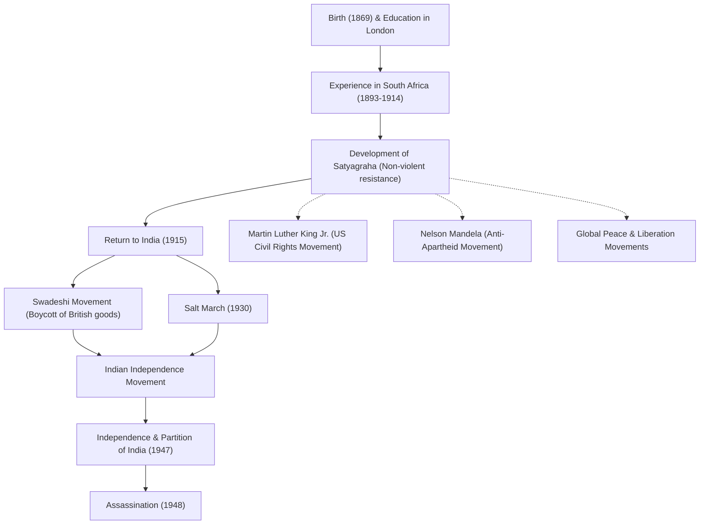

# Apostle of Peace Mahatma Gandhi: How Nonviolent Civil Disobedience Changed the World

"An eye for an eye will only make the whole world blind."

Mohandas Karamchand Gandhi (commonly known as Mahatma Gandhi), who left these words, is one of the most influential leaders of the 20th century. His philosophy of "nonviolent civil disobedience (Satyagraha)" not only led India to independence from British colonial rule but also profoundly influenced civil rights and liberation movements worldwide, including those of Martin Luther King Jr. and Nelson Mandela. This article delves into his life and philosophy, exploring how he came to be called the "Great Soul (Mahatma)."

## Studies in London and Awakening in South Africa

Born in 1869 in Porbandar, Gujarat, western India, Gandhi grew up in a wealthy family. At the age of 18, he traveled to London, England, to study law and qualified as a barrister. At the time, he was an ordinary young man who admired Western culture.

However, it was his experience in South Africa, where he traveled for work in 1893, that profoundly changed his destiny. In South Africa at the time, white supremacist racism was rampant. Gandhi himself experienced the humiliation of being thrown off a train despite holding a first-class ticket, simply because he was a person of color. This incident prompted him to begin a movement to improve the rights of Indian immigrants.

During his nearly 20 years of activism in South Africa, Gandhi established his unique philosophy of "Satyagraha (holding onto truth)." This was not merely passive resistance, but an active nonviolent movement that aimed to correct injustice by appealing to the conscience of the opponent through self-suffering, without resorting to violence.

## Return to India and Leadership of the Independence Movement

In 1915, at the age of 45, Gandhi returned to India and threw himself into his homeland's independence movement. He became a leader of the Indian National Congress and led protests against unjust British laws.

At the core of his movement were "Ahimsa (non-violence)" and "Swadeshi (use of domestic products)." Gandhi boycotted British-made cotton textiles and launched a movement to spin thread himself using a traditional spinning wheel (charkha). This was a resistance against British economic domination, while simultaneously aiming for the independence and restoration of dignity of the Indian people. His figure spinning thread became a symbol of the Indian independence movement.

### The Salt March (1930)

The most symbolic event in Gandhi's activities was the "Salt March" held in 1930. At the time, the British colonial government held a monopoly on salt and imposed a heavy salt tax on the poor Indian masses. To protest this, Gandhi and his supporters walked about 390 kilometers over 24 days to reach the coast of Dandi facing the Arabian Sea. There, he boiled seawater to make salt with his own hands, openly breaking the law.

This nonviolent direct action was widely reported around the world, increasing international condemnation of Britain and decisively boosting momentum for independence within India. More than tens of thousands were imprisoned, but the will of the people was never broken.

## Achievement of Independence and Tragic End

After World War II, Britain finally agreed to India's independence. However, Gandhi's dream of a "united India" was not realized. Conflict between Hindus and Muslims intensified, leading to the partition of India and Pakistan in 1947. Gandhi desperately fasted to promote harmony between the two religions, working tirelessly to quell the riots.

However, on January 30, 1948, just half a year after independence, Gandhi was assassinated by a fanatic Hindu youth while on his way to a prayer meeting in New Delhi. He was 78 years old. His death brought profound sorrow to the world, but the spirit he left behind will never die.

## Influence on Future Generations: Gandhi's Legacy

Gandhi's life proved how the "power of the spirit" held by a single human being can move a giant empire. His philosophy of "nonviolent civil disobedience" has transcended borders and eras, passed down to future generations.

Martin Luther King Jr., who led the American civil rights movement, said, "Christ furnished the spirit and motivation, while Gandhi furnished the method," and launched a movement to abolish racial discrimination through nonviolence. Furthermore, many peace leaders, such as Nelson Mandela, who fought against South Africa's apartheid policy, and the 14th Dalai Lama of Tibet, have been profoundly influenced by Gandhi's philosophy.

Even in modern society, against the many challenges we face, such as conflicts, divisions, and environmental issues, Gandhi's teaching, "Be the change you wish to see in the world," continues to resonate without fading.

## Flow of Achievements and Influence

Below is a diagram showing the major events in Gandhi's life and their impact on future generations.

