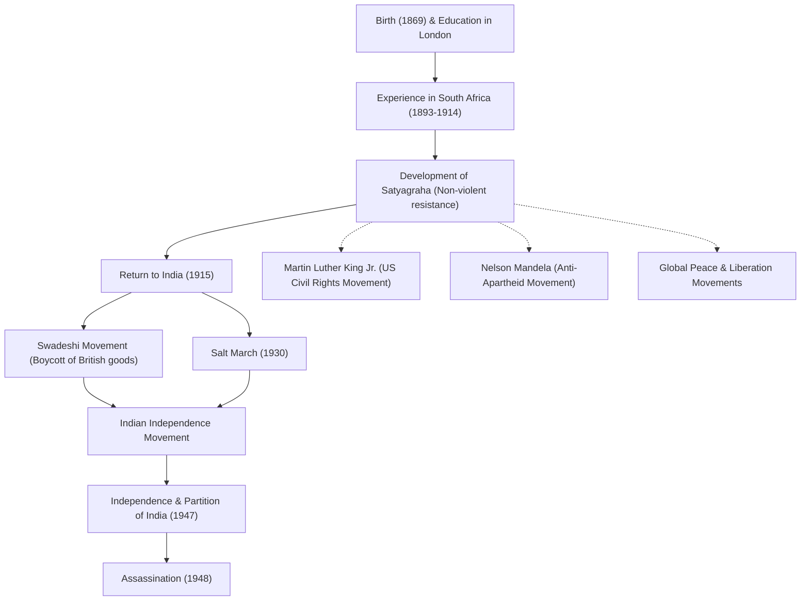

# Apóstol de la Paz Mahatma Gandhi: Cómo la desobediencia civil no violenta cambió el mundo

"Ojo por ojo, y el mundo acabará ciego."

Mohandas Karamchand Gandhi (comúnmente conocido como Mahatma Gandhi), quien dejó estas palabras, es uno de los líderes más influyentes del siglo XX. Su filosofía de "desobediencia civil no violenta (Satyagraha)" no solo llevó a la India a la independencia del dominio colonial británico, sino que también influyó profundamente en los movimientos de derechos civiles y de liberación en todo el mundo, incluidos los de Martin Luther King Jr. y Nelson Mandela. Este artículo profundiza en su vida y filosofía, explorando cómo llegó a ser llamado el "Alma Grande (Mahatma)".

## Estudios en Londres y despertar en Sudáfrica

Nacido en 1869 en Porbandar, estado de Gujarat, al oeste de la India, Gandhi creció en el seno de una familia acomodada. A los 18 años, viajó a Londres, Inglaterra, para estudiar derecho y se licenció como abogado. En ese momento, era un joven común que admiraba la cultura occidental.

Sin embargo, fue su experiencia en Sudáfrica, adonde viajó por trabajo en 1893, lo que cambió drásticamente su destino. En Sudáfrica, en aquella época, proliferaba el racismo supremacista blanco. El propio Gandhi experimentó la humillación de ser arrojado de un tren a pesar de tener un billete de primera clase, simplemente por ser una persona de color. Este incidente lo llevó a iniciar un movimiento para mejorar los derechos de los inmigrantes indios.

Durante sus casi 20 años de activismo en Sudáfrica, Gandhi estableció su filosofía única de "Satyagraha (firmeza en la verdad)". Esta no era simplemente una resistencia pasiva, sino un movimiento no violento activo que tenía como objetivo corregir la injusticia apelando a la conciencia del oponente a través del propio sufrimiento, sin recurrir a la violencia.

## Regreso a la India y liderazgo del movimiento de independencia

En 1915, a la edad de 45 años, Gandhi regresó a la India y se dedicó al movimiento de independencia de su patria. Se convirtió en líder del Congreso Nacional Indio y dirigió protestas contra las injustas leyes británicas.

En el núcleo de su movimiento estaban "Ahimsa (no violencia)" y "Swadeshi (uso de productos nacionales)". Gandhi boicoteó los textiles de algodón de fabricación británica y lanzó un movimiento para hilar hilo él mismo utilizando una rueca tradicional (charkha). Esta fue una resistencia contra la dominación económica británica y, al mismo tiempo, tuvo como objetivo la independencia y la restauración de la dignidad del pueblo indio. Su figura hilando se convirtió en un símbolo del movimiento de independencia de la India.

### La Marcha de la Sal (1930)

El evento más simbólico de las actividades de Gandhi fue la "Marcha de la Sal" de 1930. En ese momento, el gobierno colonial británico tenía el monopolio de la sal e imponía un fuerte impuesto sobre la sal a las empobrecidas masas indias. Para protestar por esto, Gandhi y sus seguidores caminaron unos 390 kilómetros durante 24 días hasta llegar a la costa de Dandi, frente al Mar Arábigo. Allí, hirvió agua de mar para hacer sal con sus propias manos, infringiendo abiertamente la ley.

Esta acción directa no violenta fue ampliamente difundida en todo el mundo, aumentando la condena internacional contra Gran Bretaña y fomentando decisivamente el impulso independentista dentro de la India. Más de decenas de miles fueron encarcelados, pero la voluntad del pueblo nunca se quebró.

## Logro de la independencia y un final trágico

Después de la Segunda Guerra Mundial, Gran Bretaña finalmente reconoció la independencia de la India. Sin embargo, el sueño de Gandhi de una "India unida" no se hizo realidad. El conflicto entre hindúes y musulmanes se intensificó, lo que llevó a la partición de India y Pakistán en 1947. Gandhi ayunó desesperadamente, arriesgando su vida, para promover la armonía entre las dos religiones e intentar sofocar los disturbios.

No obstante, el 30 de enero de 1948, apenas medio año después de la independencia, Gandhi fue asesinado por un joven hindú fanático mientras se dirigía a una reunión de oración en Nueva Delhi. Tenía 78 años. Su muerte trajo una profunda tristeza a todo el mundo, pero su espíritu nunca murió.

## Influencia en las generaciones futuras: el legado de Gandhi

La vida de Gandhi demostró cómo el "poder del espíritu" que posee un solo ser humano puede mover a un imperio gigante. Su filosofía de "desobediencia civil no violenta" ha trascendido fronteras y épocas, y ha sido transmitida a las generaciones futuras.

Martin Luther King Jr., quien lideró el movimiento de derechos civiles en los Estados Unidos, dijo: "Cristo dio el espíritu y Gandhi dio el método", e impulsó un movimiento para abolir la discriminación racial mediante la no violencia. Además, muchos líderes pacifistas, como Nelson Mandela, quien luchó contra la política del apartheid de Sudáfrica, y el decimocuarto Dalai Lama del Tíbet, han sido profundamente influenciados por la filosofía de Gandhi.

Incluso en la sociedad moderna, frente a los muchos desafíos que enfrentamos, como los conflictos, las divisiones y los problemas ambientales, la enseñanza de Gandhi: "Sé el cambio que deseas ver en el mundo", sigue resonando sin perder su vigencia.

## Flujo de logros e influencia

A continuación se muestra un diagrama que ilustra los principales acontecimientos de la vida de Gandhi y su impacto en las generaciones futuras.

