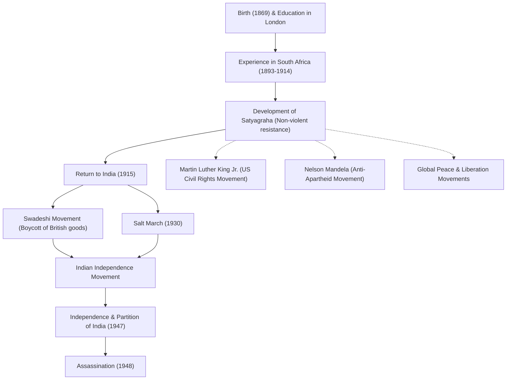

# Apôtre de la paix Mahatma Gandhi : Comment la désobéissance civile non violente a changé le monde

« Œil pour œil, et le monde finira aveugle. »

Mohandas Karamchand Gandhi (communément appelé Mahatma Gandhi), qui a laissé ces mots, est l'un des dirigeants les plus influents du XXe siècle. Sa philosophie de la « désobéissance civile non violente (Satyagraha) » a non seulement conduit l'Inde à l'indépendance vis-à-vis de la domination coloniale britannique, mais a également profondément influencé les mouvements pour les droits civiques et de libération dans le monde entier, notamment ceux de Martin Luther King Jr. et de Nelson Mandela. Cet article se penche sur sa vie et sa philosophie, explorant comment il en est venu à être appelé la « Grande Âme (Mahatma) ».

## Études à Londres et éveil en Afrique du Sud

Né en 1869 à Porbandar, dans l'État du Gujarat, dans l'ouest de l'Inde, Gandhi a grandi dans une famille aisée. À 18 ans, il se rend à Londres, en Angleterre, pour étudier le droit et obtient le diplôme d'avocat. À l'époque, c'était un jeune homme ordinaire qui admirait la culture occidentale.

Cependant, c'est son expérience en Afrique du Sud, où il se rend pour travailler en 1893, qui va radicalement changer son destin. À l'époque, l'Afrique du Sud était en proie à un racisme fondé sur la suprématie blanche. Gandhi lui-même subit l'humiliation d'être jeté d'un train alors qu'il possédait un billet de première classe, simplement parce qu'il était une personne de couleur. Cet incident l'a poussé à lancer un mouvement pour améliorer les droits des immigrés indiens.

Au cours de ses près de 20 ans de militantisme en Afrique du Sud, Gandhi a forgé sa philosophie unique du « Satyagraha (l'étreinte de la vérité) ». Il ne s'agissait pas d'une simple résistance passive, mais d'un mouvement non violent actif visant à corriger l'injustice en faisant appel à la conscience de l'adversaire par sa propre souffrance, sans recourir à la violence.

## Retour en Inde et direction du mouvement pour l'indépendance

En 1915, à l'âge de 45 ans, Gandhi retourne en Inde et se jette à corps perdu dans le mouvement d'indépendance de sa patrie. Il devient un chef de file du Congrès national indien et mène des manifestations contre les lois britanniques injustes.

Au cœur de son mouvement se trouvaient l'« Ahimsa (non-violence) » et le « Swadeshi (utilisation de produits nationaux) ». Gandhi boycotte les textiles de coton fabriqués en Grande-Bretagne et lance un mouvement pour filer lui-même le fil à l'aide d'un rouet traditionnel (charkha). Il s'agissait à la fois d'une résistance à la domination économique britannique et d'une volonté de restaurer l'indépendance et la dignité du peuple indien. La figure de Gandhi filant le coton devient un symbole du mouvement d'indépendance de l'Inde.

### La Marche du sel (1930)

L'événement le plus symbolique de l'action de Gandhi est la « Marche du sel », qui s'est déroulée en 1930. À l'époque, le gouvernement colonial britannique détenait le monopole du sel et imposait une lourde taxe sur le sel aux masses indiennes appauvries. Pour protester, Gandhi et ses partisans parcourent à pied environ 390 kilomètres en 24 jours pour atteindre la côte de Dandi, au bord de la mer d'Oman. Là, il fait bouillir l'eau de mer pour fabriquer du sel de ses propres mains, violant ainsi ouvertement la loi.

Cette action directe non violente est largement couverte par les médias du monde entier, ce qui accroît la condamnation internationale de la Grande-Bretagne et donne un élan décisif à la volonté d'indépendance au sein de l'Inde. Des dizaines de milliers de personnes sont emprisonnées, mais la volonté du peuple ne faiblit pas.

## L'indépendance et une fin tragique

Après la Seconde Guerre mondiale, la Grande-Bretagne accepte finalement l'indépendance de l'Inde. Cependant, le rêve de Gandhi d'une « Inde unie » ne se réalise pas. Le conflit entre hindous et musulmans s'intensifie, conduisant à la partition de l'Inde et du Pakistan en 1947. Gandhi jeûne désespérément au péril de sa vie pour promouvoir l'harmonie entre les deux religions, s'efforçant de réprimer les émeutes.

Pourtant, le 30 janvier 1948, à peine six mois après l'indépendance, Gandhi est assassiné par un jeune hindou fanatique alors qu'il se rendait à une réunion de prière à New Delhi. Il a 78 ans. Sa mort plonge le monde dans un profond chagrin, mais l'esprit qu'il a laissé derrière lui ne mourra jamais.

## Influence sur les générations futures : L'héritage de Gandhi

La vie de Gandhi a prouvé que la « force d'esprit » d'un seul être humain peut faire bouger un empire gigantesque. Sa philosophie de la « désobéissance civile non violente » a transcendé les frontières et les époques pour se transmettre aux générations futures.

Martin Luther King Jr., qui a dirigé le mouvement américain pour les droits civiques, a déclaré : « Le Christ a fourni l'esprit et la motivation, tandis que Gandhi a fourni la méthode », et a lancé un mouvement visant à abolir la discrimination raciale par la non-violence. En outre, de nombreux dirigeants pacifistes, tels que Nelson Mandela, qui a lutté contre la politique d'apartheid de l'Afrique du Sud, et le 14e Dalaï Lama du Tibet, ont été profondément influencés par la philosophie de Gandhi.

Même dans la société moderne, face aux nombreux défis auxquels nous sommes confrontés, tels que les conflits, les divisions et les problèmes environnementaux, l'enseignement de Gandhi, « Soyez le changement que vous voulez voir dans le monde », continue de résonner sans perdre de sa pertinence.

## Flux des réalisations et de l'influence

Vous trouverez ci-dessous un diagramme illustrant les événements majeurs de la vie de Gandhi et leur impact sur les générations futures.

