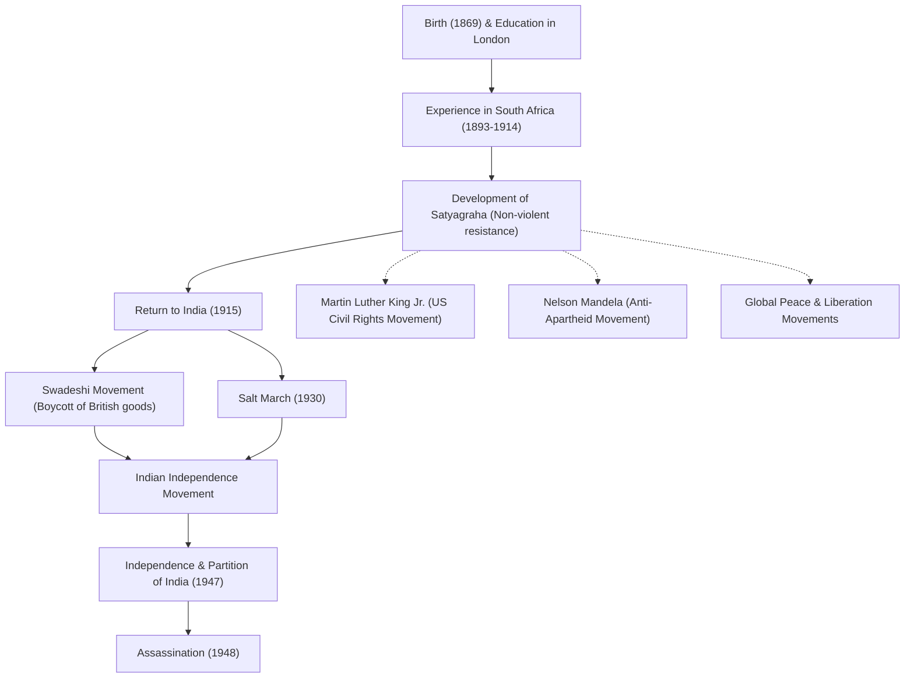

# शांति के दूत महात्मा गांधी: कैसे अहिंसक सविनय अवज्ञा ने दुनिया को बदल दिया

"आँख के बदले आँख, पूरी दुनिया को अंधा बना देगी।"

ये शब्द कहने वाले मोहनदास करमचंद गांधी (जिन्हें महात्मा गांधी के नाम से जाना जाता है) 20वीं सदी के सबसे प्रभावशाली नेताओं में से एक हैं। उनके "अहिंसक सविनय अवज्ञा (सत्याग्रह)" के दर्शन ने न केवल भारत को ब्रिटिश औपनिवेशिक शासन से स्वतंत्रता दिलाई, बल्कि मार्टिन लूथर किंग जूनियर और नेल्सन मंडेला सहित दुनिया भर के नागरिक अधिकार और मुक्ति आंदोलनों को भी गहराई से प्रभावित किया। यह लेख उनके जीवन और दर्शन पर गहराई से प्रकाश डालता है, यह खोजता है कि उन्हें "महान आत्मा (महात्मा)" क्यों कहा जाने लगा।

## लंदन में पढ़ाई और दक्षिण अफ्रीका में जागृति

1869 में पश्चिमी भारत के गुजरात राज्य के पोरबंदर में जन्मे गांधी जी एक संपन्न परिवार में पले-बढ़े। 18 वर्ष की आयु में, वे कानून की पढ़ाई करने के लिए लंदन, इंग्लैंड गए और बैरिस्टर के रूप में योग्य हुए। उस समय, वे एक साधारण युवा थे जो पश्चिमी संस्कृति की प्रशंसा करते थे।

हालाँकि, यह दक्षिण अफ्रीका में उनका अनुभव था, जहाँ वे 1893 में काम के लिए गए थे, जिसने उनकी नियति को पूरी तरह से बदल दिया। उस समय दक्षिण अफ्रीका में, श्वेत वर्चस्ववादी नस्लवाद बड़े पैमाने पर था। गांधी जी को स्वयं प्रथम श्रेणी का टिकट होने के बावजूद, केवल एक अश्वेत व्यक्ति होने के कारण ट्रेन से बाहर फेंके जाने का अपमान सहना पड़ा। इस घटना ने उन्हें भारतीय प्रवासियों के अधिकारों में सुधार के लिए एक आंदोलन शुरू करने के लिए प्रेरित किया।

दक्षिण अफ्रीका में अपने लगभग 20 वर्षों के सक्रियतावाद के दौरान, गांधी जी ने "सत्याग्रह (सत्य पर दृढ़ रहना)" का अपना अनूठा दर्शन स्थापित किया। यह केवल निष्क्रिय प्रतिरोध नहीं था, बल्कि एक सक्रिय अहिंसक आंदोलन था जिसका उद्देश्य हिंसा का सहारा लिए बिना, स्वयं कष्ट सहकर विरोधी की अंतरात्मा से अपील करके अन्याय को सुधारना था।

## भारत वापसी और स्वतंत्रता आंदोलन का नेतृत्व

1915 में, 45 वर्ष की आयु में, गांधी जी भारत लौट आए और खुद को अपनी मातृभूमि के स्वतंत्रता आंदोलन में झोंक दिया। वे भारतीय राष्ट्रीय कांग्रेस के नेता बने और अन्यायपूर्ण ब्रिटिश कानूनों के खिलाफ विरोध प्रदर्शनों का नेतृत्व किया।

उनके आंदोलन के मूल में "अहिंसा (हिंसा न करना)" और "स्वदेशी (घरेलू उत्पादों का उपयोग)" थे। गांधी जी ने ब्रिटिश निर्मित सूती वस्त्रों का बहिष्कार किया और पारंपरिक चरखे का उपयोग करके स्वयं सूत कातने का आंदोलन शुरू किया। यह ब्रिटिश आर्थिक वर्चस्व के खिलाफ एक प्रतिरोध था, जबकि साथ ही इसका उद्देश्य स्वतंत्रता और भारतीय लोगों की गरिमा की बहाली था। सूत कातते हुए उनकी आकृति भारतीय स्वतंत्रता आंदोलन का प्रतीक बन गई।

### दांडी मार्च (1930)

गांधी जी की गतिविधियों में सबसे प्रतीकात्मक घटना 1930 में आयोजित "नमक मार्च (दांडी मार्च)" थी। उस समय, ब्रिटिश औपनिवेशिक सरकार का नमक पर एकाधिकार था और उसने गरीब भारतीय जनता पर भारी नमक कर लगाया था। इसका विरोध करने के लिए, गांधी जी और उनके समर्थकों ने अरब सागर के सामने दांडी के तट तक पहुंचने के लिए 24 दिनों में लगभग 390 किलोमीटर पैदल यात्रा की। वहाँ, उन्होंने अपने हाथों से नमक बनाने के लिए समुद्री जल उबाला और खुलेआम कानून तोड़ा।

इस अहिंसक प्रत्यक्ष कार्रवाई की दुनिया भर में व्यापक रूप से रिपोर्ट की गई, जिससे ब्रिटेन की अंतर्राष्ट्रीय निंदा बढ़ी और भारत के भीतर स्वतंत्रता की गति को निर्णायक रूप से बढ़ावा मिला। हजारों से अधिक लोगों को जेल में डाल दिया गया, लेकिन लोगों की इच्छाशक्ति कभी नहीं टूटी।

## स्वतंत्रता की प्राप्ति और दुखद अंत

द्वितीय विश्व युद्ध के बाद, ब्रिटेन आखिरकार भारत की स्वतंत्रता के लिए सहमत हो गया। हालाँकि, गांधी जी का "अखंड भारत" का सपना साकार नहीं हुआ। हिंदुओं और मुसलमानों के बीच संघर्ष तेज हो गया, जिसके कारण 1947 में भारत और पाकिस्तान का विभाजन हुआ। गांधी जी ने दोनों धर्मों के बीच सद्भाव को बढ़ावा देने के लिए अपने जीवन को जोखिम में डालकर हताशा में उपवास किया, और दंगों को शांत करने के लिए अथक प्रयास किया।

हालाँकि, 30 जनवरी 1948 को, स्वतंत्रता के केवल आधे साल बाद, नई दिल्ली में एक प्रार्थना सभा में जाते समय गांधी जी की एक कट्टरपंथी हिंदू युवक द्वारा हत्या कर दी गई। वे 78 वर्ष के थे। उनकी मृत्यु ने दुनिया में गहरा दुख ला दिया, लेकिन उनके द्वारा छोड़ी गई भावना कभी नहीं मरेगी।

## आने वाली पीढ़ियों पर प्रभाव: गांधी जी की विरासत

गांधी जी के जीवन ने साबित कर दिया कि एक इंसान के पास मौजूद "आत्मा की शक्ति" कैसे एक विशाल साम्राज्य को हिला सकती है। उनके "अहिंसक सविनय अवज्ञा" के दर्शन ने सीमाओं और युगों को पार कर लिया है, जो आने वाली पीढ़ियों तक पहुँचाया गया है।

अमेरिकी नागरिक अधिकार आंदोलन का नेतृत्व करने वाले मार्टिन लूथर किंग जूनियर ने कहा, "ईसा मसीह ने भावना और प्रेरणा प्रदान की, जबकि गांधी ने तरीका प्रदान किया," और अहिंसा के माध्यम से नस्लीय भेदभाव को समाप्त करने के लिए एक आंदोलन शुरू किया। इसके अलावा, नेल्सन मंडेला, जिन्होंने दक्षिण अफ्रीका की रंगभेद नीति के खिलाफ लड़ाई लड़ी, और तिब्बत के 14वें दलाई लामा जैसे कई शांति नेता, गांधी जी के दर्शन से गहराई से प्रभावित हुए हैं।

आधुनिक समाज में भी, संघर्ष, विभाजन और पर्यावरणीय मुद्दों जैसी कई चुनौतियों का सामना करते हुए, गांधी जी की शिक्षा, "वह बदलाव बनें जो आप दुनिया में देखना चाहते हैं," बिना फीकी पड़े गूंजती रहती है।

## उपलब्धियों और प्रभाव का प्रवाह

नीचे एक आरेख दिया गया है जो गांधी जी के जीवन की प्रमुख घटनाओं और आने वाली पीढ़ियों पर उनके प्रभाव को दर्शाता है।

