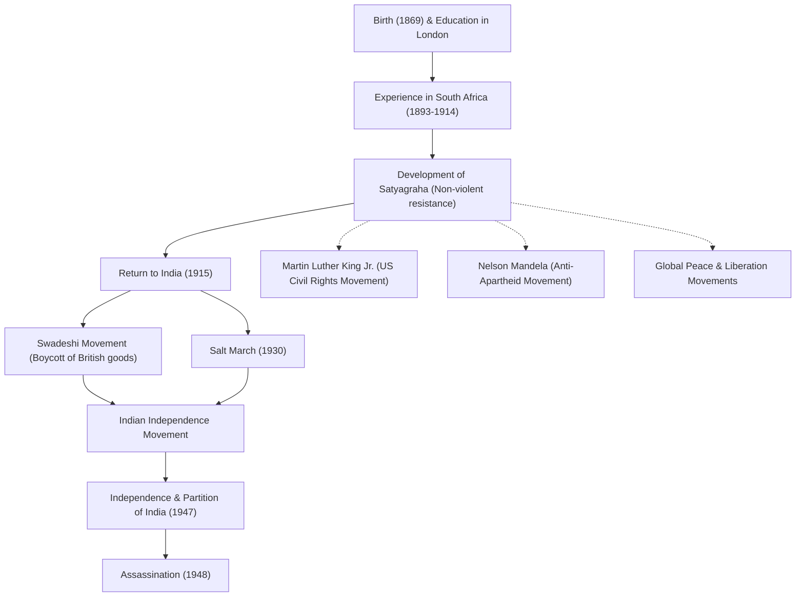

# Rasul Perdamaian Mahatma Gandhi: Bagaimana Pembangkangan Sipil Tanpa Kekerasan Mengubah Dunia

"Mata ganti mata hanya akan membuat seluruh dunia buta."

Mohandas Karamchand Gandhi (biasa dikenal sebagai Mahatma Gandhi), yang meninggalkan kata-kata ini, adalah salah satu pemimpin paling berpengaruh di abad ke-20. Filosofinya tentang "pembangkangan sipil tanpa kekerasan (Satyagraha)" tidak hanya memimpin India menuju kemerdekaan dari penjajahan Inggris, tetapi juga sangat memengaruhi gerakan hak-hak sipil dan pembebasan di seluruh dunia, termasuk Martin Luther King Jr. dan Nelson Mandela. Artikel ini menggali lebih dalam kehidupan dan filosofinya, mengeksplorasi bagaimana ia kemudian disebut sebagai "Jiwa Agung (Mahatma)".

## Belajar di London dan Pencerahan di Afrika Selatan

Lahir pada tahun 1869 di Porbandar, negara bagian Gujarat, India barat, Gandhi tumbuh dalam keluarga kaya. Pada usia 18 tahun, ia bepergian ke London, Inggris, untuk belajar hukum dan memenuhi syarat sebagai pengacara. Pada saat itu, ia adalah seorang pemuda biasa yang mengagumi budaya Barat.

Namun, pengalamannyalah di Afrika Selatan, tempat ia bepergian untuk bekerja pada tahun 1893, yang secara drastis mengubah takdirnya. Di Afrika Selatan pada saat itu, rasisme supremasi kulit putih merajalela. Gandhi sendiri mengalami penghinaan karena dilempar dari kereta api meskipun memegang tiket kelas satu, hanya karena ia adalah orang kulit berwarna. Insiden ini mendorongnya untuk memulai gerakan untuk meningkatkan hak-hak imigran India.

Selama hampir 20 tahun aktivismenya di Afrika Selatan, Gandhi mendirikan filosofi uniknya "Satyagraha (berpegang teguh pada kebenaran)". Ini bukan sekadar perlawanan pasif, melainkan gerakan tanpa kekerasan aktif yang bertujuan untuk memperbaiki ketidakadilan dengan memohon hati nurani lawan melalui penderitaan diri sendiri, tanpa menggunakan kekerasan.

## Kembali ke India dan Memimpin Gerakan Kemerdekaan

Pada tahun 1915, pada usia 45 tahun, Gandhi kembali ke India dan terjun ke gerakan kemerdekaan tanah airnya. Ia menjadi pemimpin Kongres Nasional India dan memimpin protes terhadap hukum Inggris yang tidak adil.

Inti dari gerakannya adalah "Ahimsa (tanpa kekerasan)" dan "Swadeshi (penggunaan produk dalam negeri)". Gandhi memboikot tekstil katun buatan Inggris dan meluncurkan gerakan untuk memintal benang sendiri menggunakan alat tenun tradisional (charkha). Ini merupakan perlawanan terhadap dominasi ekonomi Inggris, sementara secara bersamaan bertujuan untuk kemerdekaan dan pemulihan martabat rakyat India. Sosoknya yang sedang memintal benang menjadi simbol gerakan kemerdekaan India.

### Pawai Garam (1930)

Peristiwa paling simbolis dalam kegiatan Gandhi adalah "Pawai Garam" yang diadakan pada tahun 1930. Pada saat itu, pemerintah kolonial Inggris memegang monopoli atas garam dan mengenakan pajak garam yang berat kepada rakyat miskin India. Untuk memprotes hal ini, Gandhi dan para pendukungnya berjalan sejauh 390 kilometer selama 24 hari untuk mencapai pantai Dandi yang menghadap ke Laut Arab. Di sana, ia merebus air laut untuk membuat garam dengan tangannya sendiri, yang secara terang-terangan melanggar hukum.

Aksi langsung tanpa kekerasan ini diliput secara luas di seluruh dunia, meningkatkan kecaman internasional terhadap Inggris dan secara meyakinkan mendorong momentum kemerdekaan di dalam India. Lebih dari puluhan ribu orang dipenjara, tetapi tekad rakyat tidak pernah patah.

## Pencapaian Kemerdekaan dan Akhir yang Tragis

Setelah Perang Dunia II, Inggris akhirnya menyetujui kemerdekaan India. Namun, impian Gandhi tentang "India yang bersatu" tidak terwujud. Konflik antara Hindu dan Muslim memanas, yang mengarah pada pemisahan India dan Pakistan pada tahun 1947. Gandhi mati-matian berpuasa dengan mempertaruhkan nyawanya untuk mempromosikan keharmonisan antara kedua agama, bekerja tanpa lelah untuk memadamkan kerusuhan.

Namun, pada tanggal 30 Januari 1948, hanya setengah tahun setelah kemerdekaan, Gandhi dibunuh oleh seorang pemuda Hindu fanatik saat dalam perjalanan ke pertemuan doa di New Delhi. Ia berusia 78 tahun. Kematiannya membawa duka yang mendalam bagi dunia, tetapi semangat yang ditinggalkannya tidak akan pernah mati.

## Pengaruh pada Generasi Mendatang: Warisan Gandhi

Kehidupan Gandhi membuktikan bagaimana "kekuatan roh" yang dimiliki oleh seorang manusia dapat menggerakkan sebuah kerajaan raksasa. Filosofinya tentang "pembangkangan sipil tanpa kekerasan" telah melampaui batas dan era, diwariskan kepada generasi mendatang.

Martin Luther King Jr., yang memimpin gerakan hak-hak sipil Amerika, berkata, "Kristus memberikan semangat dan motivasi, sementara Gandhi memberikan metodenya," dan meluncurkan gerakan untuk menghapus diskriminasi rasial melalui tanpa kekerasan. Lebih jauh, banyak pemimpin perdamaian, seperti Nelson Mandela, yang berjuang melawan kebijakan apartheid Afrika Selatan, dan Dalai Lama ke-14 dari Tibet, sangat dipengaruhi oleh filosofi Gandhi.

Bahkan dalam masyarakat modern, dalam menghadapi banyak tantangan yang kita hadapi, seperti konflik, perpecahan, dan masalah lingkungan, ajaran Gandhi, "Jadilah perubahan yang ingin Anda lihat di dunia," terus bergema tanpa memudar.

## Alur Pencapaian dan Pengaruh

Di bawah ini adalah diagram yang menunjukkan peristiwa-peristiwa besar dalam kehidupan Gandhi dan dampaknya pada generasi mendatang.

