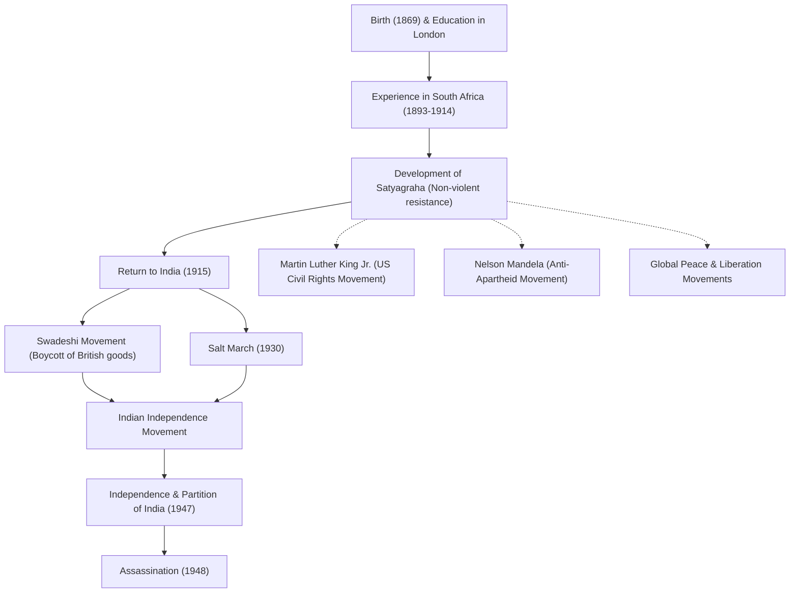

# 평화의 사도 마하트마 간디: 비폭력 불복종이 바꾼 세상

"눈에는 눈이라는 생각은 결국 온 세상을 눈멀게 할 것이다."

이 말을 남긴 모한다스 카람찬드 간디(통칭 마하트마 간디)는 20세기 가장 영향력 있는 지도자 중 한 명입니다. 그가 주창한 '비폭력 불복종(사티아그라하)' 철학은 인도를 영국의 식민 지배로부터 독립으로 이끌었을 뿐만 아니라, 훗날 마틴 루터 킹 주니어나 넬슨 만델라 등 전 세계의 공민권 운동과 해방 운동에 지대한 영향을 미쳤습니다. 본 기사에서는 그가 어떻게 '위대한 영혼(마하트마)'으로 불리게 되었는지, 그의 생애와 철학을 깊이 파헤쳐 봅니다.

## 런던에서의 배움과 남아프리카에서의 각성

1869년 인도 서부 구자라트주 포르반다르에서 태어난 간디는 유복한 가정에서 자랐습니다. 18세에 법학을 공부하기 위해 영국 런던으로 건너가 변호사 자격을 취득합니다. 당시의 그는 서양 문화에 동경을 품은 평범한 청년이었습니다.

그러나 그의 운명을 크게 바꾼 것은 1893년 일을 위해 건너간 남아프리카공화국에서의 경험입니다. 당시 남아프리카공화국은 백인 우월주의적인 인종차별이 만연해 있었습니다. 간디 자신도 일등석 표를 가지고 있었음에도 불구하고 유색인종이라는 이유로 기차에서 내쫓기는 굴욕적인 체험을 합니다. 이 사건을 계기로 그는 인도인 이민자의 권리 향상을 위한 운동을 시작했습니다.

남아프리카공화국에서의 약 20년에 걸친 활동 속에서 간디는 '사티아그라하(진리의 파악)'라는 독자적인 철학을 확립합니다. 이는 단순한 수동적인 저항이 아니라, 폭력에 호소하지 않고 스스로의 고통을 통해 상대의 양심에 호소하여 부정을 바로잡는 적극적인 비폭력 운동이었습니다.

## 인도로의 귀환과 독립운동의 지도

1915년, 45세가 된 간디는 인도로 귀환하여 조국의 독립운동에 몸을 던집니다. 그는 인도 국민회의파의 지도자가 되어 영국의 부당한 법률에 대한 항의 활동을 주도했습니다.

그의 운동의 근간에 있었던 것은 '아힘사(불살생)'와 '스와데시(국산품 애용)'입니다. 간디는 영국산 면직물을 보이콧하고, 전통적인 물레(차르카)로 직접 실을 잣는 운동을 전개했습니다. 이는 영국의 경제 지배에 대한 저항인 동시에, 인도 민중의 자립과 존엄 회복을 목표로 하는 것이었습니다. 그가 실을 잣는 모습은 인도 독립운동의 상징이 됩니다.

### 소금 행진 (1930년)

간디의 활동 중 가장 상징적인 사건이 1930년에 행해진 '소금 행진(Salt March)'입니다. 당시 영국 식민 정부는 소금 전매제를 실시하여 가난한 인도 민중에게 무거운 소금세를 부과하고 있었습니다. 이에 항의하기 위해 간디는 지지자들과 함께 약 390킬로미터의 거리를 24일에 걸쳐 걸어 아라비아해에 면한 단디 해안에 도달했습니다. 그리고 바닷물을 끓여 자신의 손으로 소금을 만들어 공공연히 법을 어겼습니다.

이 비폭력에 의한 직접 행동은 전 세계에 대대적으로 보도되어 영국에 대한 국제적인 비난을 높이는 동시에 인도 국내의 독립 기운을 결정적인 것으로 만들었습니다. 수만 명 이상이 투옥되었지만, 사람들의 의지는 꺾이지 않았습니다.

## 독립 달성과 비극적인 최후

제2차 세계대전 후, 영국은 마침내 인도의 독립을 인정하게 됩니다. 그러나 간디가 꿈꾸었던 '통일 인도'의 실현은 이루어지지 않았습니다. 힌두교도와 이슬람교도의 대립이 격화되어 1947년에 인도와 파키스탄이 분리 독립하게 된 것입니다. 간디는 양 종교의 융화를 위해 목숨을 걸고 단식을 하며 폭동을 진압하기 위해 동분서주했습니다.

그러나 독립으로부터 불과 반년 후인 1948년 1월 30일, 뉴델리에서 기도 집회로 향하던 중, 간디는 광신적인 힌두교도 청년에 의해 암살되었습니다. 향년 78세. 그의 죽음은 전 세계에 깊은 슬픔을 가져왔지만, 그가 남긴 정신은 결코 죽지 않았습니다.

## 후세에 미친 영향: 간디의 유산

간디의 생애는 한 인간이 가진 '정신의 힘'이 얼마나 거대한 제국을 움직일 수 있는지를 증명했습니다. 그의 '비폭력 불복종' 철학은 국경과 시대를 넘어 후세 사람들에게 이어졌습니다.

미국의 공민권 운동을 지도한 마틴 루터 킹 주니어는 "그리스도가 정신을 주었고, 간디가 방법을 주었다"라고 말하며 비폭력에 의한 인종차별 철폐 운동을 전개했습니다. 또한, 남아프리카공화국의 아파르트헤이트 정책과 싸운 넬슨 만델라나 티베트의 달라이 라마 14세 등 많은 평화 지도자들이 간디의 철학에 지대한 영향을 받았습니다.

현대 사회에서도 분쟁이나 분단, 환경 문제 등 우리가 직면한 많은 과제에 대해, 간디의 "세상을 바꾸고 싶다면, 먼저 스스로 그 변화가 되어라"라는 가르침은 빛바래지 않고 계속 울려 퍼지고 있습니다.

## 공적과 영향의 흐름

아래는 간디 생애의 주요 사건과 그것이 후세에 미친 영향을 보여주는 도해입니다.

