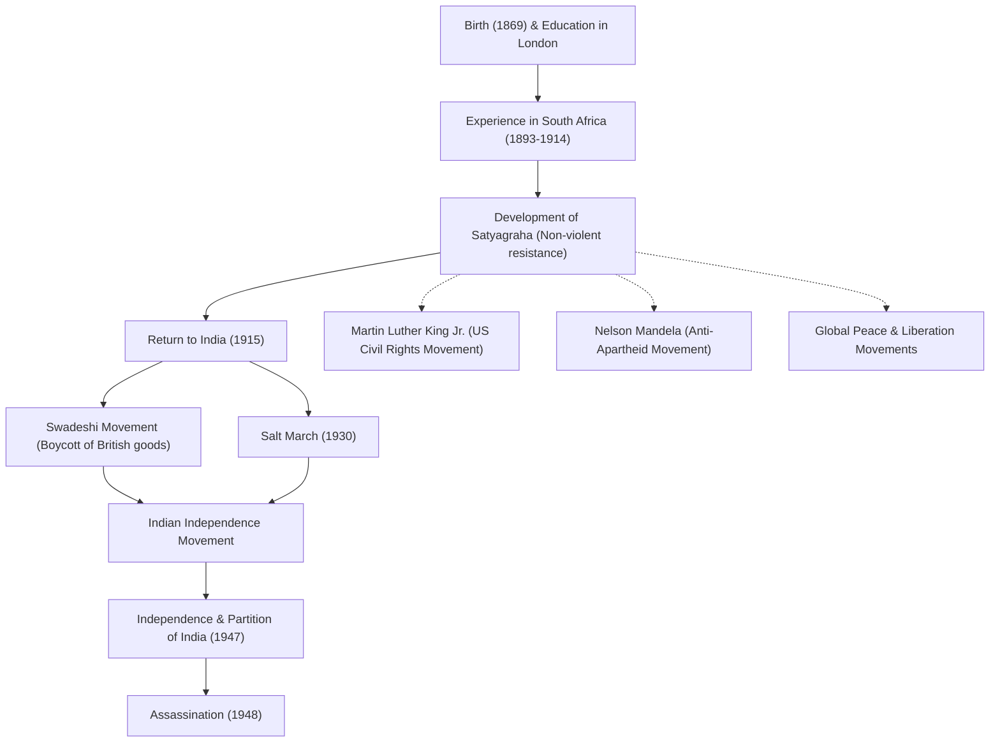

# 平和の使徒・マハトマ・ガンディー：非暴力不服従が変えた世界

「目には目を、という考え方は、やがて世界中を盲目にするだろう。」

この言葉を残したモーハンダース・カラムチャンド・ガーンディー（通称マハトマ・ガンディー）は、20世紀において最も影響力のある指導者の一人です。彼の提唱した「非暴力不服従（サティヤーグラハ）」という哲学は、インドをイギリスの植民地支配から独立へと導いただけではなく、後のマーティン・ルーサー・キング・ジュニアやネルソン・マンデラなど、世界中の公民権運動や解放運動に多大な影響を与えました。本記事では、彼がどのようにして「偉大なる魂（マハトマ）」と呼ばれるに至ったのか、その生涯と哲学を深く掘り下げます。

## ロンドンでの学びと南アフリカでの覚醒

1869年、インド西部のグジャラート州ポルバンダルで生まれたガンディーは、裕福な家庭に育ちました。18歳で法学を学ぶためにイギリスのロンドンへと渡り、弁護士の資格を取得します。当時の彼は、西洋の文化に憧れを抱く一般的な青年でした。

しかし、彼の運命を大きく変えたのは、1893年に仕事のために渡った南アフリカでの経験です。当時の南アフリカは、白人至上主義的な人種差別が蔓延していました。ガンディー自身も、一等車の切符を持っていたにもかかわらず、有色人種であることを理由に列車から放り出されるという屈辱的な体験をします。この事件をきっかけに、彼はインド人移民の権利向上のための運動を開始しました。

南アフリカでの約20年間にわたる活動の中で、ガンディーは「サティヤーグラハ（真理の把握）」という独自の哲学を確立します。これは単なる受動的な抵抗ではなく、暴力に訴えることなく、自らの苦痛を通じて相手の良心に訴えかけ、不正を正すという積極的な非暴力運動でした。

## インドへの帰還と独立運動の指導

1915年、45歳になったガンディーはインドへ帰還し、祖国の独立運動に身を投じます。彼はインド国民会議派の指導者となり、イギリスの不当な法律に対する抗議活動を主導しました。

彼の運動の根幹にあったのは、「アヒンサー（不殺生）」と「スワデーシー（国産品愛用）」です。ガンディーは、イギリス製の綿織物をボイコットし、伝統的な手紡ぎ車（チャルカ）で自ら糸を紡ぐ運動を展開しました。これはイギリスの経済支配に対する抵抗であると同時に、インド民衆の自立と尊厳の回復を目指すものでした。彼が糸を紡ぐ姿は、インド独立運動の象徴となります。

### 塩の行進（1930年）

ガンディーの活動の中で最も象徴的な出来事が、1930年に行われた「塩の行進（Salt March）」です。当時、イギリス植民地政府は塩の専売制を敷き、貧しいインドの民衆に重い塩税を課していました。これに抗議するため、ガンディーは支持者と共に約390キロメートルの道のりを24日間かけて歩き、アラビア海に面したダンディの海岸に到達しました。そして、海水を煮詰めて自らの手で塩を作り、公然と法律を破ったのです。

この非暴力による直接行動は世界中で大々的に報じられ、イギリスに対する国際的な非難を高めるとともに、インド国内の独立への機運を決定的なものにしました。数万人以上が投獄されましたが、人々の意志が折れることはありませんでした。

## 独立の達成と悲劇的な最期

第二次世界大戦後、イギリスはついにインドの独立を認めることになります。しかし、ガンディーが夢見た「統一インド」の実現は叶いませんでした。ヒンドゥー教徒とイスラム教徒の対立が激化し、1947年にインドとパキスタンが分離独立することになったのです。ガンディーは両宗教の融和のために命がけで断食を行い、暴動を鎮めようと奔走しました。

しかし独立からわずか半年後の1948年1月30日、ニューデリーで祈りの集会に向かう途中、ガンディーは狂信的なヒンドゥー教徒の青年によって暗殺されました。享年78。彼の死は世界中に深い悲しみをもたらしましたが、彼の残した精神は決して死ぬことはありませんでした。

## 後世への影響：ガンディーの遺産

ガンディーの生涯は、一人の人間が持つ「精神の力」がいかに巨大な帝国を動かすことができるかを証明しました。彼の「非暴力不服従」の哲学は、国境や時代を超え、後世の人々に引き継がれました。

アメリカの公民権運動を指導したマーティン・ルーサー・キング・ジュニアは、「キリストが精神を与え、ガンディーが手法を与えた」と語り、非暴力による人種差別撤廃運動を展開しました。また、南アフリカのアパルトヘイト政策と闘ったネルソン・マンデラや、チベットのダライ・ラマ14世など、多くの平和指導者がガンディーの哲学に多大な影響を受けています。

現代社会においても、紛争や分断、環境問題など、私たちが直面する多くの課題に対し、ガンディーの「世界を変えたいなら、まず自分がその変化となりなさい」という教えは、色褪せることなく響き続けています。

## 功績と影響のフロー

以下は、ガンディーの生涯の主要な出来事と、それが後世に与えた影響を示す図解です。

