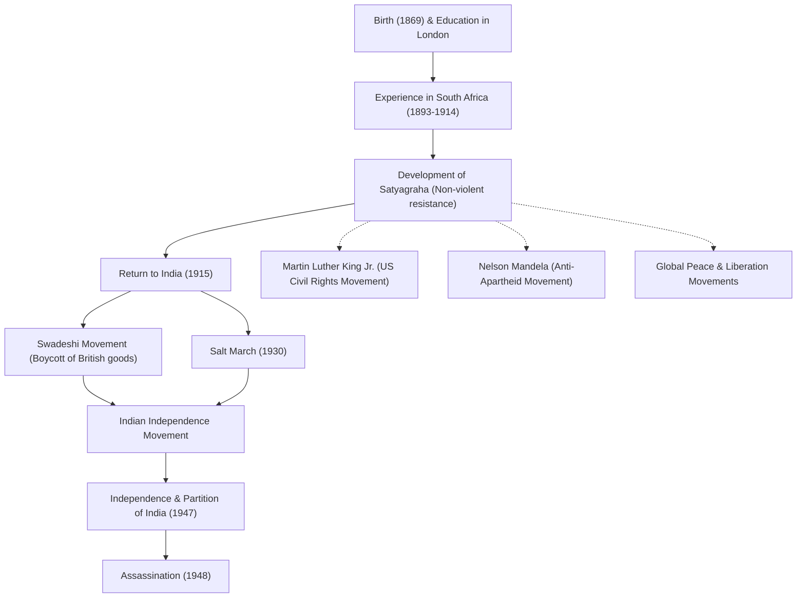

# Apóstolo da Paz Mahatma Gandhi: Como a desobediência civil não violenta mudou o mundo

"Olho por olho e o mundo acabará cego."

Mohandas Karamchand Gandhi (comumente conhecido como Mahatma Gandhi), que deixou essas palavras, é um dos líderes mais influentes do século XX. Sua filosofia de "desobediência civil não violenta (Satyagraha)" não apenas liderou a Índia à independência do domínio colonial britânico, mas também influenciou profundamente os movimentos de direitos civis e de libertação em todo o mundo, incluindo os de Martin Luther King Jr. e Nelson Mandela. Este artigo investiga sua vida e filosofia, explorando como ele passou a ser chamado de "Grande Alma (Mahatma)".

## Estudos em Londres e despertar na África do Sul

Nascido em 1869 em Porbandar, estado de Gujarat, oeste da Índia, Gandhi cresceu em uma família rica. Aos 18 anos, viajou para Londres, Inglaterra, para estudar direito e se formou advogado. Na época, ele era um jovem comum que admirava a cultura ocidental.

No entanto, foi a sua experiência na África do Sul, para onde viajou a trabalho em 1893, que mudou drasticamente o seu destino. Na África do Sul da época, o racismo da supremacia branca era galopante. O próprio Gandhi experimentou a humilhação de ser atirado para fora de um trem apesar de ter uma passagem de primeira classe, simplesmente por ser uma pessoa de cor. Este incidente o levou a iniciar um movimento para melhorar os direitos dos imigrantes indianos.

Durante seus quase 20 anos de ativismo na África do Sul, Gandhi estabeleceu sua filosofia única de "Satyagraha (firmeza na verdade)". Esta não era uma resistência meramente passiva, mas um movimento não violento ativo que visava corrigir a injustiça apelando à consciência do oponente através do próprio sofrimento, sem recorrer à violência.

## Retorno à Índia e liderança do movimento de independência

Em 1915, aos 45 anos, Gandhi regressou à Índia e dedicou-se ao movimento de independência da sua pátria. Ele se tornou um líder do Congresso Nacional Indiano e liderou protestos contra leis britânicas injustas.

No centro do seu movimento estavam "Ahimsa (não violência)" e "Swadeshi (uso de produtos nacionais)". Gandhi boicotou os têxteis de algodão de fabricação britânica e lançou um movimento para fiar ele próprio o fio, usando uma roca tradicional (charkha). Esta foi uma resistência contra a dominação económica britânica, ao mesmo tempo que visava a independência e a restauração da dignidade do povo indiano. A sua figura fiando tornou-se um símbolo do movimento de independência da Índia.

### A Marcha do Sal (1930)

O evento mais simbólico nas atividades de Gandhi foi a "Marcha do Sal" realizada em 1930. Na época, o governo colonial britânico detinha o monopólio do sal e impunha um pesado imposto sobre o sal às empobrecidas massas indianas. Para protestar contra isso, Gandhi e os seus apoiantes caminharam cerca de 390 quilómetros durante 24 dias para chegar à costa de Dandi, de frente para o Mar da Arábia. Lá, ele ferveu a água do mar para fazer sal com as próprias mãos, quebrando abertamente a lei.

Esta ação direta não violenta foi amplamente divulgada em todo o mundo, aumentando a condenação internacional contra a Grã-Bretanha e impulsionando decisivamente a vontade de independência dentro da Índia. Mais de dezenas de milhares de pessoas foram presas, mas a vontade do povo nunca foi quebrada.

## Conquista da independência e um fim trágico

Após a Segunda Guerra Mundial, a Grã-Bretanha finalmente concordou com a independência da Índia. No entanto, o sonho de Gandhi de uma "Índia unida" não se concretizou. O conflito entre hindus e muçulmanos intensificou-se, levando à divisão da Índia e do Paquistão em 1947. Gandhi jejuou desesperadamente, arriscando a vida, para promover a harmonia entre as duas religiões e trabalhou incansavelmente para reprimir os tumultos.

No entanto, em 30 de janeiro de 1948, apenas meio ano após a independência, Gandhi foi assassinado por um jovem hindu fanático quando estava a caminho de uma reunião de oração em Nova Deli. Ele tinha 78 anos. A sua morte trouxe profunda tristeza ao mundo, mas o espírito que deixou para trás nunca morrerá.

## Influência nas gerações futuras: O legado de Gandhi

A vida de Gandhi provou como o "poder do espírito" possuído por um único ser humano pode mover um império gigante. Sua filosofia de "desobediência civil não violenta" transcendeu fronteiras e épocas e foi transmitida às gerações futuras.

Martin Luther King Jr., que liderou o movimento dos direitos civis nos Estados Unidos, disse: "Cristo forneceu o espírito e a motivação, enquanto Gandhi forneceu o método", e lançou um movimento para abolir a discriminação racial através da não violência. Além disso, muitos líderes pacifistas, como Nelson Mandela, que lutou contra a política de apartheid da África do Sul, e o 14º Dalai Lama do Tibete, foram profundamente influenciados pela filosofia de Gandhi.

Mesmo na sociedade moderna, face aos muitos desafios que enfrentamos, como conflitos, divisões e questões ambientais, o ensinamento de Gandhi: "Seja a mudança que deseja ver no mundo", continua a ressoar sem perder a sua força.

## Fluxo de conquistas e influência

Abaixo está um diagrama que mostra os principais eventos da vida de Gandhi e o seu impacto nas gerações futuras.

