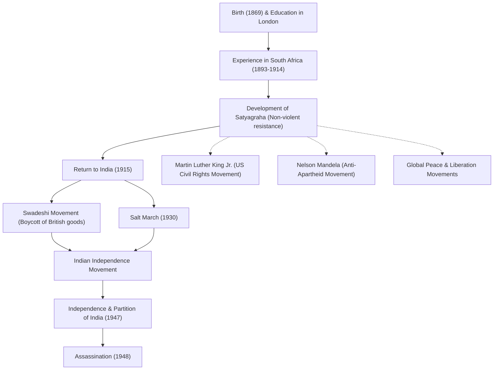

# Апостол мира Махатма Ганди: Как ненасильственное гражданское неповиновение изменило мир

«Око за око сделает весь мир слепым».

Мохандас Карамчанд Ганди (широко известный как Махатма Ганди), оставивший эти слова, является одним из самых влиятельных лидеров 20-го века. Его философия «ненасильственного гражданского неповиновения (сатьяграха)» не только привела Индию к независимости от британского колониального господства, но и оказала глубокое влияние на движения за гражданские права и освободительные движения по всему миру, включая движения Мартина Лютера Кинга-младшего и Нельсона Манделы. Эта статья углубляется в его жизнь и философию, исследуя, как его стали называть «Великой душой (Махатмой)».

## Учеба в Лондоне и пробуждение в Южной Африке

Родившийся в 1869 году в Порбандаре, штат Гуджарат на западе Индии, Ганди вырос в богатой семье. В возрасте 18 лет он отправился в Лондон, Англия, изучать право и получил квалификацию адвоката (барристера). В то время он был обычным молодым человеком, восхищавшимся западной культурой.

Однако именно опыт, полученный в Южной Африке, куда он отправился по работе в 1893 году, кардинально изменил его судьбу. В Южной Африке того времени процветал расизм, основанный на превосходстве белых. Ганди сам испытал унижение, когда его вышвырнули из поезда, несмотря на наличие билета первого класса, просто потому, что он был «цветным». Этот инцидент побудил его начать движение за улучшение прав индийских иммигрантов.

За почти 20 лет своей активистской деятельности в Южной Африке Ганди создал свою уникальную философию «Сатьяграха (упорство в истине)». Это было не просто пассивное сопротивление, а активное ненасильственное движение, направленное на исправление несправедливости путем обращения к совести противника через собственные страдания, без применения насилия.

## Возвращение в Индию и руководство движением за независимость

В 1915 году, в возрасте 45 лет, Ганди вернулся в Индию и посвятил себя движению за независимость своей родины. Он стал лидером Индийского национального конгресса и возглавил протесты против несправедливых британских законов.

В основе его движения лежали принципы «Ахимса (ненасилие)» и «Свадеши (использование отечественных товаров)». Ганди бойкотировал хлопчатобумажные ткани британского производства и запустил движение, в рамках которого сам прял пряжу на традиционной прялке (чаркхе). Это было сопротивлением британскому экономическому господству, и в то же время оно было направлено на достижение независимости и восстановление достоинства индийского народа. Его фигура за прялкой стала символом движения за независимость Индии.

### Соляной поход (1930)

Самым символичным событием в деятельности Ганди стал «Соляной поход», состоявшийся в 1930 году. В то время британское колониальное правительство обладало монополией на соль и облагало беднейшие слои населения Индии тяжелым налогом на соль. В знак протеста против этого Ганди и его сторонники прошли пешком около 390 километров за 24 дня, чтобы добраться до побережья Данди на берегу Аравийского моря. Там он выпаривал морскую воду, чтобы своими руками добыть соль, открыто нарушая закон.

Эта ненасильственная акция прямого действия широко освещалась во всем мире, усилив международное осуждение Великобритании и решительно придав импульс движению за независимость внутри Индии. Более десятков тысяч человек были брошены в тюрьмы, но воля народа так и не была сломлена.

## Достижение независимости и трагический конец

После Второй мировой войны Великобритания, наконец, согласилась на независимость Индии. Однако мечта Ганди о «единой Индии» не сбылась. Конфликт между индуистами и мусульманами обострился, что привело к разделу Индии и Пакистана в 1947 году. Ганди отчаянно голодал, рискуя своей жизнью, чтобы способствовать гармонии между двумя религиями, и неустанно трудился, чтобы подавить беспорядки.

Однако 30 января 1948 года, всего через полгода после обретения независимости, Ганди был убит фанатичным индуистским юношей по пути на молитвенное собрание в Нью-Дели. Ему было 78 лет. Его смерть принесла миру глубокую скорбь, но дух, который он оставил после себя, никогда не умрет.

## Влияние на будущие поколения: наследие Ганди

Жизнь Ганди доказала, как «сила духа» одного человека может сдвинуть с места гигантскую империю. Его философия «ненасильственного гражданского неповиновения» преодолела границы и эпохи, передавшись будущим поколениям.

Мартин Лютер Кинг-младший, возглавивший американское движение за гражданские права, говорил: «Христос дал дух и мотивацию, а Ганди дал метод», и начал движение за отмену расовой дискриминации с помощью ненасилия. Кроме того, философия Ганди оказала глубокое влияние на многих миротворцев, таких как Нельсон Мандела, боровшийся против политики апартеида в Южной Африке, и 14-й Далай-лама Тибета.

Даже в современном обществе, перед лицом многочисленных проблем, с которыми мы сталкиваемся, таких как конфликты, разделения и экологические проблемы, учение Ганди «Стань тем изменением, которое ты хочешь видеть в мире» продолжает находить отклик, не теряя своей актуальности.

## Поток достижений и влияния

Ниже приведена диаграмма, показывающая основные события в жизни Ганди и их влияние на будущие поколения.

