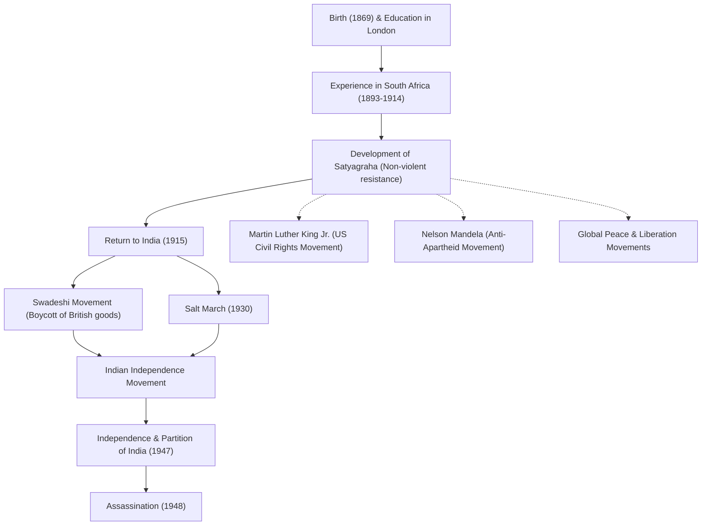

# 和平使者圣雄甘地：非暴力不合作如何改变世界

“以眼还眼，只会让全世界都盲目。”

留下这句名言的莫罕达斯·卡拉姆昌德·甘地（通称圣雄甘地），是20世纪最具影响力的领导人之一。他所倡导的“非暴力不合作（坚持真理）”哲学，不仅带领印度摆脱了英国的殖民统治走向独立，也对后来的马丁·路德·金、纳尔逊·曼德拉等世界各地的民权运动和解放运动产生了深远影响。本文将深入探讨他的一生及其哲学，了解他是如何被称为“伟大灵魂（圣雄）”的。

## 伦敦求学与南非的觉醒

1869年，甘地出生于印度西部古吉拉特邦的博尔本德尔，在一个富裕的家庭长大。18岁时，他前往英国伦敦学习法律，并取得了律师资格。当时的甘地，是一个向往西方文化的普通青年。

然而，极大改变他命运的，是1893年因工作前往南非的经历。当时的南非，白人至上主义的种族歧视横行。甘地本人也经历过奇耻大辱——尽管他持有头等车厢的车票，却仅仅因为是有色人种，就被赶出了火车。以此事件为契机，他开始发起改善印度移民权利的运动。

在南非长达约20年的活动中，甘地确立了“坚持真理（Satyagraha）”这一独特的哲学。这不仅仅是消极的抵抗，而是一种积极的非暴力运动：不诉诸暴力，而是通过自己承受痛苦来唤醒对手的良知，从而纠正不公。

## 重返印度与领导独立运动

1915年，45岁的甘地回到印度，投身于祖国的独立运动。他成为印度国大党的领袖，领导了反对英国不公正法律的抗议活动。

他运动的核心是“非暴力（Ahimsa，不杀生）”和“自力更生（Swadeshi，爱用国货）”。甘地发起抵制英国制造的棉织品，并提倡使用传统的手摇纺车（Charkha）自己纺纱。这既是对英国经济统治的抵抗，也旨在恢复印度民众的自立与尊严。他纺纱的身影，成为了印度独立运动的象征。

### 食盐进军（1930年）

在甘地的活动中，最具象征意义的事件是1930年的“食盐进军（Salt March）”。当时，英国殖民政府实行食盐专卖制，向贫苦的印度民众征收重税。为了抗议这一制度，甘地与支持者们徒步约390公里，历时24天，抵达了濒临阿拉伯海的丹地海岸。在那里，他亲手煮海水制盐，公然违反了法律。

这一非暴力直接行动在全世界被广泛报道，不仅加剧了国际社会对英国的谴责，也决定性地推动了印度国内的独立浪潮。超过数万人被捕入狱，但人们的意志并未被折服。

## 实现独立与悲剧的结局

第二次世界大战后，英国终于被迫承认印度独立。然而，甘地梦想中的“统一印度”并未实现。印度教徒与穆斯林之间的冲突加剧，导致1947年印巴分治。为了促成两大宗教的融合，甘地冒死绝食，奔走呼号试图平息暴乱。

然而，就在独立仅仅半年后的1948年1月30日，在前往新德里参加祈祷集会的途中，甘地被一名狂热的印度教青年暗杀，享年78岁。他的离世给全世界带来了深切的悲痛，但他留下的精神却永不磨灭。

## 对后世的影响：甘地的遗产

甘地的一生证明了，一个人的“精神力量”能够产生多么巨大的能量，甚至能撼动一个庞大的帝国。他的“非暴力不合作”哲学跨越了国界与时代，被后世所继承。

领导美国民权运动的马丁·路德·金曾说：“基督赋予了精神，甘地提供了方法”，并发起了非暴力的废除种族歧视运动。此外，与南非种族隔离政策作斗争的纳尔逊·曼德拉，以及西藏的第十四世达赖喇嘛等众多和平领袖，都受到了甘地哲学的深远影响。

在现代社会，面对我们所遭遇的冲突、分裂、环境问题等诸多挑战，甘地那句“欲变世界，先变其身”的教诲，依然历久弥新。

## 功绩与影响流程图

以下图解展示了甘地一生的主要事件及其对后世的影响。

