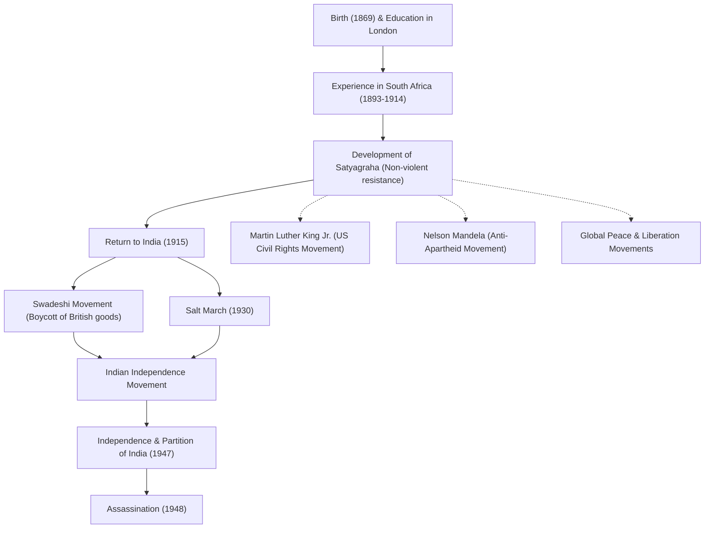

# 和平使者聖雄甘地：非暴力不合作如何改變世界

「以眼還眼，只會讓全世界都盲目。」

留下這句名言的莫罕達斯·卡拉姆昌德·甘地（通稱聖雄甘地），是20世紀最具影響力的領導人之一。他所倡導的「非暴力不合作（堅持真理）」哲學，不僅帶領印度擺脫了英國的殖民統治走向獨立，也對後來的馬丁·路德·金、納爾遜·曼德拉等世界各地的民權運動和解放運動產生了深遠影響。本文將深入探討他的一生及其哲學，了解他是如何被稱為「偉大靈魂（聖雄）」的。

## 倫敦求學與南非的覺醒

1869年，甘地出生於印度西部古吉拉特邦的波爾本達，在一個富裕的家庭長大。18歲時，他前往英國倫敦學習法律，並取得了律師資格。當時的甘地，是一個嚮往西方文化的普通青年。

然而，極大改變他命運的，是1893年因工作前往南非的經歷。當時的南非，白人至上主義的種族歧視橫行。甘地本人也經歷過奇恥大辱——儘管他持有頭等車廂的車票，卻僅僅因為是有色人種，就被趕出了火車。以此事件為契機，他開始發起改善印度移民權利的運動。

在南非長達約20年的活動中，甘地確立了「堅持真理（Satyagraha）」這一獨特的哲學。這不僅僅是消極的抵抗，而是一種積極的非暴力運動：不訴諸暴力，而是透過自己承受痛苦來喚醒對手的良知，從而糾正不公。

## 重返印度與領導獨立運動

1915年，45歲的甘地回到印度，投身於祖國的獨立運動。他成為印度國大黨的領袖，領導了反對英國不公正法律的抗議活動。

他運動的核心是「非暴力（Ahimsa，不殺生）」和「自力更生（Swadeshi，愛用國貨）」。甘地發起抵制英國製造的棉織品，並提倡使用傳統的手搖紡車（Charkha）自己紡紗。這既是對英國經濟統治的抵抗，也旨在恢復印度民眾的自立與尊嚴。他紡紗的身影，成為了印度獨立運動的象徵。

### 食鹽進軍（1930年）

在甘地的活動中，最具象徵意義的事件是1930年的「食鹽進軍（Salt March）」。當時，英國殖民政府實行食鹽專賣制，向貧苦的印度民眾徵收重稅。為了抗議這一制度，甘地與支持者們徒步約390公里，歷時24天，抵達了瀕臨阿拉伯海的丹地海岸。在那裡，他親手煮海水製鹽，公然違反了法律。

這一非暴力直接行動在全世界被廣泛報導，不僅加劇了國際社會對英國的譴責，也決定性地推動了印度國內的獨立浪潮。超過數萬人被捕入獄，但人們的意志並未被折服。

## 實現獨立與悲劇的結局

第二次世界大戰後，英國終於被迫承認印度獨立。然而，甘地夢想中的「統一印度」並未實現。印度教徒與穆斯林之間的衝突加劇，導致1947年印巴分治。為了促成兩大宗教的融合，甘地冒死絕食，奔走呼號試圖平息暴亂。

然而，就在獨立僅僅半年後的1948年1月30日，在前往新德里參加祈禱集會的途中，甘地被一名狂熱的印度教青年暗殺，享年78歲。他的離世給全世界帶來了深切的悲痛，但他留下的精神卻永不磨滅。

## 對後世的影響：甘地的遺產

甘地的一生證明了，一個人的「精神力量」能夠產生多麼巨大的能量，甚至能撼動一個龐大的帝國。他的「非暴力不合作」哲學跨越了國界與時代，被後世所繼承。

領導美國民權運動的馬丁·路德·金曾說：「基督賦予了精神，甘地提供了方法」，並發起了非暴力的廢除種族歧視運動。此外，與南非種族隔離政策作鬥爭的納爾遜·曼德拉，以及西藏的第十四世達賴喇嘛等眾多和平領袖，都受到了甘地哲學的深遠影響。

在現代社會，面對我們所遭遇的衝突、分裂、環境問題等諸多挑戰，甘地那句「欲變世界，先變其身」的教誨，依然歷久彌新。

## 功績與影響流程圖

以下圖解展示了甘地一生的主要事件及其對後世的影響。

