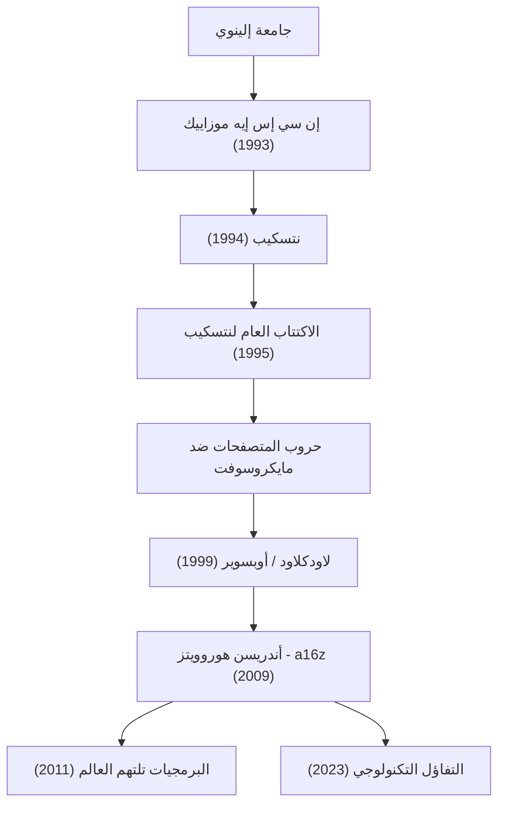

شخصية جعلت من الإنترنت الحديث أمراً مألوفاً، وتستمر في تشكيل العالم من خلال استثمار مبالغ طائلة في مستقبل التكنولوجيا. إنه مارك أندريسن (Marc Andreessen). بصفته أحد مخترعي متصفح الويب والمؤسس المشارك لشركة رأس المال الاستثماري الرائدة في وادي السيليكون "Andreessen Horowitz (a16z)"، فإن مسيرته تتطابق تمامًا مع تاريخ تطور الإنترنت.

في هذا المقال، سنتعمق في كيفية فتحه لأبواب الويب، وكيف يستمر في التأثير على الأجيال القادمة من خلال فلسفته كرائد أعمال ومستثمر.

## مسار وإنجازات مارك أندريسن

## العبقري الشاب الذي "صوّر" الإنترنت

وُلد أندريسن في ولاية آيوا الأمريكية عام 1971، وكان مفتونًا بأجهزة الكمبيوتر منذ صغره. ظهوره على مسرح التاريخ كان أثناء دراسته في جامعة إلينوي في إربانا-شامبين (UIUC). في ذلك الوقت، كان الإنترنت (شبكة الويب العالمية) يعتمد على النصوص والجفاف، وكان مقتصرًا على الباحثين الأكاديميين وبعض المهووسين.

ولكن في عام 1993، قام أندريسن بالتعاون مع إريك بينا وآخرين بتطوير متصفح الويب الرسومي "NCSA Mosaic"، الذي يمكنه عرض الصور والنصوص بشكل جميل في نفس الصفحة. كانت هذه الواجهة البديهية بمثابة اختراق تاريخي حرر الويب لعامة الناس. اجتاح مفهوم Mosaic المتمثل في "يمكن لأي شخص تتبع المعلومات بسهولة" العالم في غمضة عين، وأرسى الأساس للمجتمع الرقمي الحديث.

## مجد وسقوط نتسكيب، والمساهمة في المصادر المفتوحة

بعد النجاح الكبير لـ Mosaic، أسس أندريسن بالتعاون مع رجل الأعمال المخضرم في وادي السيليكون جيم كلارك شركة "Netscape Communications" في عام 1994. سيطر متصفح "Netscape Navigator" الذي أصدروه على سوق المتصفحات في ذلك الوقت، وحقق الاكتتاب العام (IPO) في عام 1995 نجاحًا باهرًا. كانت هذه اللحظة، التي سُميت "لحظة نتسكيب"، بداية فقاعة الدوت كوم، وفي الوقت نفسه حدثًا أثبت للعالم أن الإنترنت سيصبح عملاً ضخماً.

ومع ذلك، لم يكن الطريق بعد ذلك ممهدًا. قامت الشركة العملاقة مايكروسوفت بتضمين "Internet Explorer" كمعيار في نظام ويندوز، واندلعت "حروب المتصفحات" (Browser Wars) الشرسة. أمام مايكروسوفت، التي كانت متسلحة بقوة مالية هائلة وحصة سوقية لنظام التشغيل، بدأت نتسكيب تفقد حصتها تدريجيًا. في النهاية، استحوذت AOL على الشركة، لكن قرار أندريسن ورفاقه ترك إرثًا كبيرًا للمستقبل. قاموا بنشر الكود المصدري للمتصفح وأطلقوا مشروع "Mozilla". وقد أثمر هذا لاحقًا عن "Firefox" وأصبح القوة الدافعة لقيادة حركة المصادر المفتوحة.

## من رائد أعمال إلى مستثمر: ولادة a16z

بعد نتسكيب، أسس أندريسن مع بن هوروويتز شركة "Loudcloud" (التي تحولت لاحقًا إلى Opsware)، والتي كانت رائدة في مجال الحوسبة السحابية. بعد التغلب على الأزمة غير المسبوقة لانهيار فقاعة تكنولوجيا المعلومات، أظهر مهارة رائعة في بيع الشركة لشركة هيوليت باكارد (HP) مقابل 1.6 مليار دولار.

وفي عام 2009، تعاون الاثنان مرة أخرى لتأسيس شركة رأس المال الاستثماري "Andreessen Horowitz (a16z)". على عكس صناديق رأس المال الاستثماري التقليدية، تبنت a16z نهجًا "صديقًا للمؤسسين" حيث يدعم المؤسسون أنفسهم رواد الأعمال بشكل كامل. من خلال بناء فرق داخلية متخصصة في العلاقات العامة والتوظيف والتواصل، وتوفير بيئة تتيح لرواد الأعمال التركيز على تطوير المنتجات، استثمروا في مراحل مبكرة في شركات تكنولوجيا تمثل العصر الحديث مثل فيسبوك وتويتر وAirbnb وGitHub وStripe، محققين عوائد ونفوذًا هائلاً.

## البرمجيات تلتهم العالم: فلسفة أندريسن

لا يمكن الحديث عن مارك أندريسن دون التطرق إلى بصيرته الحادة وقدرته على التعبير اللفظي. في عام 2011، كتب مقالًا تاريخيًا لصحيفة وول ستريت جورنال بعنوان "البرمجيات تلتهم العالم" (Software is eating the world). تنبؤه بأن جميع الصناعات سيعاد تعريفها بواسطة البرمجيات، وأن الشركات التقليدية ستضطر إلى التحول لشركات برمجيات، قد ثبتت صحته تمامًا من خلال الانتشار اللاحق للهواتف الذكية وازدهار نماذج تقديم البرمجيات كخدمة (SaaS).

في أساس فلسفته يكمن "تفاؤل تكنولوجي" قوي. في بيانه الصادر مؤخرًا بعنوان "بيان المتفائل التكنولوجي" (The Techno-Optimist Manifesto)، يجادل بصوت عالٍ بأن "التكنولوجيا هي الوسيلة الوحيدة لحل مشاكل البشرية وجلب النمو والازدهار". حتى في العصر الحديث حيث يلوح في الأفق صعود الذكاء الاصطناعي وموجات من التنظيمات الصارمة، فإنه لا يتشاءم أبدًا ويستمر في الإيمان بقوة الهندسة والابتكار.

## التأثير على الأجيال القادمة ورؤية للمستقبل

كمهندس، ابتكر مارك أندريسن "مظهر" الإنترنت؛ وكرائد أعمال، أظهر "كيفية القتال" في أعمال الإنترنت؛ وكمستثمر، صمم "المستقبل" حيث تغطي التكنولوجيا المجتمع بأكمله.

حياته ليست مجرد قصة نجاح عادية. إنها قصة إصرار كـ "باني" (Builder) يكتشف بسرعة قيمة التقنيات غير المعروفة، ويجعلها في متناول الجميع، ويستمر في تحديث المجتمع بأسره. البذور التي زرعها لا تزال تنبت حتى اليوم في مكاتب الشركات الناشئة حول العالم، أو في مجتمعات المصادر المفتوحة. موقفه الذي يجسد مقولة "أفضل طريقة للتنبؤ بالمستقبل هي اختراعه" سيستمر في إلهام الجيل القادم من رواد الأعمال.
