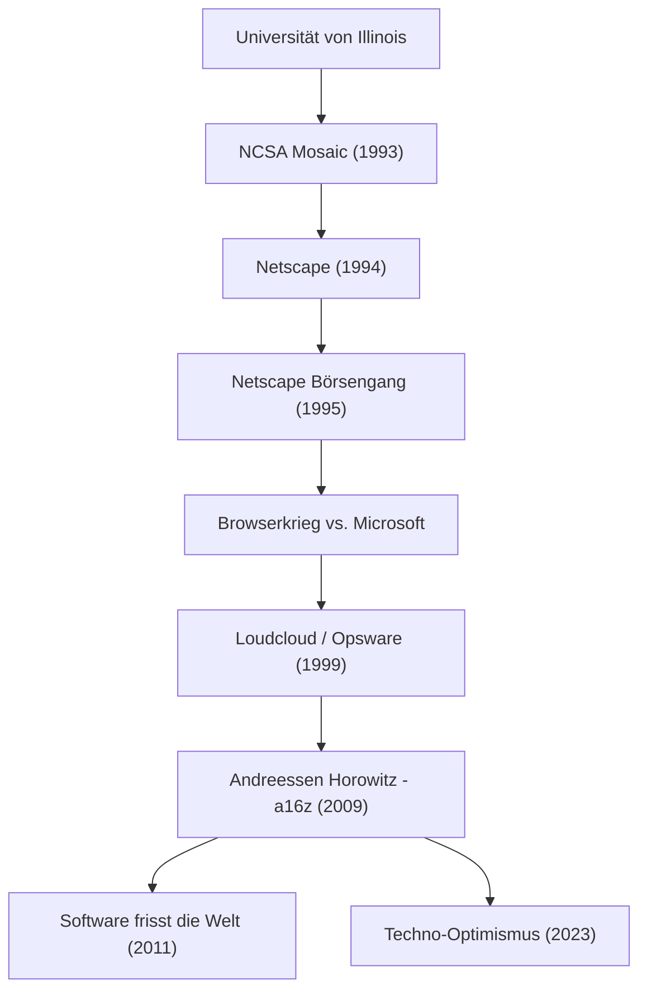

Eine Person, die das moderne Internet zu einer Selbstverständlichkeit gemacht hat und die Welt weiterhin formt, indem sie riesige Geldsummen in die Zukunft der Technologie investiert. Das ist Marc Andreessen. Als einer der Väter des Webbrowsers und Mitbegründer der repräsentativen Silicon-Valley-Risikokapitalfirma „Andreessen Horowitz (a16z)“ überschneidet sich sein Werdegang direkt mit der Entwicklungsgeschichte des Internets.

In diesem Artikel werden wir tief eintauchen, wie er die Türen zum Web öffnete und mit welcher Philosophie er als Unternehmer und Investor weiterhin Einfluss auf die Nachwelt nimmt.

## Der Werdegang und die Errungenschaften von Marc Andreessen

## Das junge Genie, das das Internet "visualisiert" hat

Geboren 1971 in Iowa, USA, war Andreessen von klein auf von Computern fasziniert. Er trat auf die historische Bühne, als er an der University of Illinois at Urbana-Champaign (UIUC) eingeschrieben war. Damals war das Internet (World Wide Web) eine trockene, textbasierte Angelegenheit und ausschließlich das Terrain von akademischen Forschern und Geeks.

Doch 1993 entwickelte Andreessen zusammen mit Eric Bina den grafischen Webbrowser „NCSA Mosaic“, der Bilder und Texte ansprechend auf derselben Seite darstellen konnte. Diese intuitive Benutzeroberfläche wurde zu einem historischen Durchbruch, der das Web der breiten Öffentlichkeit zugänglich machte. Das Konzept von Mosaic, dass „jeder Informationen einfach verfolgen kann“, eroberte die Welt im Sturm und legte den Grundstein für die moderne digitale Gesellschaft.

## Ruhm und Rückschläge von Netscape und der Beitrag zu Open Source

Nach dem massiven Erfolg von Mosaic gründete Andreessen 1994 zusammen mit dem erfahrenen Silicon-Valley-Unternehmer Jim Clark „Netscape Communications“. Der von ihnen veröffentlichte „Netscape Navigator“ dominierte den damaligen Browsermarkt und der Börsengang (IPO) 1995 war ein großer Erfolg. Dieser Moment, der als „Netscape-Moment“ bekannt wurde, markierte den Beginn der Dotcom-Blase und bewies der Welt gleichzeitig, dass das Internet ein riesiges Geschäft werden würde.

Der weitere Weg war jedoch nicht eben. Das gigantische Unternehmen Microsoft integrierte den „Internet Explorer“ standardmäßig in Windows, und ein erbitterter „Browserkrieg (Browser Wars)“ brach aus. Angesichts von Microsofts überwältigender Finanzkraft und Betriebssystem-Marktanteil verlor Netscape allmählich Marktanteile. Letztendlich wurde das Unternehmen von AOL übernommen, aber die Entscheidungen von Andreessen und seinem Team hinterließen ein großes Erbe für die Zukunft. Sie veröffentlichten den Quellcode des Browsers und starteten das „Mozilla“-Projekt. Dies führte später zu „Firefox“ und wurde zur treibenden Kraft der Open-Source-Bewegung.

## Vom Unternehmer zum Investor: Die Geburt von a16z

Nach Netscape gründeten Andreessen und Ben Horowitz „Loudcloud (später zu Opsware umgewandelt)“, einen Vorreiter im Cloud-Computing. Sie meisterten die beispiellose Krise des Platzens der IT-Blase und zeigten ihr herausragendes Geschick, indem sie das Unternehmen für 1,6 Milliarden Dollar an Hewlett-Packard (HP) verkauften.

2009 schlossen sich die beiden erneut zusammen und gründeten die Risikokapitalfirma „Andreessen Horowitz (a16z)“. Im Gegensatz zu traditionellen VC-Firmen verfolgte a16z konsequent einen „gründerfreundlichen“ Ansatz, bei dem die Gründer selbst Unternehmer unterstützen. Indem sie spezialisierte Teams für PR, Personalbeschaffung und Networking intern aufbauten und ein Umfeld boten, in dem sich Unternehmer auf die Produktentwicklung konzentrieren konnten, investierten sie von der Frühphase an in Unternehmen wie Facebook, Twitter, Airbnb, GitHub und Stripe, die die heutige Ära repräsentieren, und erlangten dadurch enorme Renditen und Einfluss.

## Software frisst die Welt: Die Philosophie von Andreessen

Unverzichtbar, wenn man über Marc Andreessen spricht, sind seine scharfe Beobachtungsgabe und seine Fähigkeit, Dinge in Worte zu fassen. Im Jahr 2011 schrieb er einen historischen Essay mit dem Titel „Software is eating the world“ (Software frisst die Welt) für das Wall Street Journal. Seine Vorhersage, dass jede Branche durch Software neu definiert wird und selbst traditionelle Unternehmen sich zu Softwareunternehmen wandeln müssen, wurde durch die anschließende Verbreitung von Smartphones und den Aufstieg von SaaS vollständig bewiesen.

Die Grundlage seiner Philosophie ist ein starker „Techno-Optimismus (technologischer Optimismus)“. Auch im kürzlich veröffentlichten „Techno-Optimist Manifesto“ behauptet er lautstark: „Technologie ist das einzige Mittel, um die Probleme der Menschheit zu lösen und Wachstum und Wohlstand zu bringen.“ Selbst in der heutigen Zeit, die vom Aufstieg der KI und einer Welle von Regulierungsverschärfungen geprägt ist, bleibt er niemals pessimistisch und glaubt weiterhin an die Kraft von Engineering und Innovation.

## Einfluss auf die Nachwelt und Perspektive für die Zukunft

Marc Andreessen hat als Technologe das „Erscheinungsbild“ des Internets geschaffen, als Unternehmer gezeigt, wie man im Internet-Geschäft „kämpft“, und als Investor eine „Zukunft“ entworfen, in der Technologie die Gesellschaft durchdringt.

Sein Leben ist nicht nur eine Erfolgsgeschichte. Es ist die Geschichte der Beharrlichkeit als „Erfinder (Builder)“, der früh den Wert unbekannter Technologien erkennt, sie popularisiert und die gesamte Gesellschaft kontinuierlich aktualisiert. Die von ihm gesäten Samen sprießen weiterhin in den Büros von Start-ups weltweit und in Open-Source-Communities. Seine Haltung, die den Satz verkörpert: „Der beste Weg, die Zukunft vorherzusagen, ist, sie zu erfinden“, wird auch weiterhin die nächste Generation von Unternehmern inspirieren.
