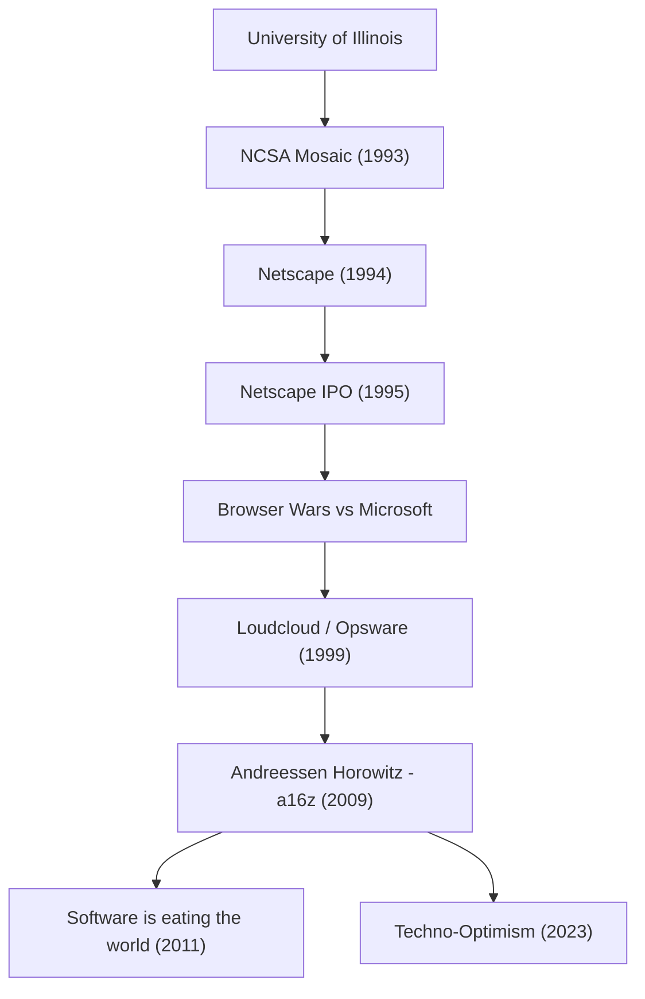

He is the man who made the modern internet something we take for granted, and who continues to shape the world by pouring massive amounts of funding into the future of technology. That man is Marc Andreessen. As one of the creators of the web browser and the co-founder of "Andreessen Horowitz (a16z)," a prominent venture capital firm in Silicon Valley, his trajectory directly overlaps with the history of the internet's development.

In this article, we delve deep into how he opened the doors to the web, and what philosophy he holds as an entrepreneur and investor that continues to influence future generations.

## The Trajectory and Achievements of Marc Andreessen

## The Young Genius Who "Visualized" the Internet

Born in Iowa, USA in 1971, Andreessen was fascinated by computers from a young age. He first stepped onto the main stage of history while studying at the University of Illinois at Urbana-Champaign (UIUC). At the time, the internet (World Wide Web) was a dry, text-based system, remaining the domain of only a few academic researchers and geeks.

However, in 1993, Andreessen, along with Eric Bina and others, developed "NCSA Mosaic," a graphical web browser capable of displaying images and text beautifully on the same page. This intuitive interface became a historic breakthrough that opened the web to the general public. Mosaic's concept that "anyone can easily navigate information" quickly took the world by storm, laying the foundation for modern digital society.

## Netscape's Glory, Setbacks, and Contributions to Open Source

Following the massive success of Mosaic, Andreessen partnered with veteran Silicon Valley entrepreneur Jim Clark to establish "Netscape Communications" in 1994. The "Netscape Navigator" they released dominated the browser market at the time, and its Initial Public Offering (IPO) in 1995 was a huge success. This moment, known as the "Netscape Moment," marked the beginning of the dot-com bubble and proved to the world that the internet could be a massive business.

However, the path forward was not smooth. Tech giant Microsoft bundled "Internet Explorer" as a standard feature in Windows, sparking the fierce "Browser Wars." Faced with Microsoft's overwhelming financial power and OS market share, Netscape gradually lost ground. Although the company was eventually acquired by AOL, the decision made by Andreessen and his team left a significant legacy for the future. They made the browser's source code public and launched the "Mozilla" project. This later culminated in "Firefox," becoming a driving force behind the open-source movement.

## From Entrepreneur to Investor: The Birth of a16z

After Netscape, Andreessen co-founded "Loudcloud" (later pivoted to Opsware), a pioneer in cloud computing, with Ben Horowitz. Overcoming the unprecedented crisis of the burst of the IT bubble, they displayed brilliant leadership by selling the company to Hewlett-Packard (HP) for $1.6 billion.

Then, in 2009, the two teamed up again to establish the venture capital firm "Andreessen Horowitz (a16z)." Unlike traditional VCs, a16z strictly adopted a "founder-friendly" approach, where former founders themselves supported entrepreneurs. By creating in-house specialized teams for PR, recruiting, and networking, they provided an environment where entrepreneurs could focus on product development. This led to early-stage investments in modern tech giants such as Facebook, Twitter, Airbnb, GitHub, and Stripe, earning them massive returns and immense influence.

## Software is Eating the World: Andreessen's Philosophy

When talking about Marc Andreessen, one cannot overlook his sharp insight and ability to articulate ideas. In 2011, he contributed a historic essay to The Wall Street Journal titled "Software is eating the world." His prophecy that every industry would be redefined by software and that traditional companies would be forced to transform into software companies was perfectly proven by the subsequent spread of smartphones and the rise of SaaS.

At the root of his philosophy lies a strong sense of "Techno-Optimism." Even in his recently published "The Techno-Optimist Manifesto," he loudly proclaims that "technology is the only way to solve humanity's challenges and bring about growth and abundance." In the modern era, amidst the rise of AI and waves of tighter regulations, he never despairs and continues to believe in the power of engineering and innovation.

## Legacy and Perspective on the Future

Marc Andreessen created how the internet "looks" as a technologist, demonstrated how to "fight" in internet business as an entrepreneur, and designed the "future" where technology envelops society as an investor.

His life is not just a success story. It is a tale of a "builder's" obsession with quickly finding value in unknown technologies, popularizing them, and continuously updating society as a whole. The seeds he planted continue to sprout today in startup offices around the world and within the open-source community. Embodying the phrase "the best way to predict the future is to invent it," his stance will continue to inspire the next generation of entrepreneurs.
