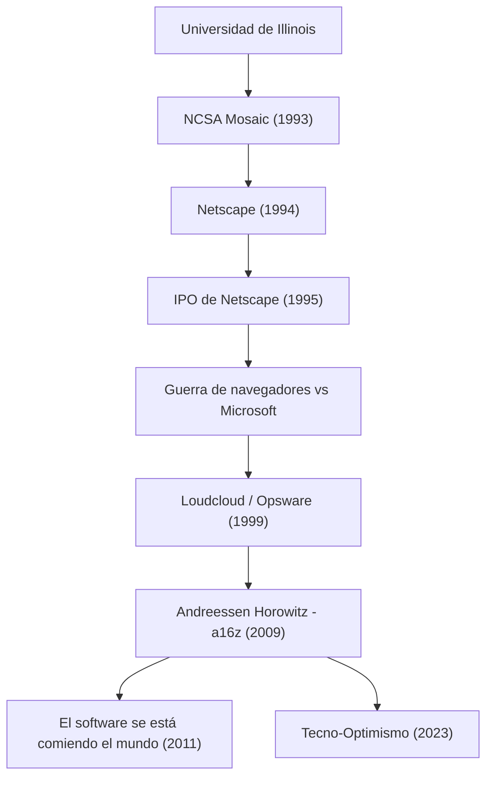

La persona que hizo que el Internet moderno se convirtiera en algo cotidiano y que sigue dando forma al mundo invirtiendo enormes sumas de dinero en el futuro de la tecnología. Ese es Marc Andreessen. Su trayectoria como uno de los creadores del navegador web y cofundador de "Andreessen Horowitz (a16z)", una firma de capital de riesgo representativa de Silicon Valley, coincide directamente con la historia del desarrollo de Internet.

En este artículo, profundizaremos en cómo abrió las puertas de la web y cómo, con qué filosofía como emprendedor e inversor, sigue influyendo en las generaciones posteriores.

## La trayectoria y los logros de Marc Andreessen

## El joven genio que "visualizó" Internet

Nacido en 1971 en el estado de Iowa, Estados Unidos, Andreessen se sintió fascinado por las computadoras desde una edad temprana. Hizo su aparición en el escenario de la historia cuando estudiaba en la Universidad de Illinois en Urbana-Champaign (UIUC). En aquel entonces, Internet (la World Wide Web) era algo árido y basado en texto, un territorio reservado para unos pocos investigadores académicos y entusiastas.

Sin embargo, en 1993, Andreessen, junto con Eric Bina y otros, desarrolló "NCSA Mosaic", un navegador web gráfico capaz de mostrar imágenes y texto de forma atractiva en la misma página. Esta interfaz intuitiva fue un avance histórico que liberó la web para el público en general. El concepto de Mosaic de que "cualquiera puede navegar fácilmente por la información" se apoderó rápidamente del mundo, sentando las bases de la sociedad digital moderna.

## La gloria y caída de Netscape, y su contribución al código abierto

Tras el gran éxito de Mosaic, Andreessen fundó "Netscape Communications" en 1994 junto al veterano emprendedor de Silicon Valley, Jim Clark. El "Netscape Navigator" que lanzaron monopolizó el mercado de navegadores de la época, y su oferta pública inicial (IPO) en 1995 fue un éxito rotundo. Este momento, conocido como el "Momento Netscape", marcó el inicio de la burbuja de las punto-com y, al mismo tiempo, demostró al mundo que Internet se convertiría en un negocio gigantesco.

Sin embargo, el camino posterior no fue llano. El gigante Microsoft incluyó "Internet Explorer" de forma estándar en Windows, desatando la feroz "Guerra de navegadores" (Browser Wars). Ante Microsoft, armado con su abrumador poder financiero y su cuota de mercado en sistemas operativos, Netscape fue perdiendo terreno gradualmente. Aunque la empresa finalmente fue adquirida por AOL, la decisión de Andreessen y su equipo dejó un gran legado para el futuro: liberaron el código fuente del navegador y lanzaron el proyecto "Mozilla". Esto más tarde dio sus frutos como "Firefox" y se convirtió en la fuerza motriz del movimiento de código abierto.

## De emprendedor a inversor: El nacimiento de a16z

Después de Netscape, Andreessen cofundó "Loudcloud" (que más tarde se transformaría en Opsware) junto a Ben Horowitz, siendo pioneros en la computación en la nube. Superando la crisis sin precedentes del estallido de la burbuja de las TI, demostró su brillante habilidad al vender la empresa a Hewlett-Packard (HP) por 1.600 millones de dólares.

Luego, en 2009, los dos volvieron a unir fuerzas para fundar la firma de capital de riesgo "Andreessen Horowitz (a16z)". A diferencia de los capitales de riesgo tradicionales, a16z adoptó un enfoque "favorable a los fundadores", donde los propios fundadores apoyan a los emprendedores. Al internalizar equipos especializados en relaciones públicas, contratación de talentos y creación de redes, proporcionaron un entorno en el que los emprendedores podían concentrarse en el desarrollo de productos. Esto les permitió invertir en las primeras etapas de empresas tecnológicas representativas de la actualidad, como Facebook, Twitter, Airbnb, GitHub y Stripe, obteniendo enormes retornos e influencia.

## El software se está comiendo el mundo: La filosofía de Andreessen

Al hablar de Marc Andreessen, es indispensable mencionar su aguda perspicacia y su capacidad para articular ideas. En 2011, contribuyó con un ensayo histórico en el Wall Street Journal titulado "El software se está comiendo el mundo" (Software is eating the world). Su predicción de que todas las industrias serían redefinidas por el software y que las empresas tradicionales se verían obligadas a transformarse en empresas de software quedó completamente demostrada por la posterior proliferación de los teléfonos inteligentes y el auge del SaaS.

En la raíz de su filosofía se encuentra un fuerte "tecno-optimismo" (Techno-Optimism). En "El Manifiesto Tecno-Optimista" (The Techno-Optimist Manifesto) publicado recientemente, argumenta en voz alta que "la tecnología es el único medio para resolver los problemas de la humanidad y traer crecimiento y abundancia". Incluso en la actualidad, con el auge de la IA y las olas de endurecimiento regulatorio, nunca se muestra pesimista y sigue creyendo en el poder de la ingeniería y la innovación.

## Su impacto en la posteridad y su visión del futuro

Marc Andreessen ha construido la "apariencia" de Internet como ingeniero, ha mostrado la "forma de luchar" en el negocio de Internet como emprendedor, y ha diseñado un "futuro" donde la tecnología cubre la sociedad como inversor.

Su vida no es solo una historia de éxito. Es una historia de perseverancia como un "constructor" (Builder) que encuentra valor tempranamente en tecnologías desconocidas, las populariza y continúa actualizando la sociedad en su conjunto. Las semillas que sembró siguen brotando hoy en las oficinas de startups de todo el mundo y en las comunidades de código abierto. Su actitud, que encarna la frase "la mejor manera de predecir el futuro es inventarlo", seguirá inspirando a las próximas generaciones de emprendedores.
