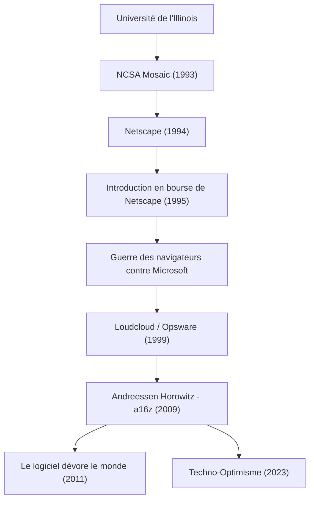

L'homme qui a rendu l'Internet moderne omniprésent et qui continue de façonner le monde en investissant massivement dans l'avenir de la technologie : il s'agit de Marc Andreessen. L'un des créateurs du navigateur web et cofondateur de la société de capital-risque représentative de la Silicon Valley, "Andreessen Horowitz (a16z)", son parcours se confond avec l'histoire du développement d'Internet.

Dans cet article, nous explorerons en profondeur comment il a ouvert les portes du Web, et avec quelle philosophie il continue d'influencer les générations futures en tant qu'entrepreneur et investisseur.

## Trajectoire et réalisations de Marc Andreessen

## Le jeune génie qui a "visualisé" Internet

Né en 1971 dans l'Iowa, aux États-Unis, Andreessen était fasciné par les ordinateurs depuis son plus jeune âge. Son apparition sur la scène historique a eu lieu lorsqu'il était étudiant à l'Université de l'Illinois à Urbana-Champaign (UIUC). À l'époque, Internet (le World Wide Web) était un espace textuel aride, réservé à quelques chercheurs universitaires et geeks.

Cependant, en 1993, Andreessen a développé avec Eric Bina et d'autres "NCSA Mosaic", un navigateur web graphique capable d'afficher magnifiquement des images et du texte sur une même page. Cette interface intuitive a été une percée historique qui a ouvert le Web au grand public. Le concept de Mosaic selon lequel "tout le monde peut facilement naviguer dans l'information" a rapidement conquis le monde et jeté les bases de la société numérique moderne.

## La gloire et la chute de Netscape, et sa contribution à l'open source

Suite à l'énorme succès de Mosaic, Andreessen a fondé "Netscape Communications" en 1994 avec Jim Clark, un entrepreneur chevronné de la Silicon Valley. "Netscape Navigator", qu'ils ont lancé, a dominé le marché des navigateurs de l'époque, et son introduction en bourse (IPO) en 1995 a été un succès retentissant. Ce moment appelé le "moment Netscape" a marqué le début de la bulle point-com et a prouvé au monde entier qu'Internet deviendrait une entreprise colossale.

Cependant, le chemin n'a pas été sans embûches par la suite. La gigantesque entreprise Microsoft a intégré par défaut "Internet Explorer" à Windows, déclenchant ainsi la féroce "Guerre des navigateurs" (Browser Wars). Face à la puissance financière écrasante et à la part de marché du système d'exploitation de Microsoft, Netscape a progressivement perdu des parts de marché. L'entreprise a finalement été rachetée par AOL, mais la décision d'Andreessen et de son équipe a laissé un héritage majeur pour l'avenir. Ils ont publié le code source de leur navigateur et lancé le projet "Mozilla". Cela a ensuite donné naissance à "Firefox" et est devenu le moteur du mouvement open source.

## D'entrepreneur à investisseur : la naissance d'a16z

Après Netscape, Andreessen a fondé "Loudcloud" (qui deviendra plus tard Opsware) avec Ben Horowitz, devenant ainsi un pionnier du cloud computing. Surmontant la crise sans précédent de l'éclatement de la bulle informatique, ils ont fait preuve de remarquables compétences en vendant l'entreprise à Hewlett-Packard (HP) pour 1,6 milliard de dollars.

Puis, en 2009, les deux hommes se sont de nouveau associés pour fonder la société de capital-risque "Andreessen Horowitz (a16z)". Contrairement aux sociétés de capital-risque traditionnelles, a16z a adopté une approche totalement "Founder-Friendly" (favorable aux fondateurs) où les fondateurs eux-mêmes soutiennent les entrepreneurs. En internalisant des équipes spécialisées en relations publiques, recrutement, réseautage, etc., et en offrant un environnement où les entrepreneurs peuvent se concentrer sur le développement de produits, ils ont investi dès les premiers stades dans des entreprises technologiques représentatives de l'ère moderne telles que Facebook, Twitter, Airbnb, GitHub et Stripe, obtenant ainsi des rendements et une influence colossaux.

## Le logiciel dévore le monde : la philosophie d'Andreessen

L'acuité et la capacité d'expression de Marc Andreessen sont essentielles pour comprendre son parcours. En 2011, il a publié dans le Wall Street Journal un essai historique intitulé "Software is eating the world" (Le logiciel dévore le monde). Sa prédiction selon laquelle toutes les industries seraient redéfinies par les logiciels et que les entreprises traditionnelles seraient obligées de se transformer en entreprises de logiciels a été entièrement prouvée par la démocratisation ultérieure des smartphones et l'essor du SaaS.

Au cœur de sa philosophie se trouve un "techno-optimisme" fervent. Dans le "Manifeste techno-optimiste" (The Techno-Optimist Manifesto) publié récemment, il affirme haut et fort que "la technologie est le seul moyen de résoudre les problèmes de l'humanité et d'apporter croissance et abondance". Même à l'ère moderne de l'émergence de l'IA et des vagues de renforcement de la réglementation, il n'est jamais pessimiste et continue de croire au pouvoir de l'ingénierie et de l'innovation.

## Impact sur les générations futures et vision de l'avenir

En tant que technicien, Marc Andreessen a créé la "façon de voir" Internet ; en tant qu'entrepreneur, il a montré "comment se battre" dans le commerce sur Internet ; et en tant qu'investisseur, il a conçu un "avenir" où la technologie recouvre entièrement la société.

Sa vie n'est pas seulement une histoire de réussite. C'est l'histoire de l'acharnement d'un "bâtisseur" (builder) qui découvre rapidement la valeur des technologies inconnues, les popularise et continue de mettre à jour la société dans son ensemble. Les graines qu'il a semées continuent de germer aujourd'hui dans les bureaux des startups du monde entier ou dans les communautés open source. Son attitude, qui incarne l'idée que "la meilleure façon de prédire l'avenir est de l'inventer", continuera d'inspirer la prochaine génération d'entrepreneurs.
