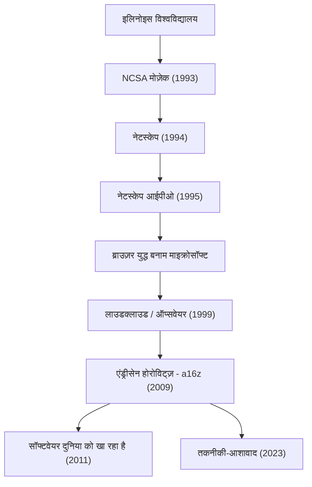

वह व्यक्ति जिसने आधुनिक इंटरनेट को हमारे जीवन का एक सामान्य हिस्सा बना दिया और प्रौद्योगिकी के भविष्य में भारी निवेश करके दुनिया को आकार देना जारी रखा है। वह मार्क एंड्रीसेन (Marc Andreessen) हैं। वेब ब्राउज़र के संस्थापकों में से एक और सिलिकॉन वैली की प्रमुख उद्यम पूंजी (वेंचर कैपिटल) फर्म "Andreessen Horowitz (a16z)" के सह-संस्थापक के रूप में, उनका जीवन पथ इंटरनेट के विकास के इतिहास के साथ गहराई से जुड़ा हुआ है।

इस लेख में, हम गहराई से जानेंगे कि उन्होंने वेब के दरवाजे कैसे खोले और एक उद्यमी और निवेशक के रूप में उनके दर्शन ने आने वाली पीढ़ियों को कैसे प्रभावित करना जारी रखा है।

## मार्क एंड्रीसेन का जीवन पथ और उपलब्धियां

## इंटरनेट को "दृश्यात्मक" (विज़ुअलाइज़) करने वाला युवा प्रतिभाशाली व्यक्ति

1971 में आयोवा, अमेरिका में जन्मे एंड्रीसेन बचपन से ही कंप्यूटर के प्रति आकर्षित थे। वह इतिहास के मुख्य मंच पर तब आए जब वह इलिनोइस विश्वविद्यालय, अर्बाना-शैंपेन (UIUC) में पढ़ रहे थे। उस समय, इंटरनेट (वर्ल्ड वाइड वेब) टेक्स्ट-आधारित और नीरस था, जो केवल कुछ अकादमिक शोधकर्ताओं और कंप्यूटर गीक्स तक ही सीमित था।

हालांकि, 1993 में, एंड्रीसेन ने एरिक बीना और अन्य लोगों के साथ मिलकर "NCSA Mosaic" विकसित किया, जो एक ग्राफिकल वेब ब्राउज़र था जो एक ही पेज पर छवियों और टेक्स्ट को खूबसूरती से प्रदर्शित कर सकता था। इस सहज इंटरफ़ेस ने वेब को आम जनता के लिए खोलने में एक ऐतिहासिक सफलता हासिल की। मोज़ेक की अवधारणा कि "कोई भी आसानी से जानकारी तक पहुँच सकता है" ने दुनिया भर में तहलका मचा दिया और आधुनिक डिजिटल समाज की नींव रखी।

## नेटस्केप की महिमा और पतन, और ओपन सोर्स में योगदान

मोज़ेक की भारी सफलता के बाद, एंड्रीसेन ने 1994 में सिलिकॉन वैली के अनुभवी उद्यमी जिम क्लार्क के साथ मिलकर "Netscape Communications" की स्थापना की। उनके द्वारा रिलीज़ किए गए "Netscape Navigator" ने उस समय के ब्राउज़र बाज़ार पर एकाधिकार कर लिया, और 1995 की आरंभिक सार्वजनिक पेशकश (IPO) एक बड़ी सफलता थी। यह क्षण, जिसे "नेटस्केप मोमेंट" कहा जाता है, डॉट-कॉम बबल की शुरुआत थी और एक घटना जिसने दुनिया को साबित कर दिया कि इंटरनेट एक विशाल व्यवसाय बन जाएगा।

हालाँकि, उसके बाद का रास्ता आसान नहीं था। विशाल कंपनी माइक्रोसॉफ्ट ने विंडोज़ में मानक के रूप में "Internet Explorer" को शामिल किया, और एक भयंकर "ब्राउज़र युद्ध" (Browser Wars) छिड़ गया। अत्यधिक वित्तीय संसाधनों और ओएस मार्केट शेयर से लैस माइक्रोसॉफ्ट के सामने नेटस्केप ने धीरे-धीरे अपना मार्केट शेयर खो दिया। अंततः कंपनी को AOL द्वारा अधिग्रहित कर लिया गया, लेकिन एंड्रीसेन और उनकी टीम के फैसले ने भविष्य के लिए एक बड़ी विरासत छोड़ी। उन्होंने ब्राउज़र का सोर्स कोड प्रकाशित किया और "Mozilla" प्रोजेक्ट शुरू किया। यह बाद में "Firefox" के रूप में फलीभूत हुआ और ओपन सोर्स आंदोलन को आगे बढ़ाने वाली एक प्रेरक शक्ति बन गया।

## उद्यमी से निवेशक तक: a16z का जन्म

नेटस्केप के बाद, एंड्रीसेन ने बेन होरोविट्ज़ के साथ मिलकर "Loudcloud" (जिसे बाद में ऑप्सवेयर में बदल दिया गया) की स्थापना की, जो क्लाउड कंप्यूटिंग के अग्रदूतों में से एक था। आईटी बबल के फूटने के अभूतपूर्व संकट को पार करते हुए, उन्होंने उत्कृष्ट कौशल दिखाते हुए कंपनी को 1.6 बिलियन डॉलर में हेवलेट-पैकर्ड (HP) को बेच दिया।

और 2009 में, दोनों ने फिर से टीम बनाई और उद्यम पूंजी फर्म "Andreessen Horowitz (a16z)" की स्थापना की। पारंपरिक वीसी के विपरीत, a16z ने "संस्थापक-अनुकूल" दृष्टिकोण अपनाया जहां संस्थापक स्वयं उद्यमियों का समर्थन करते हैं। पीआर, भर्ती और नेटवर्किंग जैसी इन-हाउस विशेषज्ञ टीमों के माध्यम से, और ऐसा वातावरण प्रदान करके जहां उद्यमी उत्पाद विकास पर ध्यान केंद्रित कर सकें, उन्होंने फेसबुक, ट्विटर, एयरबीएनबी, गिटहब, और स्ट्राइप जैसी आधुनिक तकनीकी कंपनियों में प्रारंभिक चरण में निवेश किया और भारी रिटर्न और प्रभाव प्राप्त किया।

## सॉफ्टवेयर दुनिया को निगल रहा है: एंड्रीसेन का दर्शन

मार्क एंड्रीसेन के बारे में बात करते समय, उनके तीव्र अंतर्दृष्टि और विचारों को व्यक्त करने की क्षमता को नजरअंदाज नहीं किया जा सकता है। 2011 में, उन्होंने वॉल स्ट्रीट जर्नल में एक ऐतिहासिक निबंध 'Software is eating the world' (सॉफ्टवेयर दुनिया को खा रहा है) लिखा। उनकी भविष्यवाणी कि प्रत्येक उद्योग को सॉफ्टवेयर द्वारा फिर से परिभाषित किया जाएगा और पारंपरिक कंपनियों को सॉफ्टवेयर कंपनियों में बदलने के लिए मजबूर होना पड़ेगा, बाद में स्मार्टफोन के प्रसार और SaaS के उदय से पूरी तरह साबित हुई।

उनके दर्शन के मूल में एक मजबूत "तकनीकी-आशावाद" (टेक्नोलॉजिकल ऑप्टिमिज़्म) है। हाल ही में प्रकाशित उनके 'द टेक्नो-ऑप्टिमिस्ट मेनिफेस्टो' (The Techno-Optimist Manifesto) में, वह जोर देकर कहते हैं कि "प्रौद्योगिकी ही मानवता की समस्याओं को हल करने और विकास और समृद्धि लाने का एकमात्र साधन है।" यहाँ तक कि आज के युग में भी जब AI का उदय हो रहा है और नियम सख्त हो रहे हैं, वह कभी निराशावादी नहीं होते हैं और इंजीनियरिंग तथा नवाचार की शक्ति में विश्वास करना जारी रखते हैं।

## आने वाली पीढ़ियों पर प्रभाव और भविष्य का नज़रिया

मार्क एंड्रीसेन ने एक इंजीनियर के रूप में इंटरनेट का "दृश्य" बनाया, एक उद्यमी के रूप में दिखाया कि इंटरनेट व्यवसाय में कैसे "लड़ना" है, और एक निवेशक के रूप में उस "भविष्य" को डिज़ाइन किया है जहाँ तकनीक समाज के हर हिस्से को कवर करती है।

उनका जीवन केवल सफलता की कहानी नहीं है। यह एक "निर्माता" (बिल्डर) के रूप में उनके दृढ़ संकल्प की कहानी है जो जल्दी से अज्ञात प्रौद्योगिकियों में मूल्य ढूंढता है, उन्हें लोकप्रिय बनाता है, और समग्र रूप से समाज को अपडेट करता रहता है। उनके द्वारा बोए गए बीज आज भी दुनिया भर के स्टार्टअप कार्यालयों में और ओपन-सोर्स समुदायों में फल-फूल रहे हैं। उनका यह दृष्टिकोण कि "भविष्य की भविष्यवाणी करने का सबसे अच्छा तरीका इसका आविष्कार करना है" निस्संदेह अगली पीढ़ी के उद्यमियों को प्रेरित करता रहेगा।
