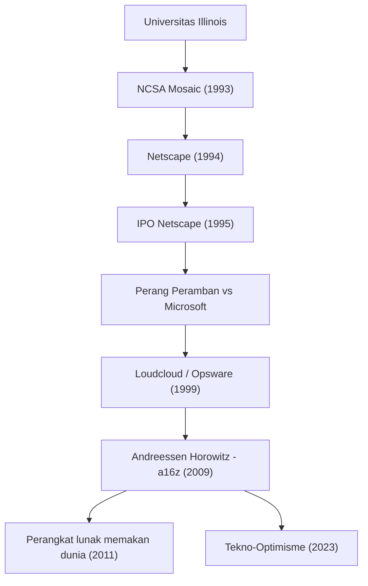

Sosok yang menjadikan internet modern sebagai hal yang lumrah, dan terus membentuk dunia dengan menginvestasikan dana besar ke masa depan teknologi. Itulah Marc Andreessen. Sebagai salah satu pencipta peramban web dan salah satu pendiri modal ventura representatif Silicon Valley, "Andreessen Horowitz (a16z)", jejak langkahnya sejalan dengan sejarah perkembangan internet itu sendiri.

Dalam artikel ini, kita akan menggali lebih dalam bagaimana ia membuka pintu menuju web, serta filosofi seperti apa yang terus memengaruhi generasi mendatang, baik sebagai pengusaha maupun investor.

## Jejak Langkah dan Prestasi Marc Andreessen

## Jenius Muda yang "Memvisualisasikan" Internet

Lahir di Iowa, Amerika Serikat pada tahun 1971, Andreessen telah terpesona oleh komputer sejak usia dini. Ia muncul di panggung sejarah saat berkuliah di Universitas Illinois Urbana-Champaign (UIUC). Pada saat itu, internet (World Wide Web) adalah hal yang berbasis teks dan kering, hanya menjadi ranah bagi sebagian peneliti akademis dan para geek.

Namun pada tahun 1993, Andreessen, bersama Eric Bina dan lainnya, mengembangkan "NCSA Mosaic", sebuah peramban web grafis yang dapat menampilkan gambar dan teks dengan indah di halaman yang sama. Antarmuka intuitif ini menjadi terobosan bersejarah yang membebaskan web bagi masyarakat umum. Konsep Mosaic, yaitu "siapa pun dapat menelusuri informasi dengan mudah," segera menyapu dunia dan meletakkan dasar bagi masyarakat digital modern.

## Kejayaan dan Kejatuhan Netscape, Serta Kontribusi terhadap Sumber Terbuka

Menyusul kesuksesan besar Mosaic, Andreessen mendirikan "Netscape Communications" pada tahun 1994 bersama pengusaha veteran Silicon Valley, Jim Clark. "Netscape Navigator" yang mereka rilis mendominasi pasar peramban pada saat itu, dan Penawaran Saham Perdana (IPO) pada tahun 1995 meraih kesuksesan besar. Momen yang disebut "Momen Netscape" ini merupakan awal dari gelembung dot-com, sekaligus sebuah peristiwa yang membuktikan kepada dunia bahwa internet akan menjadi bisnis besar.

Namun, jalan setelahnya tidaklah mulus. Perusahaan raksasa Microsoft membundel "Internet Explorer" secara standar ke dalam Windows, memicu "Perang Peramban (Browser Wars)" yang sengit. Di hadapan Microsoft yang dipersenjatai dengan kekuatan finansial luar biasa dan pangsa pasar OS, pangsa pasar Netscape secara bertahap direbut. Pada akhirnya, perusahaan tersebut diakuisisi oleh AOL, tetapi keputusan Andreessen dan rekan-rekannya meninggalkan warisan besar untuk masa depan. Mereka merilis kode sumber peramban tersebut dan meluncurkan proyek "Mozilla". Ini kemudian membuahkan hasil sebagai "Firefox" dan menjadi kekuatan pendorong yang memimpin gerakan sumber terbuka (open source).

## Dari Pengusaha Menjadi Investor: Lahirnya a16z

Setelah Netscape, Andreessen mendirikan "Loudcloud" (kemudian berubah menjadi Opsware), yang menjadi pelopor komputasi awan, bersama Ben Horowitz. Mereka mengatasi krisis yang belum pernah terjadi sebelumnya pasca meletusnya gelembung TI, dan menunjukkan keterampilan luar biasa dengan menjual perusahaan tersebut ke Hewlett-Packard (HP) seharga 1,6 miliar dolar AS.

Dan pada tahun 2009, keduanya bergabung kembali untuk mendirikan perusahaan modal ventura "Andreessen Horowitz (a16z)". Tidak seperti VC tradisional, a16z dengan cermat menerapkan pendekatan "ramah pendiri" (founder-friendly) di mana pendiri itu sendiri mendukung para pengusaha. Dengan menginternalisasi tim ahli untuk PR, perekrutan, jaringan, dan lainnya, serta menyediakan lingkungan di mana pengusaha dapat fokus pada pengembangan produk, mereka berinvestasi sejak tahap awal pada perusahaan teknologi terkemuka modern seperti Facebook, Twitter, Airbnb, GitHub, dan Stripe, dan memperoleh pengembalian dan pengaruh yang luar biasa.

## Perangkat Lunak Memakan Dunia: Filosofi Andreessen

Saat membicarakan Marc Andreessen, yang tidak bisa dilewatkan adalah wawasannya yang tajam dan kemampuannya untuk mengartikulasikan ide. Pada tahun 2011, ia menyumbangkan esai bersejarah berjudul "Software is eating the world" (Perangkat lunak memakan dunia) ke The Wall Street Journal. Ramalannya bahwa semua industri akan didefinisikan ulang oleh perangkat lunak, dan perusahaan tradisional terpaksa berubah menjadi perusahaan perangkat lunak, sepenuhnya terbukti dengan penyebaran ponsel pintar dan kebangkitan SaaS yang mengikutinya.

Dasar filosofinya adalah "tekno-optimisme" (optimisme teknologi) yang kuat. Dalam "The Techno-Optimist Manifesto" (Manifesto Tekno-Optimis) yang diterbitkan baru-baru ini, ia dengan lantang berargumen bahwa "teknologi adalah satu-satunya cara untuk memecahkan masalah umat manusia, serta membawa pertumbuhan dan kemakmuran." Bahkan di masa kini di mana gelombang kebangkitan AI dan pengetatan regulasi melanda, ia tidak pernah pesimis dan terus memercayai kekuatan rekayasa dan inovasi.

## Pengaruh pada Generasi Mendatang dan Pandangan Masa Depan

Marc Andreessen telah menciptakan "cara memandang" internet sebagai seorang insinyur, menunjukkan "cara bertarung" dalam bisnis internet sebagai seorang pengusaha, dan merancang "masa depan" di mana teknologi menutupi masyarakat sebagai seorang investor.

Kehidupannya bukan sekadar kisah sukses. Ini adalah kisah kegigihan sebagai seorang "pembangun" (builder) yang dengan cepat menemukan nilai dalam teknologi yang belum diketahui, mempopulerkannya, dan terus memperbarui masyarakat secara keseluruhan. Benih yang ia tanam terus bersemi di kantor-kantor perusahaan rintisan di seluruh dunia saat ini, atau di dalam komunitas sumber terbuka. Sikapnya, yang mewujudkan kata-kata, "Cara terbaik untuk memprediksi masa depan adalah dengan menciptakannya," akan terus menginspirasi generasi pengusaha berikutnya.
