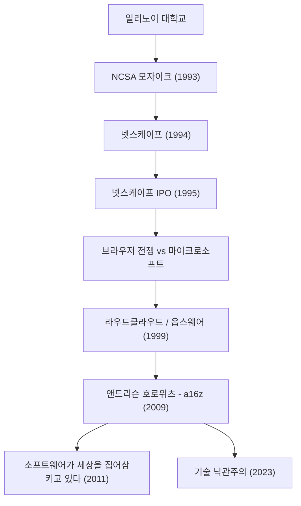

현대의 인터넷을 당연한 존재로 만들고, 나아가 기술의 미래에 막대한 자금을 투자하여 세상을 계속해서 형성해 나가는 인물. 그가 바로 마크 앤드리슨(Marc Andreessen)입니다. 웹 브라우저의 창시자 중 한 명이자 실리콘 밸리를 대표하는 벤처 캐피탈 'Andreessen Horowitz(a16z)'의 공동 창업자이기도 한 그의 발자취는 인터넷의 발전사와 그대로 겹칩니다.

본 기사에서는 그가 어떻게 웹의 문을 열었고, 기업가로서 그리고 투자자로서 어떤 철학을 가지고 후세에 계속 영향을 미치고 있는지 깊이 파헤쳐 봅니다.

## 마크 앤드리슨의 발자취와 업적 흐름

## 인터넷을 "시각화"한 젊은 천재

1971년 미국 아이오와주에서 태어난 앤드리슨은 어릴 적부터 컴퓨터에 매료되었습니다. 그가 역사의 표면에 등장한 것은 일리노이 대학교 어바나-샴페인(UIUC)에 재학 중일 때입니다. 당시 인터넷(World Wide Web)은 텍스트 기반의 무미건조한 것이었으며, 일부 학술 연구자나 오타쿠들만의 영역이었습니다.

하지만 1993년, 앤드리슨은 에릭 비나 등과 함께 이미지와 텍스트를 동일한 페이지 내에 아름답게 표시할 수 있는 그래픽 웹 브라우저 'NCSA Mosaic'를 개발합니다. 이 직관적인 인터페이스는 웹을 일반 대중에게 개방한 역사적 돌파구가 되었습니다. "누구나 쉽게 정보를 찾을 수 있다"는 Mosaic의 콘셉트는 순식간에 전 세계를 휩쓸며 현대 디지털 사회의 기초를 다졌습니다.

## 넷스케이프의 영광과 좌절, 그리고 오픈 소스에 대한 기여

Mosaic의 큰 성공에 힘입어 앤드리슨은 실리콘 밸리의 베테랑 기업가 짐 클라크와 함께 'Netscape Communications'를 1994년에 설립했습니다. 이들이 출시한 'Netscape Navigator'는 당시 브라우저 시장을 독점했고, 1995년의 신규 주식 공개(IPO)는 큰 성공을 거둡니다. 이 '넷스케이프 모멘트'라고 불리는 순간은 닷컴 버블의 서막이자, 인터넷이 거대한 비즈니스가 될 수 있음을 전 세계에 증명한 사건이었습니다.

그러나 그 후의 여정은 평탄하지만은 않았습니다. 거대 기업 마이크로소프트가 'Internet Explorer'를 윈도우에 기본 탑재하면서 치열한 '브라우저 전쟁(Browser Wars)'이 발발합니다. 압도적인 자금력과 OS 점유율을 무기로 삼은 마이크로소프트 앞에서 넷스케이프는 점차 점유율을 빼앗겼습니다. 결국 회사는 AOL에 인수되지만, 앤드리슨 일행의 결단은 미래에 큰 유산을 남겼습니다. 브라우저의 소스 코드를 공개하고 'Mozilla' 프로젝트를 출범시킨 것입니다. 이것이 나중에 'Firefox'로 결실을 맺어 오픈 소스 운동을 견인하는 원동력이 되었습니다.

## 기업가에서 투자자로: a16z의 탄생

넷스케이프 이후, 앤드리슨은 벤 호로위츠와 함께 클라우드 컴퓨팅의 선구자인 'Loudcloud(나중에 Opsware로 전환)'를 창업합니다. IT 버블 붕괴라는 초유의 위기를 극복하고, 이 회사를 휴렛 팩커드(HP)에 16억 달러에 매각하는 뛰어난 수완을 보여주었습니다.

그리고 2009년, 두 사람은 다시 손을 잡고 벤처 캐피탈 'Andreessen Horowitz(a16z)'를 설립합니다. a16z는 기존의 VC와 달리 창업자 자신이 기업가를 지원하는 '창업자 친화적'인 접근을 철저히 했습니다. PR, 인재 채용, 네트워킹 등의 전문 팀을 내재화하여 기업가가 제품 개발에 집중할 수 있는 환경을 제공함으로써 Facebook, Twitter, Airbnb, GitHub, Stripe 등 현대를 대표하는 기술 기업들에 초기 단계부터 투자하여 막대한 수익과 영향력을 얻었습니다.

## 소프트웨어가 세상을 집어삼킨다: 앤드리슨의 철학

마크 앤드리슨을 이야기할 때 빼놓을 수 없는 것이 그의 날카로운 통찰력과 언어화 능력입니다. 2011년 그는 월스트리트 저널에 'Software is eating the world(소프트웨어가 세상을 집어삼킨다)'라는 역사적인 에세이를 기고했습니다. 모든 산업이 소프트웨어에 의해 재정의되고, 전통적인 기업도 소프트웨어 기업으로 변모할 수밖에 없다는 그의 예언은 이후 스마트폰의 보급과 SaaS의 융성에 의해 완벽하게 증명되었습니다.

그의 철학의 바탕에는 강렬한 '기술 낙관주의(Techno-Optimism)'가 있습니다. 최근 발표된 '기술 낙관주의자 선언(The Techno-Optimist Manifesto)'에서도 그는 "기술만이 인류의 과제를 해결하고 성장과 풍요를 가져다줄 유일한 수단이다"라고 목소리를 높여 주장합니다. AI의 대두와 규제 강화의 물결이 밀려오는 현대에도 그는 결코 비관하지 않고 엔지니어링과 혁신의 힘을 계속 믿고 있습니다.

## 후세에 미친 영향과 미래를 향한 시각

마크 앤드리슨은 기술자로서 인터넷의 '보이는 방식'을 만들었고, 기업가로서 인터넷 비즈니스의 '싸우는 방식'을 제시했으며, 투자자로서 기술이 사회를 뒤덮는 '미래'를 디자인해 왔습니다.

그의 생애는 단순한 성공담이 아닙니다. 미지의 기술에서 남보다 먼저 가치를 찾아내고, 이를 대중화하며, 사회 전체를 계속해서 업데이트하는 '빌더(창조자)'로서의 집념의 이야기입니다. 그가 뿌린 씨앗은 지금도 전 세계 스타트업의 사무실에서, 혹은 오픈 소스 커뮤니티에서 계속 싹트고 있습니다. "미래를 예측하는 가장 좋은 방법은 그것을 발명하는 것이다"라는 말을 체현하는 그의 자세는 앞으로도 차세대 기업가들에게 계속 영감을 줄 것입니다.
