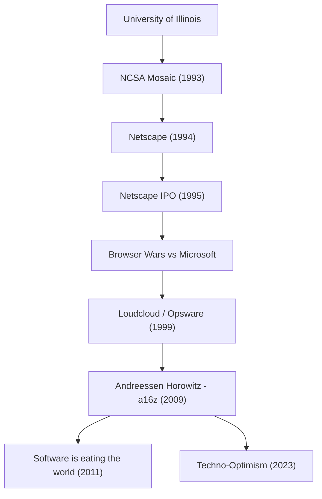

現代のインターネットを当たり前の存在にし、さらにテクノロジーの未来に巨額の資金を投じることで世界を形作り続ける人物。それが、マーク・アンドリーセン（Marc Andreessen）です。ウェブブラウザの生みの親の一人であり、シリコンバレーを代表するベンチャーキャピタル「Andreessen Horowitz（a16z）」の共同創業者でもある彼の軌跡は、そのままインターネットの発展史と重なります。

本記事では、彼がどのようにしてウェブの扉を開き、起業家として、そして投資家としてどのような哲学をもって後世に影響を与え続けているのかを深く掘り下げます。

## マーク・アンドリーセンの軌跡と功績フロー

## インターネットを「視覚化」した若き天才

1971年、アメリカのアイオワ州に生まれたアンドリーセンは、幼い頃からコンピュータに魅了されていました。彼が歴史の表舞台に登場するのは、イリノイ大学アーバナ・シャンペーン校（UIUC）に在籍していた時のことです。当時、インターネット（World Wide Web）はテキストベースの無味乾燥なものであり、一部の学術研究者やオタクだけの領域でした。

しかし1993年、アンドリーセンはエリック・ビナらと共に、画像とテキストを同一ページ内に美しく表示できるグラフィカル・ウェブブラウザ「NCSA Mosaic」を開発します。この直感的なインターフェースは、ウェブを一般大衆に解放する歴史的ブレイクスルーとなりました。「誰もが簡単に情報をたどれる」というMosaicのコンセプトは瞬く間に世界を席巻し、現代のデジタル社会の基礎を築いたのです。

## ネットスケープの栄光と挫折、そしてオープンソースへの貢献

Mosaicの大成功を受け、アンドリーセンはシリコンバレーのベテラン起業家ジム・クラークと共に「Netscape Communications」を1994年に設立しました。彼らがリリースした「Netscape Navigator」は、当時のブラウザ市場を独占し、1995年の新規株式公開（IPO）は大成功を収めます。この「ネットスケープ・モーメント」と呼ばれる瞬間は、ドットコム・バブルの幕開けであると同時に、インターネットが巨大なビジネスになることを世界に証明した出来事でした。

しかし、その後の道のりは平坦ではありませんでした。巨大企業マイクロソフトが「Internet Explorer」をWindowsに標準搭載し、苛烈な「ブラウザ戦争（Browser Wars）」が勃発します。圧倒的な資金力とOSのシェアを武器にするマイクロソフトの前に、ネットスケープは徐々にシェアを奪われていきました。最終的に会社はAOLに買収されることになりますが、アンドリーセンたちの決断は未来に大きな遺産を残しました。ブラウザのソースコードを公開し、「Mozilla」プロジェクトを立ち上げたのです。これが後に「Firefox」として結実し、オープンソース運動を牽引する原動力となりました。

## 起業家から投資家へ：a16zの誕生

ネットスケープの後、アンドリーセンはベン・ホロウィッツと共にクラウドコンピューティングの先駆けとなる「Loudcloud（後にOpswareへと転換）」を創業します。ITバブル崩壊という未曾有の危機を乗り越え、同社をヒューレット・パッカード（HP）に16億ドルで売却するという見事な手腕を見せました。

そして2009年、二人は再びタッグを組み、ベンチャーキャピタル「Andreessen Horowitz（a16z）」を設立します。a16zは従来のVCとは異なり、創業者自身が起業家を支援する「ファウンダー・フレンドリー」なアプローチを徹底しました。PR、人材採用、ネットワーキングなどの専門チームを内製化し、起業家が製品開発に集中できる環境を提供することで、Facebook、Twitter、Airbnb、GitHub、Stripeなど、現代を代表するテクノロジー企業へと初期段階から投資し、莫大なリターンと影響力を手に入れました。

## ソフトウェアが世界を飲み込む：アンドリーセンの哲学

マーク・アンドリーセンを語る上で欠かせないのが、彼の鋭い洞察力と言語化能力です。2011年、彼はウォール・ストリート・ジャーナルに『Software is eating the world（ソフトウェアが世界を飲み込む）』という歴史的なエッセイを寄稿しました。あらゆる産業がソフトウェアによって再定義され、伝統的な企業もソフトウェア企業へと変貌せざるを得ないという彼の予言は、その後のスマートフォンの普及やSaaSの隆盛によって完全に証明されました。

彼の哲学の根底にあるのは、強烈な「テクノロジカル・オプティミズム（技術的楽観主義）」です。近年発表された『テクノ・オプティミスト・マニフェスト（The Techno-Optimist Manifesto）』の中でも、彼は「技術こそが人類の課題を解決し、成長と豊かさをもたらす唯一の手段である」と声高に主張しています。AIの台頭や規制強化の波が押し寄せる現代においても、彼は決して悲観せず、エンジニアリングとイノベーションの力を信じ続けています。

## 後世への影響と未来への視座

マーク・アンドリーセンは、技術者としてインターネットの「見え方」を作り、起業家としてインターネット・ビジネスの「戦い方」を示し、投資家としてテクノロジーが社会を覆い尽くす「未来」をデザインしてきました。

彼の生涯は、単なる成功譚ではありません。未知の技術にいち早く価値を見出し、それを大衆化し、社会全体をアップデートし続けるという「ビルダー（創る者）」としての執念の物語です。彼が蒔いた種は、今も世界中のスタートアップのオフィスで、あるいはオープンソースのコミュニティで芽吹き続けています。「未来を予測する最良の方法は、それを発明することだ」という言葉を体現する彼の姿勢は、これからも次世代の起業家たちを鼓舞し続けるでしょう。
