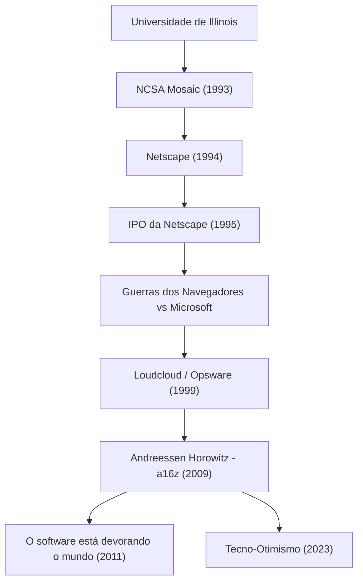

A pessoa que tornou a internet moderna algo natural e continua moldando o mundo investindo enormes quantias no futuro da tecnologia. Esse é Marc Andreessen. Sendo um dos criadores do navegador da web e cofundador de uma das principais firmas de capital de risco do Vale do Silício, a "Andreessen Horowitz (a16z)", a sua trajetória se sobrepõe à própria história do desenvolvimento da internet.

Neste artigo, vamos nos aprofundar em como ele abriu as portas da web e qual filosofia ele mantém, como empreendedor e investidor, continuando a influenciar as gerações futuras.

## Trajetória e Conquistas de Marc Andreessen

## O jovem gênio que "visualizou" a internet

Nascido em Iowa, nos Estados Unidos, em 1971, Andreessen foi fascinado por computadores desde pequeno. Sua entrada no palco principal da história ocorreu enquanto ele era estudante na Universidade de Illinois em Urbana-Champaign (UIUC). Naquela época, a internet (World Wide Web) era árida, baseada em texto, e o domínio apenas de alguns pesquisadores acadêmicos e geeks.

No entanto, em 1993, Andreessen desenvolveu com Eric Bina o "NCSA Mosaic", um navegador web gráfico capaz de exibir belamente imagens e texto na mesma página. Essa interface intuitiva foi o avanço histórico que abriu a web para o público em geral. O conceito do Mosaic, de que "qualquer um pode facilmente navegar por informações", rapidamente conquistou o mundo e lançou as bases da sociedade digital moderna.

## A glória e o fracasso da Netscape, e a contribuição para o código aberto

Após o grande sucesso do Mosaic, Andreessen e o veterano empreendedor do Vale do Silício, Jim Clark, fundaram a "Netscape Communications" em 1994. O "Netscape Navigator" lançado por eles dominou o mercado de navegadores na época, e a sua oferta pública inicial (IPO) em 1995 foi um sucesso estrondoso. Esse momento, apelidado de "momento Netscape", não apenas marcou o início da bolha das pontocom, mas também provou ao mundo que a internet se tornaria um negócio colossal.

Porém, o caminho seguinte não foi tranquilo. A gigante corporativa Microsoft incluiu o "Internet Explorer" como padrão no Windows, o que desencadeou as ferozes "Guerras dos Navegadores (Browser Wars)". Enfrentando o avassalador poder financeiro da Microsoft e a sua participação no mercado de SO, a Netscape gradualmente perdeu sua fatia de mercado. A empresa acabou sendo comprada pela AOL, mas as decisões tomadas por Andreessen deixaram um legado enorme para o futuro: eles abriram o código-fonte do seu navegador e lançaram o projeto "Mozilla". Este projeto posteriormente floresceria como "Firefox", impulsionando o movimento de código aberto.

## De empreendedor a investidor: o nascimento da a16z

Após a Netscape, Andreessen e Ben Horowitz fundaram a "Loudcloud (mais tarde transformada em Opsware)", uma das pioneiras na computação em nuvem. Demonstrando uma habilidade excepcional, superaram a crise sem precedentes do colapso da bolha da tecnologia e venderam a empresa para a Hewlett-Packard (HP) por 1,6 bilhão de dólares.

Então, em 2009, os dois se uniram novamente para fundar a firma de capital de risco "Andreessen Horowitz (a16z)". Diferente dos VCs tradicionais, a a16z estabeleceu uma abordagem extremamente "amigável ao fundador (founder-friendly)", onde os próprios fundadores ajudam os empreendedores. Ao formar internamente equipes especializadas em RP, recrutamento de talentos e networking, eles ofereceram um ambiente para que os empreendedores focassem no desenvolvimento de produtos, investindo nos estágios iniciais de empresas de tecnologia representativas de hoje, como Facebook, Twitter, Airbnb, GitHub e Stripe, obtendo assim retornos enormes e influência massiva.

## O software está devorando o mundo: a filosofia de Andreessen

Ao falar de Marc Andreessen, sua percepção aguçada e sua capacidade de articulação são indispensáveis. Em 2011, ele publicou no Wall Street Journal o histórico ensaio "Software is eating the world (O software está devorando o mundo)". Sua previsão de que todas as indústrias seriam redefinidas por softwares, forçando empresas tradicionais a se transformarem em empresas de software, foi perfeitamente comprovada com a posterior disseminação de smartphones e o surgimento do SaaS.

No cerne de sua filosofia, há um intenso "Otimismo Tecnológico (Techno-Optimism)". Em seu recentemente divulgado "The Techno-Optimist Manifesto (O Manifesto Tecno-Otimista)", ele afirma enfaticamente que "a tecnologia é a única maneira de resolver os problemas da humanidade e trazer crescimento e prosperidade". Mesmo na era atual com a ascensão da IA e uma onda de endurecimento nas regulamentações, ele nunca se mostra pessimista, mas continua acreditando firmemente no poder da engenharia e da inovação.

## O impacto nas gerações futuras e uma visão do futuro

Como tecnólogo, Marc Andreessen moldou a "aparência" da internet; como empreendedor, demonstrou a "forma de batalhar" nos negócios da internet; e como investidor, ele projetou o "futuro" onde a tecnologia abrange a sociedade.

A vida dele não é apenas uma história de sucesso. É uma história de persistência como "construtor (builder)", que rapidamente percebe o valor de tecnologias desconhecidas, populariza-as e continua a atualizar a sociedade como um todo. As sementes que ele plantou continuam a brotar em escritórios de startups em todo o mundo, ou nas comunidades de código aberto. A sua postura, encarnando a citação "A melhor maneira de prever o futuro é inventá-lo", continuará inspirando as futuras gerações de empreendedores.
